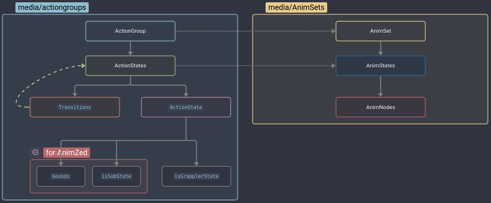

# Animation

> Offline PZwiki reference. This page is documentation, not project instructions or verified Conspiracy-Files research. Source build warnings and incomplete entries remain applicable. External destinations are omitted. See the library README and COVERAGE for scope.

This page was last updated for an older version of the current build (42.15.0).

The current stable version is 42.20.4, so information on this page may be inaccurate.

Help get this page updated by adding any missing content. [Edit](Animation.md) (Create account)

**Animation** in Project Zomboid consist in the creation of custom animations and adding them to the game or replacing existing ones. The process involves both animating a skeleton of the character model, usually called a rig, exporting it to a [format](../foundations/File_formats.md#Modeling_and_animation_formats) that the game can read (preferably GL Transmission Format`.glb`) and defining an [AnimNode](AnimNode.md) which will be used to play the animation in-game and define its properties.

You can find a list of available rigs for animating on the page [Character rigs](Character_rigs.md).

<a id="Folder_structure"></a>

## Folder structure

Main article: [Mod structure](../foundations/Mod_structure.md)

The`anims_X` folder is used to store animation files. They can be put in subfolders for organization and can replace files with the same relative path. See the page [file formats](../foundations/File_formats.md#Modeling_and_animation_formats) for more details.

**AnimSets** are put inside the`AnimSets` folder. An [AnimSet](AnimSet.md) is a collection of [AnimStates](AnimState.md) and are usually associated to an entity such as the player, a zombie or an animal. [AnimStates](AnimState.md) define a specific state the entity can be in, such as walking, running, or idle. For an AnimState, [AnimNode](AnimNode.md) are used to define the animations that can be played in that state, and for which conditions like the current speed of the entity playing a different animation, or the player being injured having a different stance.

In parallel, the game uses [ActionGroups](ActionGroup.md) which are associated to an AnimSet, and are composed of [ActionStates](ActionState.md) associated to a specific [AnimState](AnimState.md), to define [transition](Transition_file.md) conditions between the different states.



<a id="Example"></a>

### Example

Below is the animation structure of the cow:


This section contains source code from Project Zomboid

**Retrieved**: Build 42.10.0


```text
media/
├── actiongroups/
│   └── cow/
│       ├── attack/
│       │   └── ...
│       ├── death/
│       │   └── ...
│       ├── eating/
│       │   └── ...
│       ├── falldown/
│       │   └── ...
│       ├── followwall/
│       │   └── ...
│       ├── hitreaction/
│       │   └── ...
│       ├── idle/
│       │   └── ...
│       ├── onground/
│       │   └── ...
│       ├── onhook/
│       │   └── ...
│       ├── pathfind/
│       │   └── ...
│       ├── trailer/
│       │   └── ...
│       ├── walk/
│       │   └── ...
│       └── zone/
│           └── ...
├── anims_X/
│   └── Cow/
│       └── ...
├── AnimSets/
│   └── cow/
│       ├── attack/
│       │   └── ...
│       ├── deadbody/
│       │   └── ...
│       ├── death/
│       │   └── ...
│       ├── eating/
│       │   └── ...
│       ├── falldown/
│       │   └── ...
│       ├── followwall/
│       │   └── ...
│       ├── hitreaction/
│       │   └── ...
│       ├── idle/
│       │   └── ...
│       ├── onground/
│       │   └── ...
│       ├── onhook/
│       │   └── ...
│       ├── pathfind/
│       │   └── ...
│       ├── trailer/
│       │   └── ...
│       ├── walk/
│       │   └── ...
│       └── zone/
│           └── ...
└── ...
```


<a id="File_types"></a>

## File types

The animation formats which can be used are:

| Format | Description |
| --- | --- |
| Graphics Library Transmission Format (`.glb`) Recommended | Allows for substantially lighter file sizes in general when properly exported, but requires a specific rig setup (see Community rig). Can be [hot reloaded](Hot_reloading.md). |
| Filmbox FBX (`.fbx`) | FBXs are more compatible with older rigs and have been the standard for animations for a while, but are extremely heavy in terms of file size. Can be [hot reloaded](Hot_reloading.md). |
| DirectX (`.x`) Not recommended | The format used for most vanilla game assets, but is widely unsupported in modern animation software. It is highly recommended to not use this format for modding, as it can cause more issues than it solves, and there is no point to using it when the other formats are available and more widely supported. |

<a id="See_also"></a>

## See also

- [Creating custom animations](Creating_custom_animations.md) – a step-by-step guide on how to create animations.
- [Game files](../foundations/Game_files.md) – accessing game files, including animations.
- [Mod structure](../foundations/Mod_structure.md) – explanation of the structure of a mod.
- [Importing assets](Importing_assets.md) - a guide on how to import in-game assets such as animations and models into Blender.

| Tutorial | Description | Author | Last updated |
| --- | --- | --- | --- |
| How To Create an Animation | A guide on how to create an animation for Project Zomboid. | Dislaik | 2023 October 2 |

Retrieved from "[https://pzwiki.net/w/index.php?title=Animation&oldid=1385283](Animation.md)"
