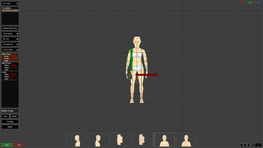
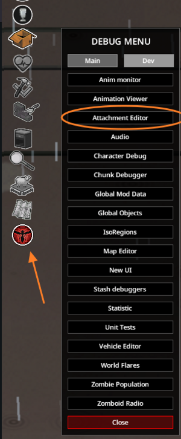

# Attachment editor

> Offline PZwiki reference. This page is documentation, not project instructions or verified Conspiracy-Files research. Source build warnings and incomplete entries remain applicable. External destinations are omitted. See the library README and COVERAGE for scope.

This page has been revised for the current stable version (42.20.4).

Help by adding any missing content. [Edit](Attachment_editor.md) (Create account)

Parts of this page may have been automatically updated to the latest build (42.20.4).

**Attachment Editor** is a menu accessible from the [debug menu](../foundations/Debug_menu.md) or the keybinds ⇧ Shift + F7 when in [debug mode](../foundations/Debug_mode.md). In this editor, the player has access to multiple tools to modify and adjust 3D model positions based on various bone attachment points on the character model and adjust them to be properly rotated, translated, or scaled per attachment bone.

By clicking on the debug mode button on the left-hand side of the player's screen, you can access the debug menu, which will have the Attachment Editor as a menu option under the 'Dev' tab of the menu. Once you have it opened, you'll be met with a 3D plane. There's going to be a variety of camera angles available at the bottom, and a few menu options at the left.

## Loading in a model

The attachment editor can only load models which are defined with a model script. Once selecting the model, it will be added to the scene, and it can be removed by selecting it and clicking Remove From Scene.

You can load the player model by selecting the Player Model menu and choosing either male or female, which will add the character to the scene. You can remove it by opening the same menu and selecting None instead. A specific animation can be chosen by selecting the menu Bob_Idle (by default it is this one) and selecting another animation of your liking. This can be useful if you want to test different holding positions for your item or how it reacts when the character moves.

You can parent the model to the player model to a specific attachment point by right-clicking the model and choosing Base.MaleBody or Base.FemaleBody based on your chosen character mode, then selecting the attachment point you want to parent it to.

You can also load animal models by selecting the Animal Model menu and choosing the animal you want to load. The same rules apply as for the player model. Vehicles can also be added to the scene by selecting the Vehicle Model menu and choosing the vehicle you want to load. The same rules apply as for the player model.

## Modifying the model attachment

To be able to modify a model attachment point and save it afterward, you need to define an attachment point directly in the attachment model script. Alternatively, you can directly add it from the attachment editor by clicking New after selecting your model, then changing the name when selecting the new attachment point and pressing enter. After clicking save, it will appear in your model script. You can also delete the attachment point by pressing Delete after selecting it.

It is recommended to parent the model to the attachment point to make your life easier to visually represent the model on the attachment slot. This will directly show the item with the right direction on the attachment point.

To modify the model offset, rotation and scale, you will have to select the attachment point for your model and then chose the modification mode. This mode can be found above the Global button, with by default Translate selected, but by clicking it you can swap to Rotate then Scale. You can then move the model with the arrows or circles based on your selected mode. Once you are done, you can click Save to save the changes to the model script.

For just one visual example of how this can be used to make small adjustments to your models in the game, take a look at this video.

**DO NOT MODIFY THE PLAYER MODEL BONES**. If you do that, you will break every single vanilla item and modded items that use the same bone! Only modify the bones in relation to your item model, in their item script!

Retrieved from "[https://pzwiki.net/w/index.php?title=Attachment_editor&oldid=1460565](Attachment_editor.md)"
