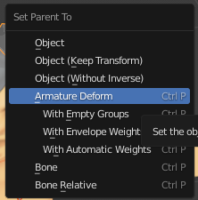
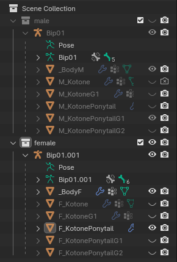
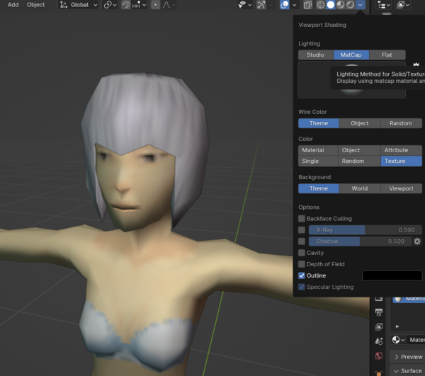
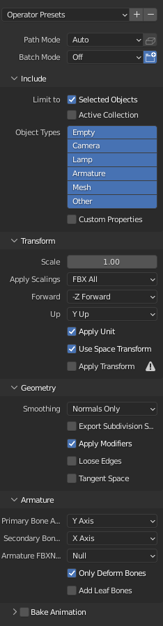
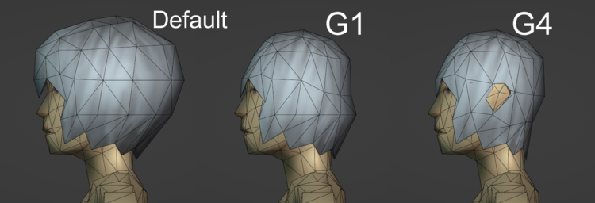
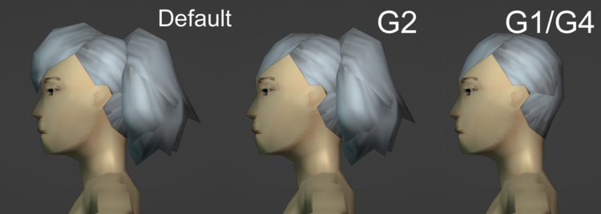
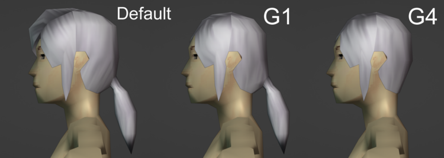

# Creating a hair mod

> Offline PZwiki reference. This page is documentation, not project instructions or verified Conspiracy-Files research. Source build warnings and incomplete entries remain applicable. External destinations are omitted. See the library README and COVERAGE for scope.

This page was last updated for an older version of the current build (42.0.2).

The current stable version is 42.20.4, so information on this page may be inaccurate.

Help get this page updated by adding any missing content. [Edit](Creating_a_hair_mod.md) (Create account)

This guide explains how to add new hairstyles to the game.

<a id="Needed"></a>

## Needed

- Character and hair models

<a id="Mod_structure"></a>

## Mod structure

For the basic mod structure see [Game files](../foundations/Game_files.md)

You'll need the following files for hairstyle modding:

-`media/hairStyles/hairStyles.xml` This is where you add the hairstyles to the game

-`media/lua/shared/translate/EN/IG_UI_EN.txt` This is where you add the hairstyle names. This is the file path for English

-`media/lua/shared/definitions/Your_File_Name_Here.lua` This is where you can change how hairstyles spawn on zombies

-`media/models_x/skinned/hair` This is where you put the models

<a id="Blender_Setup"></a>

## Blender Setup

If you are using the character blend file from the link at the start of this guide then you will be able to ignore most of this section.

This section won't cover the modelling process but includes key information for hair models, as well as some general tips that you can use for all Zomboid models.

<a id="Importing"></a>

### Importing

When you import models from the game I recommend selecting Dummy01 and then setting its scale to 1 on all axes so that you can work with the model at a more reasonable size.

You can then press CTRL+A to open the "Apply Transforms" menu and apply the rotation + scale of the Dummy01 object. You should then be free to delete Dummy01 as well as Bip01_Prop and Translation_Data.

If you are importing multiple models into the same scene then it can be helpful to repeat the above process for each of them, next you can also apply the rotation + scale of the duplicate Bip01 armatures - which you should then be able to delete without breaking the rotation/scale of the models attached to it.

If you have converted a model yourself to .DAE then you may find that all of the triangles in the mesh are separated. To fix this, go into edit mode on the mesh, select all, and then press M and merge by distance.

Importing this way might also import a ton of line objects, which you will need to delete.

<a id="Parenting_the_model_to_the_armature"></a>

### Parenting the model to the armature

In order to attach the mesh to the armature, you will need to select it, and then select **Bip01**, You can select multiple objects by holding CTRL when selecting in the hierarchy list, or by holding Shift if you are selecting in the 3D Viewer.

Make sure your cursor is in the 3D View and then press CTRL+P to open the parenting menu, and **Armature Deform** to assign it.



You will then want to check the **Vertex Groups** of the mesh and ensure that the mesh has a **Bip01_Head** group. If your hairstyle is short enough then you may want to simply select your whole mesh and assign it to this vertex group - otherwise you will need to do **Weight Painting** to make sure that the hair moves correctly when the head bone is rotated.

<a id="My_Blender_Scene"></a>

### My Blender Scene



I set up my Blender scenes like this so that each hairstyle has its own Blend file. If I have multiple hairstyles based on the same model then I will keep them in the same file. I separate the male and female models into separate collections so they can be hidden.

**I suggest deleting unnecessary bones from the male and female armatures to lower file size.** I usually only keep the Head, Neck, and Chest bones. **I don't recommend weighting anything to the neck bone because it usually breaks in-game.**

I also recommend going to the shading tab in the top right and changing the shading mode to MatCap while you are modelling so that it looks closer to how it would in-game.



<a id="Texture_Info"></a>

## Texture Info

You will want to use **F_Hair_White, F_HairCurly_Long, F_HairCurly_Short, or F_Hair_Braids** found in media\textures on the hair model, although you can also use your own custom texture.

You can use whatever texture you want inside Blender as the in-game texture will be assigned through script. **Zomboid only supports models having one material** so you will need to delete any extra materials that your hair meshes might have.

<a id="Model_Exporting"></a>

## Model Exporting

Select the hair mesh and the armature, and then go to export and choose **.FBX**.

These are my recommended export settings:



<a id="Creating_the_Hairstyle"></a>

## Creating the Hairstyle

Inside the hairStyles folder you'll need to create **hairStyles.xml**, which will be where we create the hairstyles for use in-game. This file should look like this:


```text
<?xml version="1.0" encoding="utf-8"?>
<hairStyles>
	<male><name>M_TestHair</name>
		<model>skinned\hair\M_TestHair</model>
		<texture>F_Hair_White</texture>
		<alternate category="default" style="M_TestHair" />
		<alternate category="Group01" style="M_TestHair" />
		<alternate category="Group02" style="M_TestHair" />
		<alternate category="Group04" style="M_TestHair" />
		<alternate category="Group05" style="M_TestHair" />
		<alternate category="Group06" style="Bound" />
		<level>2</level>
		<trimChoices>Donny</trimChoices>
		<trimChoices>M_TestHair2</trimChoices>
		<attachedHair>false</attachedHair>
	</male>
</hairStyles>
```


**I will now explain what each of these lines means:**

Every hairstyle you add to your mod will need to be included inside of this **<hairStyles>** tag.

You create a new hairstyle entry by using a **<male>** tag or a **<female>** tag, which decides which body type the hairstyle will be available for.

The **name** you use for the hairstyle will be its internal name, so you should make sure it does not conflict with any other hairstyle names. In this example I have included an **"M_"** in the name as I usually make my hairstyles available for both male and female characters, and it helps with organisation.

The **model** entry is where you will include the file path of the model you created. The path will automatically start inside the **models_X** folder. You also do not need to include a file type as the game will handle it automatically.

The **texture** entry is where you will include the file path of the texture you want to use for the hairstyle, it is recommended to use one of the default textures for maximum compatibility but you can include your own custom texture here instead. **The texture here needs to be white, as it will be tinted in-game to the player's hair colour.** The path will automatically start inside the **textures** folder.

The **alternate** categories will let you change to a different hairstyle entry when certain types of hats are equipped in-game, in order to prevent the hair from clipping through them. This is something we will return to in a later section of the tutorial.

The **level** is the length of the hair: 0 = bald 1 = short 2 = medium 3 = long

You can add multiple **trimChoices** to your hairstyle, which will define which hairstyles of the same length the player will be able to choose when using scissors in-game. If you use my Spongie's Hair API mod then these trim choices won't do anything, as it includes a workaround that unlocks every hairstyle regardless of the trim choices defined in them.

Finally the last relevant entry for this section is **attachedHair**, which you will only include if your hairstyle is a ponytail or any similar 'tied' hairstyle. This will let the player tie their regular hair into this hairstyle in-game. If this is not needed for the hairstyle you have chosen then you can delete this line entirely.

<a id="Creating_the_Translation_File"></a>

## Creating the Translation File

At this point you should be able to test the mod in-game and see that the hairstyle works, but the name in the character creation menu will be very strange. This is because we will need to create a translation for it.

To do this you will need to go to **media/lua/shared/Translate/EN**, where we will create **IG_UI_EN.txt**. This file should contain this:


```text
IGUI_EN = {

    IGUI_Hair_M_TestHair = "Test",
    IGUI_Hair_M_OtherHair = "Cool",

}
```


**IGUI_Hair_** is a prefix added to the name of every hairstyle, and **M_TestHair** is the name that you defined in **hairStyles.xml**. The **"Test"** will then be whatever name you want to appear in-game.

After this the name should appear in-game.

<a id="Hat_Compatibility"></a>

## Hat Compatibility

This section will explain how to use the **Alternate** categories in **hairStyles.xml** to use custom hairstyles when wearing headwear.

**It is highly recommended that you use the mod Fluffy Hair**, as it modifies the hat categories of every vanilla hat item to allow for more freedom with hat groups.

If you do use Fluffy Hair then you will need to make it a required mod on your workshop page and in your mod.info file. In mod.info you will need to include **"require=FH"**.

This section of the tutorial will be assuming you are using Fluffy Hair.

<a id="Setup"></a>

### Setup

For this example I have removed any lines that are not important:


```text
<male><name>M_TestHair</name>
		<alternate category="default" style="M_TestHair" />
		<alternate category="Group01" style="M_TestHairG1" />
		<alternate category="Group02" style="M_TestHairG2" />
		<alternate category="Group03" style="M_TestHairG3" />
		<alternate category="Group04" style="M_TestHairG4" />
		<alternate category="Group05" style="M_TestHair" />
		<alternate category="Group06" style="Bound" />
	</male>
```


The categories you need to be aware of are: Group01 = Hats Group02 = Bandannas/Bandages Group03 = Hoods Group04 = Full Helmets (Crash helmets, bicycle helmets, etc)

The style is where you will enter the name of the hairstyle that will be used. This is how we will switch to a flattened version of the hair model. You can enter the same hairstyle for multiple categories.

As you can also see in this example, I have given my hat variants a "Group1", "Group2", "Group3", and "Group4" at the end of the name so that I can keep them organised.

Before you move on to modelling, I will point out that you can enter any hairstyle for a hat category. This means that if your hairstyle is already similar to one from the vanilla game, you could enter the name of a hat variant from Fluffy Hair instead of creating your own.

<a id="Modelling"></a>

### Modelling

You will need to return to Blender to create new versions of your model that will need to be modified to reduce clipping with hat models as much as possible.

**You need to make sure you have models that can cover the 4 hat categories** You will want to save effort by making your models fulfil as many categories as possible.

<a id="Example_-_Regular_Hair"></a>

#### Example - Regular Hair



For most regular hairstyles I will just make two hat models, one where the top half is flattened, and one where the whole hair is flattened. Because I reuse these for all the hat groups it's important that none of the mesh clips into the head.

<a id="Example_-_Ponytail"></a>

#### Example - Ponytail

The process I use for ponytails is a bit confusing but it's very efficient.



This hair has a high ponytail so I make the tail hidden in the Group01 model to avoid clipping. In these situations I name the models G1 or G4 interchangeably. The tail can't be hidden when wearing bandannas so I made a model for Group02 where the tail is visible but the rest of the hair is still flattened.

This hairstyle in my mod is a ponytail variant of another hair, so I also use this flattened model for Group03 and Group04 in the regular hairstyle.

<a id="Example_-_Ponytail_2"></a>

#### Example - Ponytail 2



This hair has a low ponytail so G1 can be used for Group01 and Group02.

<a id="General_tips"></a>

#### General tips

For short hairstyles, You will want to just make 1 hat model.

I recommend using wireframe mode to help align the mesh as closely to the head as possible without clipping.

<a id="Creating_the_hat_hairstyles"></a>

### Creating the hat hairstyles

Next we need to create new hairstyles for each hat model you made.


```text
<male><name>M_TestHairG1</name>
		<model>skinned\hair\M_TestHairG1</model>
		<texture>F_Hair_White</texture>
		<noChoose>true</noChoose>
	</male>
	<male><name>M_TestHairG2</name>
		<model>skinned\hair\M_TestHairG2</model>
		<texture>F_Hair_White</texture>
		<noChoose>true</noChoose>
	</male>
	<male><name>M_TestHairG3</name>
		<model>skinned\hair\M_TestHairG3</model>
		<texture>F_Hair_White</texture>
		<noChoose>true</noChoose>
	</male>
	<male><name>M_TestHairG4</name>
		<model>skinned\hair\M_TestHairG4</model>
		<texture>F_Hair_White</texture>
		<noChoose>true</noChoose>
	</male>
```


These are created the same way as a regular hairstyle.

Once again, I also recommend you add the group name (or another indicator) at the end of the model names, as it will make it much easier for you to manage your files.

The important thing you need to add is the **noChoose** tag, which will ensure that players and zombies cannot spawn with this hairstyle, as it will only be applied when the player is wearing an appropriate hat item.

<a id="Zombie_Spawning"></a>

## Zombie Spawning

You can set your hairstyle to only spawn on zombies when they meet certain conditions, such as their outfit, or how many days into the apocalypse need to have passed for it to spawn.

This technique can be used to stop a hairstyle from spawning on zombies, which I recommend using on immersion-breaking hairstyles.

<a id="Setup_2"></a>

### Setup

You will need to create a new LUA file in **media/lua/shared/Definitions** called something like **TestMod_HairOutfitDefinitions.lua**, as long as the name is unique it doesn't matter.

This file will need this at the beginning:


```text
require 'Definitions/HairOutfitDefinitions'
```


<a id="Examples"></a>

### Examples

Here are some examples of the types of things you can include in this file from the vanilla game:


```text
local cat = {};
cat.name = "MohawkSpike";
cat.minWorldAge = 180;
cat.onlyFor = "Punk,Bandit";
table.insert(HairOutfitDefinitions.haircutDefinition, cat);
```


Here you can see that the hairstyle "MohawkSpike" is only allowed to spawn on zombies with the "Punk" or "Bandit" outfits, and only if the save game is 180 days into the apocalypse.

<a id="Remove_zombie_spawning"></a>

### Remove zombie spawning


```text
local cat = {};
cat.name = "M_TestHair";
cat.onlyFor = "ZombiesDontLike";
table.insert(HairOutfitDefinitions.haircutDefinition, cat);
```


This example will make "M_TestHair" only spawn on zombies wearing an outfit called "ZombiesDontLike", this outfit doesn't actually exist so there won't be any zombies for the hairstyle to spawn on.

If you have a lot of hairstyles in your mod that you need to exclude then you can copy this code and add your hairstyles to the list:


```text
local excludedHairs = {
"M_Redfield",
"M_Goth",
"M_Valentine",
"M_Mitsuru",
"M_MitsuruPonytail",
}

for k,v in pairs(excludedHairs) do
	local cat = {name = v, onlyFor = "ZombiesDontLike"};
	table.insert(HairOutfitDefinitions.haircutDefinition, cat);
end
```


This code will loop over each name in the list and remove them all from zombie spawning automatically.

Retrieved from "[https://pzwiki.net/w/index.php?title=Creating_a_hair_mod&oldid=1387541](Creating_a_hair_mod.md)"
