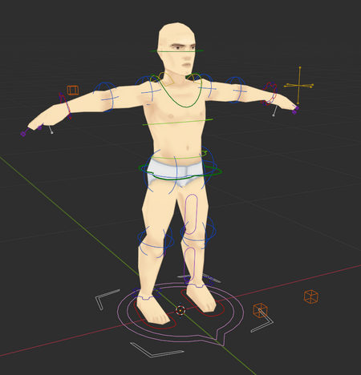
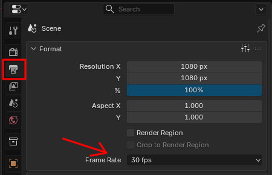
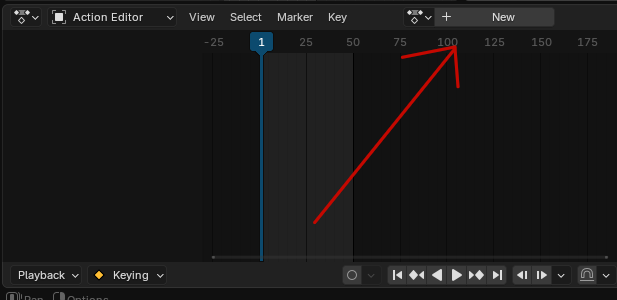
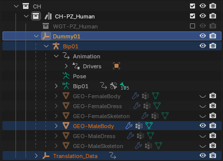
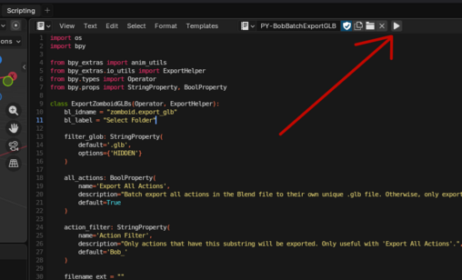

# Creating custom animations

> Offline PZwiki reference. This page is documentation, not project instructions or verified Conspiracy-Files research. Source build warnings and incomplete entries remain applicable. External destinations are omitted. See the library README and COVERAGE for scope.

This page was last updated for an older version of the current build (42.14.1).

The current stable version is 42.20.4, so information on this page may be inaccurate.

Help get this page updated by adding any missing content. [Edit](Creating_custom_animations.md) (Create account)

This guide will teach step by step how to create custom [animations](Animation.md) for the game. The rig used in this guide is the Paddlefruit Rig in Blender 5, but [other options](Character_rigs.md) also exist.



It is suggested to read the Community rig page to familiarize yourself with the rig and its functionalities before following this guide.

<a id="Blend_File_Setup"></a>

## Blend File Setup



In the Properties Editor, go to the 'Output' tab (the printer icon).

Select '30 fps' for the frame rate. This is to have your animation lengths sync up precisely with how PZ reads animation files. Be sure to do this BEFORE you start animating (You can scale them up or down later in case you don't, though).

<a id="Action_Setup"></a>

## Action Setup



In the Dope Sheet, open the Action Editor. It's as simple as clicking 'New' to create a new action, which is where you will be storing your keyframes.

For action naming convention, it is HIGHLY encouraged that your action name begins with 'Bob_', as that is the base game animation naming convention for human animations and will help with the custom export script.

You can make multiple actions per Blender file without issue.

<a id="Exporting"></a>

## Exporting

This rig is set up specifically for exporting animations as individual GLB files. To help with exporting headache in this regard, a custom script has been written that will do pretty much all of the work for you.

First, make sure that these objects are visible in the scene:



Make sure that the rig has the EXACT names as shown here. Not Dummy02, Dummy01.001, or anything else.

Then, in the Text Editor, open the Python script`PY-BobBatchExportGLB.py` and run it.



This will open a file explorer window where you will open the location of the folder you want the animation files to be stored in (see the next section).

There are two options, 'Export All Animations' and 'Animation Filter'. By default, the script will export every animation as an individual GLB file if that action has 'Bob_' in the name. If you would rather just have the script export the active animation on Bip01, uncheck 'Export All Animations'.

Don't bother with inputting a name at the bottom, the script will automatically name the file after the action. Then, click 'Select Folder'.

<a id="File_structure_and_XML_structure"></a>

## File structure and XML structure

Main article: [Mod structure](../foundations/Mod_structure.md)

File structure and XML structure advice and notes.

<a id="Animation_File_Location"></a>

### Animation File Location

When moving your animation files into your mod's file structure, you will keep the files under the following folder:


```text
📁 media/
    📁 anims_X/
        ...
```


Place the animation files within the`anims_X` folder in your mod's file structure. In Build 42, only subfolders set by the model's animationsMesh will be scanned for animations. These are further filtered by the animation set. This means that the same animation node can have different animations for each model. For the human models, only the folders`Bob/` and`Kate/` will be scanned, and file names must be prefixed with`Bob_` or`Kate_`. For example:


```text
📁 ModName
    📁 Contents
        📁 mods
            📁 subModname
                📁 media
                    📁 anims_X
                        📁 Bob
                            📄 Bob_*.fbx    <-- name your file accordingly
                            ...
```


<a id="Animation_nodes"></a>

### Animation nodes

Main article: [AnimNode](AnimNode.md)

Animation nodes, defined with XML files, (in the`AnimSets/` folder) control how your animations trigger, how fast they run etc.

Reference vanilla animation XML files (idle, emote, actions, etc) to determine optimal parameters for your animations. Studying how The Indie Stone configures their XML files can provide insights into effective parameter settings.

<a id="See_also"></a>

## See also

You can refer to these for more detail on animations.

- [AnimNode](AnimNode.md) - explains the XML structure of animation nodes and their parameters.
- Animation viewer - a tool to view animations in-game.

Retrieved from "[https://pzwiki.net/w/index.php?title=Creating_custom_animations&oldid=1387545](Creating_custom_animations.md)"
