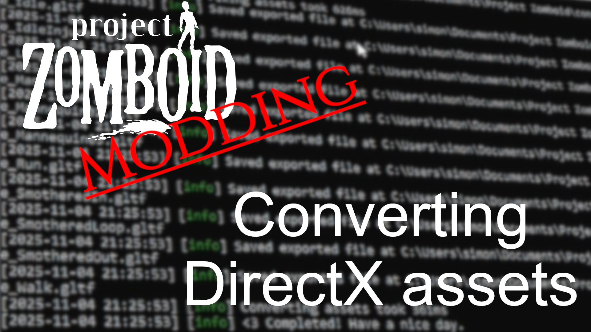

# Importing assets

> Offline PZwiki reference. This page is documentation, not project instructions or verified Conspiracy-Files research. Source build warnings and incomplete entries remain applicable. External destinations are omitted. See the library README and COVERAGE for scope.

This page has been revised for the current stable version (42.20.4).

Help by adding any missing content. [Edit](Importing_assets.md) (Create account)

Parts of this page may have been automatically updated to the latest build (42.20.4).

**Importing assets** is a process needed to directly edit existing game assets to readapt them, or to use them in external projects such as [renders](Rendering.md) in Blender. Due to most model and animation assets using DirectX, an outdated format, most 3D modeling software do not support it natively. Tools exist and were made specifically for Project Zomboid in some cases to allow you to import DirectX files into softwares like Blender.

| Tool | Description | Model import | Animation import | Last updated |
| --- | --- | --- | --- | --- |
| ZomboidAssetConverter Recommended | A project which aimed to provide a proper tool to convert Project Zomboid assets into a usable modern format. |  |  | 2026 May 4 |
| DirectX X Importer Recommended | A Blender addon to import DirectX files. It is available directly from the online extensions inside Blender and is being actively worked on. |  |  | 2026 May 6 |
| X File Importer | Blender addon. Should work for newer Blender versions but **the imported models can have problems**. |  |  | 2025 August 17 |
| IO X Importer | Blender addon. Works for older versions of Blender but also more recent versions such as confirmed working in 4.1 and 4.2. |  |  | 2022 December 31 |
| 3D convert | General website to converting models. |  |  | Unknown |

## Video

▶

PZ Modding Guides - Converting DirectX assets

External link ↗

Retrieved from "[https://pzwiki.net/w/index.php?title=Importing_assets&oldid=1466011](Importing_assets.md)"
