# Debug menu

> Offline PZwiki reference. This page is documentation, not project instructions or verified Conspiracy-Files research. Source build warnings and incomplete entries remain applicable. External destinations are omitted. See the library README and COVERAGE for scope.

This page has been revised for the current stable version (42.20.3).

Help by adding any missing content. [Edit](Debug_menu.md) (Create account)

Parts of this page may have been automatically updated to the latest build (42.20.4).

This article is currently under construction.

Each debug tools will be split into their own page.

If this page has not been updated in a while, please replace this notice with`{{Improve}}`. Last edit was 25/08/2026.

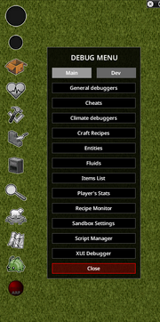

The debug menu in-game

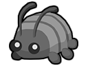

Closed Debug Icon

Open Debug Icon

The **Debug menu** is a menu containing many debug tools which can be opened in [debug mode](Debug_mode.md) via the Plumpa bug icon in the left tools bar. The main is separated into two tabs:

- **Main** - contains mostly generic tools that users may be interested in
- **Dev** - contains mostly developer tools

## Main

### General debuggers

A sub-menu with four additional menus: Game, Blood, Body, Search Mode

#### Game

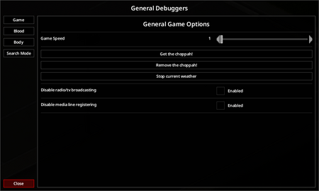

General debuggers Game Menu

This option shows all general game options.

| Option | Description | Variables |
| --- | --- | --- |
| GameSpeed | Adjust the game speed by moving the slider. Clicking the left and right arrows will increase/decrease the game speed by 0.1 increment at a time, or 1.0 if holding the sprint key (LShift by default). This value can range from 1 to 1000, with 0.1 increments. | default=1 / fast-forward=5 / fast-fast-forward=20 / wait=40 |
| Get the choppah! | Spawns the helicopter event. | (button) |
| Remove the choppah! | Stops the helicopter event. | (button) |
| Stop current weather | Stops the current Weather event. | (button) |
| Disable radio/tv broadcasting | Disables radio and television broadcasts. | boolean |
| Disable media line registering |  | boolean |

#### Blood

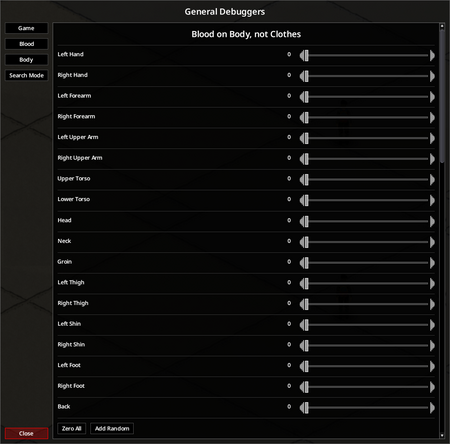

Parts of the body for blood

Change the amount of blood on the body, randomize or zero all body parts.

#### Body

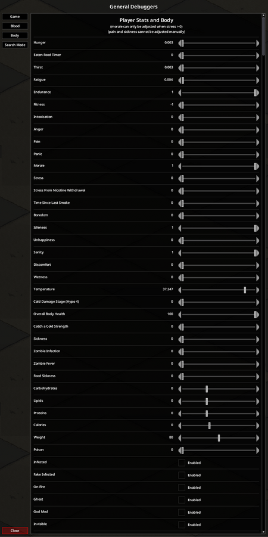

Player's Body and Status Menu

| Option | Description | Variables |
| --- | --- | --- |
| Hunger | Slider that affects the hunger moodle, increases to 1 naturally. | min=0 / max=1 |
| Thirst | Slider that affects the thirst moodle, increases to 1 naturally. | min=0 / max=1 |
| Fatigue | Slider that affects the tired moodle, increases to 1 naturally. | min=0 / max=1 |
| Endurance | Slider that affects the endurance moodle, increases to 1 naturally. | min=0 / max=1 |
| Fitness | Slider that affects the fitness skill. This is a dynamic skill that will increase and decrease depending on the player's actions in 0.2 increments (per level). | min=-1 / max=1 |
| Drunkenness | Slider that affects the drunk moodle, decreases to 0 naturally. A full bottle of alcohol adds 0.41. A higher value will increase the fatigue moodle at a much higher rate. | min=0 / max=100 |
| Anger | Slider that affects the angry moodle, decreases to 0 naturally. | min=0 / max=1 |
| Fear | Slider that affects an unknown naturally static value. | min=0 / max=1 |
| Pain | Slider that affects the pain moodle, decreases to 0 naturally. Cannot be adjusted manually | min=0 / max=100 |
| Panic | Slider that affects the panic moodle, decreases to 0 naturally. | min=0 / max=100 |
| Morale | Slider that decreases to 0 naturally when stress is above 0.5. When stress is below 0.5, morale will instantly become 1.0. | min=0 / max=1 |
| Stress | Slider that affects the stress moodle, decreases to 0 naturally. | min=0 / max=1 |
| StressFromCigarettes | Slider that affects the stress moodle from cigarettes. | min=0 / max=0.51 |
| TimeSinceLastSmoke | Slider that affects time since last cigarette was smoked. | min=0 / max=10 |
| BoredomLevel | Slider that affects the bored moodle, decreases to 0 naturally. | min=0 / max=100 |
| UnhappynessLevel (sic!) | Slider that affects the unhapiness. | min=0 / max=100 |
| Sanity | Slider that can be adjusted when the BoredomLevel is above 50. | min=0 / max=1 |
| Wetness | Slider that affects the wet moodle, decreases to 0 naturally. | min=0 / max=100 |
| Temperature | Slider that affects the player's body temperature, affecting the hyperthermia and hypothermia moodles, decreases to 0 naturally. | min=20 / max=40 |
| ColdDamageStage (hypo 4) | Slider that determines how much damage the player will take when the hypoermia moodle is at level 4. | min=0 / max=1 |
| OverallBodyHealth | Slider that affects the player's overall health. | min=0 / max=100 |
| CatchAColdStrength | Slider that affects the cold moodles, increaes to 100 naturally when above 1.0. | min=0 / max=100 |
| Sickness | Slider that determines the sick moodle. Adjusts with InfectionLevel and FakeInfectionLevel Cannot be adjusted manually | min=0 / max=1 |
| InfectionLevel | Slider that affects the player's progress towards zombification, increasing rate of damage taken. | min=0 / max=100 |
| FakeInfectionLevel | Slider that affects the player's sickness, naturally occurs with the hypochondriac trait. | min=0 / max=100 |
| FoodSicknessLevel | Slider that affects the player's sickness, naturally occurs after eating bad food. | min=0 / max=100 |
| Calories | Slider that affects the player's calories. | min=-2200 / max=3700 |
| Weight | Slider that affects the player's weight. | min=35 / max=130 |
| IsInfected | Checkbox that determines whether the player has the zombie infection. | boolean |
| IsFakeInfected | Checkbox that determines whether the player should have zombie infection symptoms without being infected. | boolean |
| IsOnFire | Checkbox that determines whether the player is on fire. | boolean |
| Ghost | Checkbox that determines whether the zombies can see the player, and zombies can be seen regardless of visibility. | boolean |
| God Mode | Checkbox that determines whether the player is in god mode. Gives the player invincibility, i.e., takes no damage, max hunger, thirst, etc. | boolean |
| Invisible | Checkbox that determines whether the player is in invisible. | boolean |

#### SearchMode

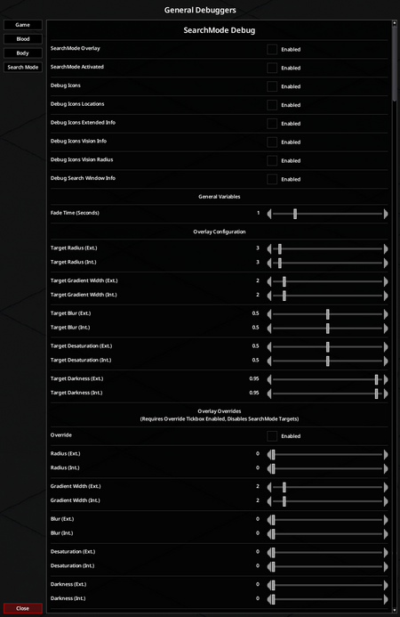

Debug Search Mode Menu

| Option | Description | Variables |
| --- | --- | --- |
| SearchMode Overlay | Activates the grey SearchMode overlay | boolean |
| SearchMode Activated | Activates Search Mode | boolean |
| Debug Icons | Display a text overlay for every foraging item on the ground. | boolean |
| Debug Icons Locations | Display direction arrows to foraging items | boolean |
| Debug Icons Extended Info | Display additional info for foraging items | boolean |
| Debug Icons Vision Info | Display Vision info | boolean |
| Debug Icons Vision Radius | Display visibility radius around foraging items | boolean |
| Debug Search Window Info | Display debug info in Search Mode window | boolean |
| Fade Time (Seconds) |  | min 0 / max 5 |
| Target Radius (Exterior) |  | min / max |
| Target Radius (Interior) |  | min / max |
| Target Gradient Width (Exterior) |  | min / max |
| Target Gradient Width (Interior) |  | min / max |
| Target Blur (Exterior) |  | min / max |

### Cheats

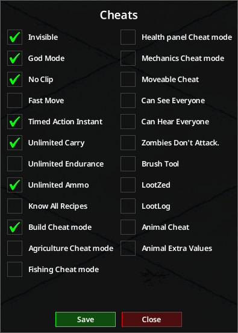

In game Debug Cheats Menu

| Option | Description | Variables |
| --- | --- | --- |
| Invisible | Checkbox that makes you invisible to zombies and players. | boolean |
| God Mode | Checkbox that makes you immune to all damage, environmental effects, and removes all status effects. | boolean |
| No Clip | Checkbox lets you move thru walls and collision iles. | boolean |
| Fast Move | Checkbox that makes you change vertical position instantly by pressing page up or down. | boolean |
| Timed Action Instant | Checkbox that determines whether your actions are done almost instantly. *NOTE: Not all actions do support this function* | boolean |
| Unlimited Carry | Checkbox that determines whether you can carry unlimited amount of items. | boolean |
| Unlimited Endurance | Checkbox that determines whether you can carry unlimited amount of [[endurance]]. | boolean |
| Unlimited Ammo | Checkbox that determines whether you have unlimited ammo. | boolean |
| Know All Recipes | Checkbox that determines whether you know all crafting and building recipes. | boolean |
| Build Cheat mode | Build anything without materials. | boolean |
| Agriculture Cheat mode | Enable debug menu for crop Skill. | boolean |
| Fishing Cheat mode | Enable cheat for Fishing. | boolean |
| Health panel Cheat mode | Get exact health statistics on the Health screen, and cure or create injuries. | boolean |
| Mechanics Cheat mode | Enable cheats related to Vehicle maintenance. | boolean |
| Moveable Cheat | Lets you move anything Moveable object regardless of tools or skills. | boolean |
| Can See Everyone | Can see all players on the map and in the world. | boolean |
| Can Hear Everyone | Can hear all players in the voice chat. | boolean |
| Zombies Don't Attack. | Zombies do not attack you. | boolean |
| Brush Tool | Place any tile that you want. | boolean |
| LootZed | Show distribution. | boolean |
| LootLog | Output all loot spawn in console.txt | boolean |
| Animal Cheat | Enable cheats for animals. | boolean |
| Animal Extra Values | Show extra values for animal testing. | boolean |

### Climate debuggers

This article may be outdated.

Editors are encouraged to update this article with new information. [Edit](Debug_menu.md) (Create account)

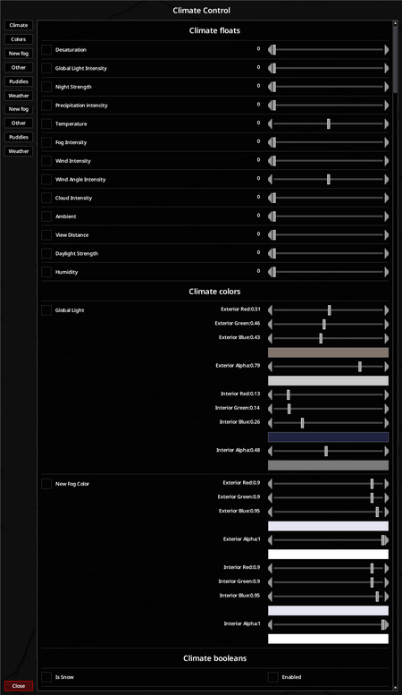

The climate control panel

#### FX panel

This is opened by selecting "Other debuggers", then "WeatherFX Panel". Here you can play around with various values such as fog intensity, precipitation levels and precipitation type. Please note that to play around with these you will need to disable the ‘Climate’ manager or the simulated daily climate will overrule your changes.

Please also note that fog enabled through this method is for testing fog masking around buildings, and won’t look as good/varied as the fog generated by the virtual climate system – as it won’t take into account color or desaturation.

#### Climate view panels

The debug climate control and climate values panels can be accessed by selecting "Other debuggers", then "Weather plotter" and "Daily values" respectively. These panels provide a stockmarket-type graph of the current/recent weather over hours (H1), days (D1) and months (M1)

To see what values are running under the bonnet use the legend/panel on the right, and values turned on will be green. The climate values panel, meanwhile, displays additional info about seasons, cloud cover, etc.

These panels are overall for the provision of information, but that said when you toggle "airMass" on, when it crosses the 0 middle line you will see weather generated when airmass switches from hot/cold.

#### Thunder panel

This panel can be opened by selecting "Other debuggers", then "Thunderbug", but is only useful if there is a storm active. A geographical indication of where the storm is over the PZ map can be seen, as well as lightning locations.

### Craft Recipes

This article may need more content.

Editors are encouraged to add new material to the page while expanding upon current topics. [Edit](Debug_menu.md) (Create account)

### Entities

This article may need more content.

Editors are encouraged to add new material to the page while expanding upon current topics. [Edit](Debug_menu.md) (Create account)

### Fluids

This article may need more content.

Editors are encouraged to add new material to the page while expanding upon current topics. [Edit](Debug_menu.md) (Create account)

### Items List

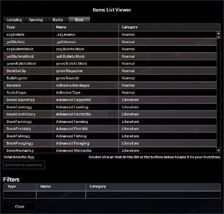

Allows the spawning of any item in-game to the player's inventory.

### Player's Stats

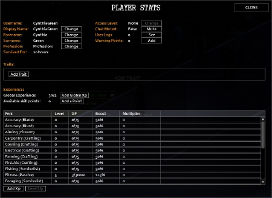

Access to player traits and skills interface.

### Recipe Monitor

This article may need more content.

Editors are encouraged to add new material to the page while expanding upon current topics. [Edit](Debug_menu.md) (Create account)

### Sandbox Settings

This article may need more content.

Editors are encouraged to add new material to the page while expanding upon current topics. [Edit](Debug_menu.md) (Create account)

### Script Manager

This article may need more content.

Editors are encouraged to add new material to the page while expanding upon current topics. [Edit](Debug_menu.md) (Create account)

### XUI Debugger

This article may need more content.

Editors are encouraged to add new material to the page while expanding upon current topics. [Edit](Debug_menu.md) (Create account)

## Dev

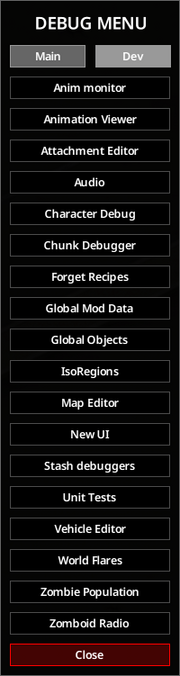

The debug Main menu

The Developer advanced tab of the debug menu.

### Anim monitor

This article may need more content.

Editors are encouraged to add new material to the page while expanding upon current topics. [Edit](Debug_menu.md) (Create account)

### Animation Viewer

Main article: Animation viewer

Allows to view game's animations using a man wearing only white underwear model or the various animals.

### Attachment Editor

Main article: [Attachment editor](../assets-and-animation/Attachment_editor.md)

Gives access to multiple tools to modify and adjust 3D model positions based on various bone attachment points on the character model and adjust them to be properly rotated, translated, or scaled per attachment bone.

### Audio

This article may need more content.

Editors are encouraged to add new material to the page while expanding upon current topics. [Edit](Debug_menu.md) (Create account)

### Character Debugger

This article may need more content.

Editors are encouraged to add new material to the page while expanding upon current topics. [Edit](Debug_menu.md) (Create account)

### Chunk Debugger

This article may need more content.

Editors are encouraged to add new material to the page while expanding upon current topics. [Edit](Debug_menu.md) (Create account)

### Forget Recipes

This article may need more content.

Editors are encouraged to add new material to the page while expanding upon current topics. [Edit](Debug_menu.md) (Create account)

### Global Mod Data

This article may need more content.

Editors are encouraged to add new material to the page while expanding upon current topics. [Edit](Debug_menu.md) (Create account)

### Global Objects

This article may need more content.

Editors are encouraged to add new material to the page while expanding upon current topics. [Edit](Debug_menu.md) (Create account)

### isoRegions

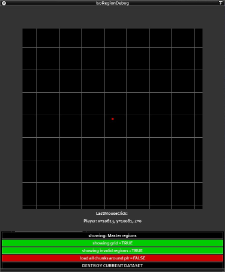

The IsoRegions panel

This will display all buildings (including player-made) and can be used to detect when buildings are fully closed off from the PZ map – and as such will allow fog/precipitation to surround structures, but not appear within them. PLEASE NOTE: this is a real performance hog, so may well slow down the game when turned on.

### Map Editor

This article may need more content.

Editors are encouraged to add new material to the page while expanding upon current topics. [Edit](Debug_menu.md) (Create account)

### New UI

This article may need more content.

Editors are encouraged to add new material to the page while expanding upon current topics. [Edit](Debug_menu.md) (Create account)

### Stash debuggers

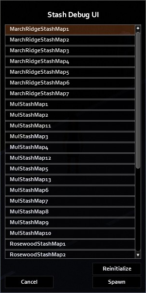

Allows the debugging of "annotated map" house stashes.

### Unit Tests

This article may need more content.

Editors are encouraged to add new material to the page while expanding upon current topics. [Edit](Debug_menu.md) (Create account)

### Vehicle Editor

This article may need more content.

Editors are encouraged to add new material to the page while expanding upon current topics. [Edit](Debug_menu.md) (Create account)

Allows for editing in-game vehicles. After opening an empty scenery with vehicle model is shown, camera can be adjusted for views: Front, Rear, Side, From above, From below. On left side an menu for editing vehicle is given.

### World Flares

This article may need more content.

Editors are encouraged to add new material to the page while expanding upon current topics. [Edit](Debug_menu.md) (Create account)

### Zombie Population

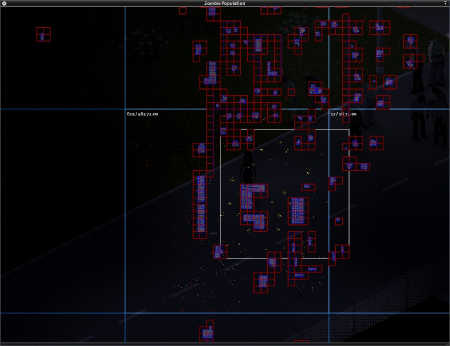

Shows all zombies as coloured squares on a map. An yellow square means an active zombie and red inactive one, green square is the player. This window also shows white square outline as the player cell affecting the zomboids' AI, huge white cells affecting zombies, a number of active and inactive zombies in each cell shown in top left corner of cell with zomboids, red cells which shows chunks that contain any buildings in, area of buildings (or just floor tiles, needs more testing), borders of each room of a building and blue shapes which are any furniture or building parts such as walls - both map and player-made. Opening this window for the first time since start-up centers on player, but unfortunately does not follow player, instead view stays in place. Holding RMB (Right Mouse Button, using LMB will move whole window instead) in area of the zombie population window and moving mouse allows to move the view, you can also use scroll to zoom in/out the view.

### Zomboid Radio

This article may need more content.

Editors are encouraged to add new material to the page while expanding upon current topics. [Edit](Debug_menu.md) (Create account)

## See also

- Imgui
- [Debug scenario](Debug_scenario.md)

Retrieved from "[https://pzwiki.net/w/index.php?title=Debug_menu&oldid=1460267](Debug_menu.md)"
