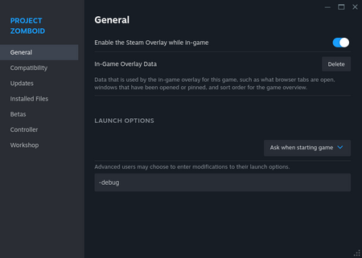

# Debug mode

> Offline PZwiki reference. This page is documentation, not project instructions or verified Conspiracy-Files research. Source build warnings and incomplete entries remain applicable. External destinations are omitted. See the library README and COVERAGE for scope.

This page has been revised for the current stable version (42.20.4).

Help by adding any missing content. [Edit](Debug_mode.md) (Create account)

Parts of this page may have been automatically updated to the latest build (42.20.4).

This article is currently under construction.

It is in the process of an expansion or major restructuring. You are welcome to assist in its construction by editing it. [Edit](Debug_mode.md) (Create account)

If this page has not been updated in a while, please replace this notice with`{{Improve}}`. Last edit was 30/08/2026.

Entering`-debug` in the Steam's launch options

**Debug mode** is a modified game state in Project Zomboid. In this mode, the player has access to multiple developer tools which can spawn items, enable various cheats, teleport the player to any destination, and way more.

To enable debug mode, add`-debug` to the game's [startup parameters](Startup_parameters.md) prior to booting the game. Various debugging tools will then be available in the game:

- [Debug scenarios](Debug_scenario.md)
- [Debug menu](Debug_menu.md)
- [Lua debugger](Lua_debugger.md)
- [Debug contextual menus](Debug_mode.md#Contextual_menus)
- And more...

## Activating debug mode

To activate debug mode, the usual way is to add`-debug` to the game's [startup parameters](Startup_parameters.md) in Steam:

- Right-click the game in the Steam Library, a menu will pop up.
- Click Properties. A new modal window will appear.
- By default the 'general' tab in the modal window should be opened, but if not, click it.
- Look under Launch Options → Selected Launch Option.
- Add`-debug` to the field.
- Close the window and launch the game.
- You should notice the menu has some extra elements, notably with the Reset Lua button on the bottom right, and the [Debug scenarios](Debug_scenario.md) available in the middle of the menu.

For a more in-depth guide, you will want to read [Startup parameters](Startup_parameters.md#Usage).

## Function tools

The **function tools** are mostly tools and editors which can be accessed using Fn keys. Below is a table with the editor tools associated to their respective keybinds.

| Keybind | Editor tool |
| --- | --- |
| F2 | In-game map editor |
| F3 | Unloads the character models. Your player shadow is still here and zombies will become shadow zombies. |
| F6 | Animation states and variables UI. |
| F7 | Vehicle editor |
| ⇧ Shift + F7 | [Attachment editor](../assets-and-animation/Attachment_editor.md) |
| F8 | Annotated map editor |
| F9 | [Seam editor](../mapping/Seam_editor.md) |
| ⇧ Shift + F9 | [Depthmap editor](../mapping/Depthmap_editor.md) |
| F11 | [Lua debugger](Lua_debugger.md) |

## Contextual menus

There are new contextual menus available in the debug mode available from right click menu. Debug related right click menu's and information are marked with the green bug icon.

### Main

This article may need more content.

Editors are encouraged to add new material to the page while expanding upon current topics. [Edit](Debug_mode.md) (Create account)

### UIs

This article may need more content.

Editors are encouraged to add new material to the page while expanding upon current topics. [Edit](Debug_mode.md) (Create account)

### Objects

Available only when clicking some tiles.

This article may need more content.

Editors are encouraged to add new material to the page while expanding upon current topics. [Edit](Debug_mode.md) (Create account)

### Zombies

This article may need more content.

Editors are encouraged to add new material to the page while expanding upon current topics. [Edit](Debug_mode.md) (Create account)

### Brush Tool Manager

This article may need more content.

Editors are encouraged to add new material to the page while expanding upon current topics. [Edit](Debug_mode.md) (Create account)

### Copy tile

This option allows to copy and then paste a tile that is right clicked. There is a submenu to select tile, handy if multiple tiles are present in the spot. A tile ID is also shown.

### Destroy tile

This option allows to destroy a tile that is right clicked, similar to the sledgehammer, except it works on any kind of tiles. There is a submenu to select tile, handy if multiple tiles are present in the spot. A tile ID is also shown.

### Item

#### Edit Item

This article may need more content.

Editors are encouraged to add new material to the page while expanding upon current topics. [Edit](Debug_mode.md) (Create account)

#### Destroy Item

Allows to destroy item permanently, similar to trash cans.

## See also

- Error
- Imgui
- [Debug scenario](Debug_scenario.md)
- [Debug menu](Debug_menu.md)

Retrieved from "[https://pzwiki.net/w/index.php?title=Debug_mode&oldid=1475219](Debug_mode.md)"
