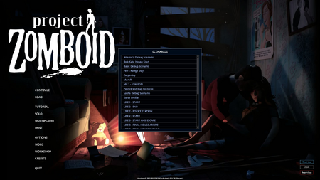

# Debug scenario

> Offline PZwiki reference. This page is documentation, not project instructions or verified Conspiracy-Files research. Source build warnings and incomplete entries remain applicable. External destinations are omitted. See the library README and COVERAGE for scope.

This page has been revised for the current stable version (42.20.3).

Help by adding any missing content. [Edit](Debug_scenario.md) (Create account)

Parts of this page may have been automatically updated to the latest build (42.20.4).

UI of the debug scenario list

**Debug scenarios** are a list of predefined save states which can be launched from the main menu when in [debug mode](Debug_mode.md). Each scenarios have a set of conditions and settings which can be used to quickly setup the save state. Every scenarios are stored inside the global table`debugScenarios` (client side only), defined from the Lua files stored inside`media/lua/client/DebugUIs/Scenarios`, which means you can create your own debug scenarios.

## Available scenarios

This article may need more content.

A description of what each scenario does and what it is used for would be useful.

Editors are encouraged to add new material to the page while expanding upon current topics. [Edit](Debug_scenario.md) (Create account)

- Aiteron's Debug Scenario
- Basic Debug Scenario
- Bob Kate House Start
- Carpentry
- Fen's Range Day
- LIFE 1 - START
- LIFE 2 - END
- LIFE 2 - POLICE STATION
- LIFE 2 - START
- LIFE 3 - FINAL HOUSE ARRIVE
- LIFE 3 - FINAL HOUSE SURVIVE
- LIFE 3 - FISHING
- LIFE 3 - GARAGE
- LIFE 3 - ROADTRIP
- LIFE 3 - START AND ESCAPE
- MP 1 - STADION
- MarkR
- Patrick's Debug Scenario
- Sasha Debug Scenario
- Steve Profile
- Swiming pool
- The Mall
- Turbo Green Test
- Turbo Save Test
- Water
- Water2
- Water5
- Water6
- WaterDelta
- WaterDelta2
- Whole Lotta Weapon

## Debug scenario parameters

This article may need more content.

Definitions of the parameters used in the debug scenarios would be useful. Preferably should be done in the PZ Lua Stubdata.

Editors are encouraged to add new material to the page while expanding upon current topics. [Edit](Debug_scenario.md) (Create account)

## See also

- Imgui
- [Debug mode](Debug_mode.md)

Retrieved from "[https://pzwiki.net/w/index.php?title=Debug_scenario&oldid=1460571](Debug_scenario.md)"
