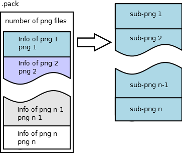

# File formats

> Offline PZwiki reference. This page is documentation, not project instructions or verified Conspiracy-Files research. Source build warnings and incomplete entries remain applicable. External destinations are omitted. See the library README and COVERAGE for scope.

This page was last updated for an older version of the current build (42.14.0).

The current stable version is 42.20.4, so information on this page may be inaccurate.

Help get this page updated by adding any missing content. [Edit](File_formats.md) (Create account)


This article is about file formats used in Project Zomboid. For the file structure of the game, see [Game files](Game_files.md).

Project Zomboid uses different **file formats** for within its files to use models, textures, images but also to write codes and scripts. This page will list the different formats used in the game and their specificity.

<a id="Programming"></a>

## Programming

<a id="Lua"></a>

### Lua

Main article: [Lua (language)](../lua-api/Lua_language.md)

Project Zomboid allows modders to program functionalities via a Java implementation of **Lua** called Kahlua (see [Lua (API)](../lua-api/Lua_API.md) which enables Lua scripts to run within Java programs. It bases itself on Lua 5.1 with a few differences and basically allows the use of exposed Java class and methods.

<a id="XML"></a>

### XML

This format is mostly used for [clothing](../assets-and-animation/Creating_a_clothing_mod.md) items and defining animations by using AnimSets.

<a id="Text_files"></a>

### Text files

The`.txt` format is commonly used, notably for [Scripts](../scripts/Scripts.md). Different files may require different types of formating inside the text file to be usable.

[Scripts](../scripts/Scripts.md) and [Translation](../translations/Translation.md) can be written easier by using [Zed Script](Visual_Studio_Code.md), an addon developed for [Visual Studio Code](Visual_Studio_Code.md).

<a id="Texture_and_modeling_formats"></a>

## Texture and modeling formats

Texture formats are used either to create items or to create the world. The formats are different for each type of texture, and the formats are outlined below. The model formats are used to create the 3D models to implement in the game, and are also outlined below.

<a id="Image_formats"></a>

### Image formats

Source marks this entry as incomplete.

The game uses 8bit PNGs (16bits is not accepted) for its textures and images, so you'll be dealing with those. A lot of the icons and some other images are not stored inside classic image textures but in [.pack files](File_formats.md).

<a id="Modeling_and_animation_formats"></a>

### Modeling and animation formats

Main articles: [Animation](../assets-and-animation/Animation.md#File_types), [Modeling](../assets-and-animation/Modeling.md#File_types)

The model formats which can be used are :

- DirectX (`.x`) Not recommended
- Filmbox FBX (`.fbx`)
- Graphics Library Transmission Format (`.glb`)

<a id="Importing_assets"></a>

#### Importing assets

Main article: [Importing assets](../assets-and-animation/Importing_assets.md)

Due to DirectX being a mostly outdated format, most 3D modeling software do not support it natively. However, there are tools and addons that allow you to import DirectX files into software like Blender or other 3D modeling software.

<a id="TexturePacks_.28.pack_files.29"></a>

### TexturePacks (.pack files)

Pack files are used to store image files in a very efficient way. The format requires you to use the Pack Viewer to be able to open the format.

<a id="Technicality"></a>

#### Technicality

These are the files located in`/media/texturepacks/`, Characters.pack, Tiles.pack, and UI.pack. Reading them is simple, the implementation will probably be 20 or 30 lines long.

Each file contains a number of 'pages' which are basically PNG images with an associated array of offset coordinates, widths, heights, and names, that are specify smaller rectangles on the PNG file that are to be copied into their own individual images. This is called a texture atlas and is a common practice in game development.

The integers in this file are little-endian, i.e. the least significant bytes come first. This is the default on my system, so no special stream reader was required, but you may have to use/write a little-endian reader if your system defaults to big-endian.

The first four bytes of the file specify a 32-bit integer, which tells you how many pages (atlas images) are located within. Every byte after this belongs to a page, and follows the structure outlined below.


```text
    int32, length of the char[] to follow
    char[], name of this texture page
    int32, number of entries in the page
    int32, represents a boolean value, true if non-zero. Titled 'mask' in the code, honestly not sure what it does. Not necessary for extraction purposes.<br>
    [entries - outlined below]<br>
    byte[], PNG data, byte[] { 49, 45, 4E, 44, AE, 42, 60, 82, EF, BE, AD, DE } marks the end of the file, they don't have to be included in the PNG's byte array.
    The next page starts immediately after the byte pattern specified above.
```


The first entry comes immediately after the`mask` int32, there are as many entries as determined by the int preceding`mask`. You'll probably want to create a struct/class to hold the info contained in each entry, though you could do with indexed arrays as well. Each entry contains the info you need to copy the subimages out of the PNG data, and some information irrelevant to that as well. The format is most easily demonstrated with code.


```text
    int32, length of the char[] to follow
    char[], name of this specific subtexture
    int32, x-coord of the upper left corner of this subimage on the subtexture
    int32, y-coord of the upper left corner of this subimage on the subtexture
    int32, width of the subtexture
    int32, height of the subtexture
    int32, number of pixels of transparent padding to the left of the image (i.e., x offset) note: This is merely a guess, this could be used for something else.
    int32, number of pixels of transparent padding on top of the image (i.e., y offset) note: This is a guess.
    int32, actual width of the subtexture, after including padding. Sometimes width + x-offset is less than this value, in which case padding is required on the right as well. note: This is a guess.
    int32, actual height of the subtexture, after including padding. Sometimes height + y-offset is less than this value, in which case padding is required at the bottom as well. note: This is a guess.
```


In simpler terms, the first int32 of the entry contains the length of the char array defining its name that follows it. The next eight int32s fill the values { x, y, w, h, ox, oy, fx, fy }. After the last int32 of the subtexture's entry, if we're not on the last subtexture, the following int32 will define the length of the char array defining that subtexture's name and so on.

(x, y) = offset within the entire PNG the image begins at
(w, h) = size of the image on the atlas
(ox, oy) = offset within the (fx, fy) bounds to put the upper left corner of the image we got from (x, y)
(fx, fy) = full desired size of the images, for most inventory images this is 32x32

For example, the Apple inventory item entry on the page 'ninventory0' has the following values:`x = 184, y = 274, w = 28, h = 32, ox = 3, oy = 0, fx = 32, fy = 32;`

So to get this image, we'd load the PNG data following these entries into memory, use some method to cut a 28x32 subtexture out of the PNG at (184, 274), and then write those pixels into a 32x32 image beginning at (3, 0).



<a id="Icon_files"></a>

### Icon files

Icon files are used in [item (scripts)](../scripts/item_scripts.md) to define the icon of an item appearing in the inventory. Vanilla icons are most of the time located in a texture pack:


```text
ProjectZomboid/
└── media/
    └── texturepacks/
        └── UI2.pack
```


For mods they should be put inside`/media/textures`. However your texture file needs to have a specific naming due to the way the game searches for the icon files. This only applies to icons used in [item (scripts)](../scripts/item_scripts.md).

Take the example of this modded script and icon:


```text
module Base
{
    ...
    item MyItem
	{
        ...
		Icon = MyItemIcon, ------ here is the icon
        ...
	}
    ...
}
```


The icon file won't be named`MyItemIcon.png`. The game will look for the icon in the texture pack by having the icon file named`item_MyItemIcon` or it will look inside the folder`media/textures` for it by adding`item_` in front of the icon name.

Putting the icon in a subfolder inside`media/textures` will not work because it finds the icon by doing`media/textures/item_<icon name>.png`. You can however still put the icon in a subfolder by naming it:


```text
module Base
{
    ...
    item MyItem
	{
        ...
		Icon = mySubFolder/MyItemIcon, ------ here is the icon with the subfolder
        ...
	}
    ...
}
```


As long as your file has the following path:


```text
ProjectZomboid/
└── media/
    └── textures/
        └── item_mySubFolder/
            └── MyItemIcon.png
```


<a id="Video_format"></a>

### Video format

Source marks this entry as incomplete.

Videos in the game use the`.bik` format. Currently they can only be installed manually.

<a id="Map_formats"></a>

## Map formats

<a id="map_sand.bin"></a>

### map_sand.bin

Simple big-endian BinaryReader override written in C#.

A simple contiguous array of big-endian 32-bit integers. On loading, each integer is stored in a specific global option variable used to control things like zombie attributes and game speed, when the power will go out, etc. All the options you can set at the creation of a Sandbox game. Useful for tweaking options after you've already created your game.

Note: If the world version is < 5 (world version is read in as a big-endian 32-bit integer from **map_ver.bin** the same way these are), you have to leave out Temperature and Rain when reading in variables.


```text
    <font color="blue">int</font> Zombies, Distribution, Survivors, Speed, DayLength, StartMonth, StartTime, WaterShut, ElecShut, Loot, Temperature, Rain;
    <font color="blue">static class ZombieStats</font>
    {
        <font color="blue">static int</font> Speed, Strength, Toughness, Transmission, Mortality, Reanimate, Cognition, Memory, Decomposition, Sight, Hearing, Smell;
    }<br>
    BigEndianBinaryReader br; <font color="#008000">// implementation left out for brevity. anything that can read four bytes in big-endian order from a file works.</font><br>
    Zombies = br.ReadInt32();
    Distribution = br.ReadInt32();
    . . .
    Rain = br.ReadInt32();<br>
    ZombieStats.Speed = br.ReadInt32();
    . . .
    ZombieStats.Smell = br.ReadInt32();
    <font color="#008000">// order is essential, exactly as listed above in the int declarations</font>
```


If any new Sandbox options are added in you'll have to check /zombie/SandboxOptions.class (decompile it with Java Decompiler) and look at the load() function.

Example file contents:


```text
    00 00 00 03 | 00 00 00 01 | 00 00 00 01 | 00 00 00 03
    00 00 00 05 | 00 00 00 07 | 00 00 00 01 | 00 00 00 05
    etc., total of six lines of this length
```


<a id=".lotheader_files"></a>

### .lotheader files

These files contain information relevant to each .lotpack file in /media/maps/[map name]/. They are found in the same directory at .lotpack files and have the same naming format as well. Each`world_[int]_[int].lotpack` file has a corresponding`[int]_[int].lotheader` file that goes with it. The variables`wX` and`wY` denote world coordinates and represent the [int]_[int] part of the file name. They will be used as such to represent these in the format code below. All integers are little-endian.

I feel these aren't very practical explanations of the formats, and so I'm linking to a GitHub gist that contains some classes and methods, written in C#, that can read .lotheader files. They don't actually do anything with the data, however.

GitHub gist displaying .lotheader reading.


```text
    int32, .lotheader format version, zero as of build 12.
    int32, number of tiles cached, following this.
    string[], delimited by 0x0A, variable length and no length specifying prefixes, so you'll have to read byte by byte for each one
    byte, empty space, has no purpose other than to be skipped. The seek position of the stream must advance one byte after reading all the strings before this.
    int32, width of this lot
    int32, height of this lot
    int32, number of (vertical) levels on this lot
    int32, number of rooms on this lot
    [room array here, outlined in following code segment]
    int32, number of buildings on this lot
    [building format, iterate over it the number of times specified above:]
        int32, number of rooms
        int32[], room indexes, corresponds with each room read above from 0 to the total number of rooms - 1. As long as the int32 before this indicates.
    [end of building format]
    byte[30][30], this reads until the end of the file. It is a 30x30 two-dimensional jagged array of bytes, each indicating the density of zombies within the specific area they denote
```


Room format, iterate over it the number of times indicated by the`int32` representing the number of rooms:


```text
    string, name of the room, same as in the above code segment. 0x0A delimited and must be read byte by byte until you reach 0x0A.
    int32, level the room is on, i.e floor
    int32, count of the rectangles in the room
    [rectangle format, iterate over it:]
        int32, x value of this rectangle, (wX * 300) is added to the value during assignment
        int32, y value of this rectangle, (wY * 300) is added to the value during assignment
        int32, width of the rectangle
        int32, height of the rectangle
    [end of rectangle format]
    int32, number of objects in this room
    [object format, iterate:]
        int32, type of object
        int32, x value of object, (wX * 300) added during assignment
        int32, y value of object, (wY * 300) added during assignment
    [end of object format]
```


Retrieved from "[https://pzwiki.net/w/index.php?title=File_formats&oldid=1460745](File_formats.md)"
