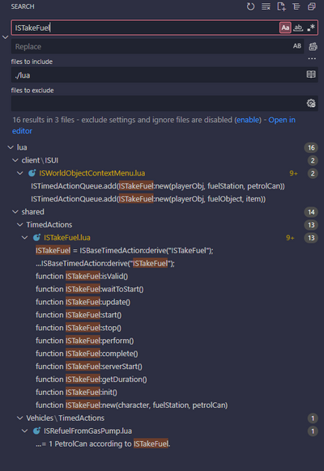

# Game files

> Offline PZwiki reference. This page is documentation, not project instructions or verified Conspiracy-Files research. Source build warnings and incomplete entries remain applicable. External destinations are omitted. See the library README and COVERAGE for scope.

This page has been revised for the current stable version (42.20.4).

Help by adding any missing content. [Edit](Game_files.md) (Create account)

Parts of this page may have been automatically updated to the latest build (42.20.4).


This article is about game files of Project Zomboid. For modding structure of Project Zomboid, see [Mod structure](Mod_structure.md). For explanations of file formats, see [File formats](File_formats.md).

This page describes the **game files** of Project Zomboid and how to access them. This page will list where different types of files can be found.

<a id="Accessing_the_game_files"></a>

## Accessing the game files

The game folder holds most of the game code, files, textures, maps, models etc. Accessing the game files of Project Zomboid can be easily achieved through Steam:

- Open your Steam game library
- Right click on Project Zomboid > Manage > Browse local files
- Alternatively you can rick click Project Zomboid > Properties > Installed files > Browse

This should open a folder named`ProjectZomboid/` with a similar path to this:


```text
📁 Steam
    📁 steamapps
        📁 common
            📁 ProjectZomboid
                ...
```


Also check this video which explains two different methods of finding the files.

<a id="Cache_folder"></a>

## Cache folder

The cache folder (often referred to as the main Template:Path directory) contains save files, player settings, local mods, and log outputs. It doesn't get deleted when you uninstall the game, holding all your configurations.

Deleting this folder can sometimes fix some game issues, however this will delete your game settings and saves, which you can backup before doing so.

You can change your cache folder with the [startup parameter](Startup_parameters.md)`-cachedir=<String Path>`. If the folder doesn't exist, the game will create it.

<a id="Windows"></a>

### Windows

To access the folder in Windows, simply use the environment variable`%UserProfile%` in the file explorer. The cache folder will be located at:


```text
📁 %UserProfile%
    📁 Zomboid
        ...
```


<a id="Linux"></a>

### Linux

Project Zomboid is Linux native, as such the cache folder will be located in the home directory of the user:


```text
📁 ~
    📁 Zomboid
        ...
```


If for some reasons you are using the Proton compatibility layer to run the game, the cache folder will be located here:


```text
📁 Steam
    📁 steamapps
        📁 compatdata
            📁 108600
                📁 pfx
                    📁 drive_c
                        📁 users
                            📁 steamuser
                                📁 Zomboid
                                    ...
```


<a id="Console_files"></a>

### Console files

The console files will be located in the cache folder, see Console.

<a id="Media_folder"></a>

## Media folder

Most of the files which you'll be interested in when modding will be located in:


```text
📁 Steam
    📁 steamapps
        📁 common
            📁 ProjectZomboid
                📁 media
                    ...
```


<a id="Java_files"></a>

## Java files

The Java files of the game were previously located in the`zombie` folder but are not stored in the game file folder next`media` in the file`projectzomboid.jar`. Tools exist to decompile the Java code to make them readable. Below is the path to the jar file:


```text
📁 Steam
    📁 steamapps
        📁 common
            📁 ProjectZomboid
                📄 projectzomboid.jar
```


<a id="Searching_the_game_files"></a>

## Searching the game files

Tools exist to search through the entirety of the game files for specific elements in the game code. Integrated development environment (IDE) are notably the most common ones used by modders since they allow you to search for specific terms inside text files in an entire workspace:

- [Visual Studio Code](Visual_Studio_Code.md) - a free IDE developed by Microsoft. Very easy to use and navigate and a few addons exist to help modding.
- IntelliJ IDEA - a free IDE developed by JetBrains. It is a bit more complex to use than Visual Studio Code but has a lot of features and is very powerful especially to navigate the Java.

Open the entire game folder as a workspace in the IDE of your choice to be able to search through all the files. You can open the`media/` folder or the decompiled code as a workspace to search through all the files.

<a id="Example"></a>

### Example

If you're searching for where something is used in Project Zomboid's code, you can simply use this functionality. For example, let's search for ISTakeFuel in [VSCode](Visual_Studio_Code.md):



<a id="See_also"></a>

## See also

- [Mod structure](Mod_structure.md)
- [workshop.txt](workshop.txt.md)
- [mod.info](mod.info.md)
- [File formats](File_formats.md) - a [section](File_formats.md#Importing_assets) details tools to import the DirectX assets into modern formats.

Retrieved from "[https://pzwiki.net/w/index.php?title=Game_files&oldid=1465629](Game_files.md)"
