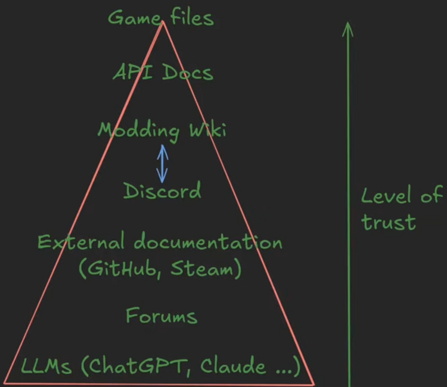
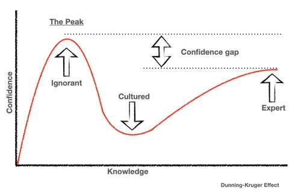

# Getting started with modding

> Offline PZwiki reference. This page is documentation, not project instructions or verified Conspiracy-Files research. Source build warnings and incomplete entries remain applicable. External destinations are omitted. See the library README and COVERAGE for scope.

This page has been revised for the current stable version (42.20.2).

Help by adding any missing content. [Edit](Getting_started_with_modding.md) (Create account)

Parts of this page may have been automatically updated to the latest build (42.20.4).

It can be daunting to navigate the complexities of modding, especially on the Lua aspect when you have no programming experience. A lot is possible and your main limitation is knowing how to achieve things and the best course of actions, which you will learn after practicing more and more. Get used to the environment, learn the various tools available and how modding works, and don't discourage if your first mod doesn't do great or doesn't work too well because you will learn from it.

It is clear from our experience that AI tools will usually bring you more problems than solutions if you blindly trust it (see [#AI in modding](Getting_started_with_modding.md#AI_in_modding)) and you will end up directly going back to square one most of the time. The list below are a few tips to help you get started with modding Project Zomboid:

- **Start Small**: Begin with simple mods and gradually increase complexity as you become more comfortable with the process of making mods.
- **Utilize Resources**: Take advantage of available resources such as the [JavaDocs](../java/JavaDocs.md), PZ API Docs, community forums, and the few tutorials to learn more about the modding practices. Make sure to read the wiki pages of the [modding fields](Modding.md#Modding_fields) you are working with as they will both contain pages of interest and guides and video guides in some cases.
- **Experiment**: Don't be afraid to experiment with code snippets and test them in a controlled environment. This will help you understand how different functions and methods work.
- **Learn from others**: It is likely what you are trying to achieve has already been done or something similar was already done. Look for existing mods that achieve similar goals and study their implementation to reverse engineer the method used and create your own. You can access the files of mods you have downloaded with the method explained in the [mod structure](Mod_structure.md#Online_workshop_folder) page.
- **Ask for Help**: If you're stuck or want feedback on what you're doing, reach out to the [modding community](Modding.md#Communities) for assistance where many experienced modders are willing to help newcomers. Simply ask your questions and be respectful, and you will get some help, some answers or at the very least some guidance.

<a id="How_to_navigate_the_modding_wiki"></a>

## How to navigate the modding wiki

The modding wiki can be overwhelming at first for different reasons. We try to provide a main hub to search for important pages in [Modding](Modding.md), this page also provides important pages to get started. The best way to search for an information are the following steps:

- Use the search bar of the wiki with key words. This can prove inefficient however due to how it works, but even if no pages show up, don't hesitate to search for the key words which will show pages that may be relevant. Searching directly from an internet explorer might even prove more efficient thanks to the wiki pages being indexed by search engines.
- Use the [Modding](Modding.md) page which shows important pages and contains links to the different [modding fields](Modding.md#Modding_fields) documented on the wiki.
- Use the modding category which can be accessed by searching`Category:Modding`, or here: [Category:Modding](../categories/Category_Modding.md). Every modding wiki pages are stored in this category and subcategories linked to it. Some modding fields which have a lot of pages will have their own subcategory.
- Ask in the [modding community](Modding.md#Communities) for help or resources related to your search.

Want to give your feedback on the modding wiki ? You can find a feedback form linked in the navigation bar at the top which appears in every modding pages.

<a id="Sources_of_truth"></a>

## Sources of truth



This is a concept brought up in a Sit-Down Sunday (video section here) where different sources of truth regarding the game API and modding knowledge exist. They are split in categories where the top part of the triangle are more trustworthy than the bottom part, but can sometimes prove harder to read or use.

- The [Game files](Game_files.md) will always be the most up-to-date source of modding information, but they can prove hard or slow to find information for.
- The API documentations ([JavaDocs](../java/JavaDocs.md), [LuaDocs](../lua-api/LuaDocs.md), PZ API Documentation) are usually automatically generated from the latest game files, but they can contain some errors due to parts being manually documented.
- The [Modding](Modding.md) wiki can be updated by anyone, which makes it a source of documentation that can be updated quickly, but yet it can contain errors and outdated information. Thankfully the wiki pages come with a page version template to indicate for which version of the game that page was written for.
- The Discord servers of the [modding community](Modding.md#Communities) are a great place to ask questions and get help, and will usually be answered by experienced modders who already know the game's API, modding practices and are searching for new ways to achieve things. However they can themselves be flawed with errors or outdated information, but can still be classed at the same level as the [Modding](Modding.md) wiki since they are the ones writting those wiki pages.
- External documentations (Steam, GitHub, YouTube, etc.) are usually made by modders but are sources of documentation that can only be updated by the author of those documentations, making them easily outdated the moment that author leaves modding or stops updating their documentation. They can contain useful documentation but need to be verified or lightly trusted.
- The official forums is an archaic source of information that is almost never updated. It contains guides which are easily overshadowed by the other sources of truth.
- LLMs (ChatGPT, Claude...) are fast sources of information but when you get started you should not trust them as they can either base their answers on outdated information or hallucinate information that doesn't exist.

<a id="Video_guides"></a>

## Video guides

Videos made by modders to teach about modding are available. Like mentioned before relevant guides to a subject you are interested in will be linked in the relevant wiki pages. Some of the channels that provide video guides are the following:

- Daddy Dirkie Dirk - a mapper who provides a huge amount of mapping tutorials.
- DystopianOutcasts_Rax
- SimKDT - the author of most of the modding wiki pages that you will find, who provides a lot of video tutorials for generic modding to get started. Sit-Down Sunday videos are notably reuploaded there, which are seminaries from modders to teach about modding and share their knowledge.

<a id="Folder_structure"></a>

## Folder structure

Main article: [Mod structure](Mod_structure.md)

When working on a mod, it is highly advised to follow the guide regarding the [modding structure](Mod_structure.md) first which explains how to setup folders for your mod to be detected in-game. It notably focuses on using the Workshop folder instead of the mods folder inside the cache folder due to its advantages compared to the mods folder.

Individual pages for the [modding fields](Modding.md#Modding_fields) also explain the important folders they use so make sure to check those too.

<a id="Programming_environment"></a>

## Programming environment

[Visual Studio Code](Visual_Studio_Code.md) is the norm for programming Project Zomboid mods thanks to extensions made by the community. The principal extensions are the following:

- [Umbrella](Umbrella_modding.md) - syntax highlight and diagnostics for the [Lua API](../lua-api/Lua_API.md) using [EmmyLua](EmmyLua.md) or [LuaLs](LuaLs.md).
- ZedScripts - provides syntax highlight and diagnostics for the [Scripts](../scripts/Scripts.md).
- [PZ Modding Configs](PZ_Modding_Configs.md) - provides default configurations for [Umbrella](Umbrella_modding.md) and other extensions for JSON, XML and console files highlighting.

IntelliJ IDEA is also another IDE which is often used to parse the [Java](../java/Java.md) files easily after decompiling the game code.

Notepad++ is not recommended as other editors with a bit more if not equal setup provide a better working environment for programming while also having extra tools for Project Zomboid modding. It is especially limited as it can't be used as an IDE to easily navigate a mod project files.

<a id="Image_editing"></a>

## Image editing

No particular software is suggested for image editing, you are free to use softwares you are confortable with. However, here are a few suggestions:

- GIMP - a free and open-source image editor that is powerful and versatile.
- Photoshop - a professional image editing software with advanced features but paid.
- Krita - a free and open-source digital painting software that is great for illustrations and concept art.
- Substance Painter by Adobe - a paid and costly software that is specialized in texturing 3D models.

<a id="Modeling_and_animating"></a>

## Modeling and animating

Same as for editing images, no particular software is suggested for [modeling](../assets-and-animation/Modeling.md) and [animating](../assets-and-animation/Animation.md), you are free to use softwares you comfortable with. However, we suggest Blender which is a powerful and free open-source 3D modeling software used by the majority of the community.

You can find many general tutorials on how to use Blender and how to create 3D models. Two Sit-Down Sunday events were held about 3D modeling and texturing so you might be interested in watching these.

[Character rigs](../assets-and-animation/Character_rigs.md) are available to do animations, with notably the Community rig which is a specialized rig to be used for [animation](../assets-and-animation/Animation.md) and [rendering](../assets-and-animation/Rendering.md) purposes and handles almost everything for you.

<a id="Mapping"></a>

## Mapping

A dedicated set of tools are maintainted specifically for Project Zomboid mapping, which are listed on the main [Mapping](../mapping/Mapping.md#Mapping_tools) page. A bunch of video tutorials are also available on that same page, which are also listed in [#Video guides](Getting_started_with_modding.md#Video_guides).

<a id="Contributing_to_the_wiki"></a>

## Contributing to the wiki

If you find mistakes or want to document something on the wiki, you are free to do so by creating an account (no email or personal information needed, just a username and a password). You can view the PZWiki:Project Modding wiki page to find more information how to get started.

<a id="Updating_existing_mods"></a>

## Updating existing mods

If you are learning modding to update existing mods, there are plenty of means to not repost a mod and simply providing a patch to fix broken elements, but if you repost a mod you need to verify that you have the rights to do so as modders will be able to DMCA you for having reposted their mod. By default even if a modder doesn't provide a license for their mod, you are not allowed to repost their mod. Contact the original author to make sure you are allowed to do so, and if they provide a GitHub repository, check if they have a license for their mod which explicitely allow others to repost their mod.

You may also want to check the [Terms & Conditions](Modding.md) of The Indie Stone regarding modding where they provide terms and conditions regarding mod ownership. Your mods are your property by default even without providing a license.

<a id="AI_in_modding"></a>

## AI in modding

AI tools are becoming more present than ever, which many people are using more and more. This warning is not regarding the different moral questions regarding them, or from stopping you to use them. When you use AI tools, you need to be aware of two things:

- For bigger projects, the tool may start to get limited, notably with planning. This is particularly true when you are an inexperienced modder and you have no idea how to plan your mods.
- You pass a deal with yourself that whatever you don't do yourself you will both not learn how to do it yourself nor fully grasp what is being achieved in the AI generated elements of your mod.

Whenever these are fine or not are only dependent on you.

<a id="Generating_a_mod_for_your_own_use"></a>

### Generating a mod for your own use

If you are a user simply wanting a specific mod tailored to your needs, AI can be great but also don't forgot to search whenever mods that do what you want to do already exist. Also understand that if you take an existing mod that does what you want and you simply feed it through and AI to output the same mod, you are bound to not be welcomed with open arms by the [modding community](Modding.md#Communities) because you effectively simply steal existing mods.

<a id="AI_in_the_modding_community"></a>

### AI in the modding community

Like mentioned in the precedent section, if you AI generate mods by feeding existing mods to the AI to output the same mods you will likely not be welcomed well. **However** that does not mean AI is overall badly received and it is more nuanced by that. When you create mods with AI, a specific feeling will tend to grow in the mind of AI users which isn't actually new in general in how humanity has always existed.



This is known as the Dunning-Kruger effect where someone learning a new subject will have low ability in that new field but think they know a lot. This feeling is usually followed by a realization when you keep learning that you actually don't know much until you slowly learn about more and more on that subject. This is effectively linked to AI usage because your AI will tell you about all these amazing things you can do but when we start asking you questions about it you actually don't know what you are talking about most of the time or don't fully grasp the full concepts you are being questioned about.

How does this link to the [modding community](Modding.md#Communities) ? When you join one of those communities you will face experienced and inexperienced modders and when you post about your project that you are proud about you will be challenged about it, you will get questions, and often simple curiosity from those modders to learn more about what you do. When AI comes into play, the newbies will often post about their new project with a lot confidence, making others think they are "experts" and so you will be faced with experts questions that you will quickly realize you are not able to answer because you don't actually know what you are posting about.

These expert modders don't have the goal of attacking you personally, but if you act as an expert, be ready to be challenged about what you present them. And if you are not ready, you will possibly get defensive about it and this is when problems happen and you will get rejected for getting overly defensive about your project and hostility against you will grow.

How should you act then ? If you are new to modding, don't get overconfident that you know a lot and accept that experienced modders will probably know way more than you do, or at the very least understand better some subjects you think you understand. There are modding projects which were AI generated and still well received because the creator knew what they were doing or are already proven modders. Modding experts are not trying to gatekeep you, they are passionate about modding and so they will deconstruct and critic your new cool toy simply because they are curious. If you receive their remarks as what they are, things should go well for you, don't get overly defensive and understand your limits, learn from people that possibly know more than you do.

This also doesn't mean modding experts are always right, but this surely means you can't come in thinking you are always right yourself. Similarly, don't get scared to showcase something you have done, if you are passionate about what you made, others will be interested and get passionated about it too. Also don't expect to revolutionize everything with what you create, changing the world cannot be done simply by showcasing something you think is a revolution in modding and it can be tedious sometimes.

<a id="Mod_previews"></a>

### Mod previews

Another common use of AI is to make mod previews for in-game and workshop previews. There seems to be a trend where mods with AI previews will get less attention on the Workshop or will tend to be ignored more by the player-base. Whenever you agree with that or not, you need to take this into account that in the current state, users will appreciate way more a human made preview, even if of lower quality. This is due to the amount of low effort mods uploaded to the Workshop with AI generated previews, which led to a perception of lower quality or effort of mods with AI previews in general. One recurring problem with AI mod previews is that they almost never fit:

- The game style
- What the mod is about
- Nor show properly what the mod is

These are typical key points in identifying non-working slop mods. You can take a simple screenshot of your mod in-game if possible and add the mod name as text on it to use as the preview for something basic preview which is less likely to be overlooked by the community.

<a id="Example"></a>

### Example

A common example of AI usage gone wrong with the [Lua API](../lua-api/Lua_API.md) is the following, where`object` is a Java class instance, which is exposed to the Lua via the API and`thefunction` a method of this class:


```text
-- normally calling the function
object:thefunction()
```


This is the usual way of calling a function of an instance, however an AI not being aware of every functions available in the base game will sometimes hallucinate functions. For example:


```text
object:notAFunction()
```


This triggers an error, the modder gives the error to the AI or sometimes doesn't, and the AI will find a solution or be misslead into finding a technically working code, which doesn't actually do anything:


```text
-- makes sure the function exists
if object.notAFunction then
    object:notAFunction() -- never calls the function since it doesn't exists, fails silently
end
```


This is a bad behavior which appears due to the AI finding solutions to a problem it has created itself and with the lack of understanding from the modder of what is being achieved by the AI. The reason this doesn't work is that an instance of an object will always have the functions available to it, which are notably listed in the [JavaDocs](../java/JavaDocs.md), and verifying if the function exists simply stops the code from throwing an error by masking the underlying issue that`notAFunction` is not a function of the instance`object` and the if statement will simply never pass.

`pcall` usage is an extra indicator of AI usage. This function is used to intercept errors but the way it works in Project Zomboid is that red errors will still be thrown and using pcall is abnormal in the [Lua API](../lua-api/Lua_API.md) environment.

Retrieved from "[https://pzwiki.net/w/index.php?title=Getting_started_with_modding&oldid=1456475](Getting_started_with_modding.md)"
