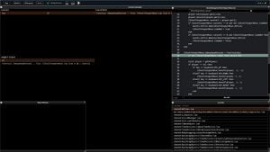
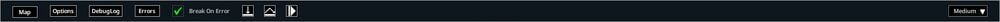
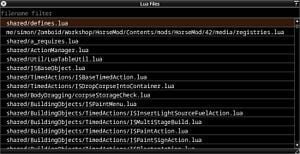
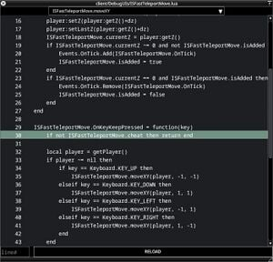
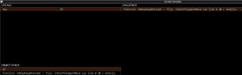
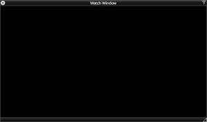

# Lua debugger

> Offline PZwiki reference. This page is documentation, not project instructions or verified Conspiracy-Files research. Source build warnings and incomplete entries remain applicable. External destinations are omitted. See the library README and COVERAGE for scope.

This page has been revised for the current stable version (42.20.4).

Help by adding any missing content. [Edit](Lua_debugger.md) (Create account)

Parts of this page may have been automatically updated to the latest build (42.20.4).

The Lua Debugger UI

The **Lua debugger** is a UI which can be accessed by pressing F11 or which will open when an error occurs while in [debug mode](Debug_mode.md). It is primarly use as a debugging tool for modders, allowing them to inspect the Lua code and variables in real time via the use of breakpoints or when the error triggers.

The UI is actually composed a few sub-UIs:

- Top [menu bar](Lua_debugger.md#Menu_bar) contains buttons to access many debugging tools, features and options as well as the buttons to step forward or continue the execution of the code.
- [Lua files](Lua_debugger.md#Lua_files) selector and reloader displays all the loaded Lua files and allows you to [hot-reload](../assets-and-animation/Hot_reloading.md) them without having to restart the game.
- [Lua file inspector](Lua_debugger.md#Lua_file_inspector) displays the content of the selected Lua file and allows you to set breakpoints on any line or reload the file.
- [Coroutine inspection](Lua_debugger.md#Coroutine_inspection) displays the list of scope locals and the callstacks.
- [Watch window](Lua_debugger.md#Watch_window)

When your game loading fails very early, the UI can be broken and show white boxes instead of the font characters. It hasn't been yet documented what kind of early failure can cause this however.

## Menu bar

The menu bar contains many buttons which will be described below in their order from left to right.

### Map

Source marks this entry as incomplete.

Opens a map UI which is similar to the Zombie Population debug UI, showing you the map in black with all the BuildingDef instances, the [256x256 cells](../mapping/Mapping.md#Cells) and the player active cell (see getCell).

### Options

A huge UI which allows you to activate a lot of different debugging visual options. When an option has been modified, it will be highlighted in yellow so you can easily deactivate them back. The options are grouped in categories.

Making a complete list of what all of these options do would be useful, but is currently not done. Taking a peak at the names of these options can possibly help you find something useful based on what you are [modding](Modding.md).

The option handler is the class DebugOptions.

These options are saved between game sessions, but deactivated automatically when the game is not in [debug mode](Debug_mode.md).

### DebugLog

Used to configure the console log output. For more information, see Console.

### Errors

Simply a UI showing the error messages you received and their stacktrace. Generally you might find errorMagnifier far easier to read and use.

### Error buttons

These are multiple buttons which allow you to handle the errors and continue running the game. The first one "Break On Error" will stop the Lua debugger from opening when an error occurs, but if you open the UI again it will get reset to the default state.

The second and third buttons are not exactly clear what they use. If you figure it out, feel free to edit this page and add the information.

The fourth one is "Continue" which will continue the execution of the code after an error has occurred. Basically quiting this UI and continuing the game.

### Font size

The last button on the very right, by default set to`Medium`, allows you to swap between three font sizes:`Small`,`Medium` and`Large`. This will change the whole Lua debugger UI font size to adjust to your screen size and resolution.

## Lua files

A UI which displays all the loaded [Lua](../lua-api/Lua_API.md) files in the game. You can select a file to inspect it in the [Lua file inspector](Lua_debugger.md#Lua_file_inspector) and when hovering a specific file a button on the right of it will appear to [hot-reload](../assets-and-animation/Hot_reloading.md) the Lua file.

## Lua file inspector

A UI which displays the content of the selected [Lua file](Lua_debugger.md#Lua_files). You can scroll through the file and double

click on a line to set a breakpoint.

The breakpoints tend to not reset when double clicking on a line, leaving you stuck in the UI permanently until restarting the game sometimes.

## Coroutine inspection

This UI displays the list of scope locals and the callstacks when in a breakpoint or when an error occurs. The locals are displayed on the left and the callstacks on the right. When selecting a local, you can inspect its values which will show up in the object callstack on the bottom.

The UI can be rough to use honestly and it's often unclear what is going on in it.

## Watch window

Source marks this entry as incomplete.

## See also

- Imgui
- [Debug mode](Debug_mode.md)
- [Debug scenario](Debug_scenario.md)

Retrieved from "[https://pzwiki.net/w/index.php?title=Lua_debugger&oldid=1460573](Lua_debugger.md)"
