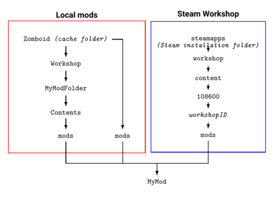
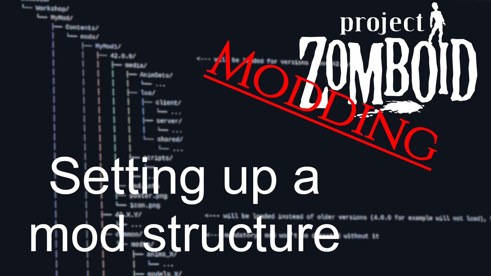

# Mod structure

> Offline PZwiki reference. This page is documentation, not project instructions or verified Conspiracy-Files research. Source build warnings and incomplete entries remain applicable. External destinations are omitted. See the library README and COVERAGE for scope.

This page has been revised for the current stable version (42.20.0).

Help by adding any missing content. [Edit](Mod_structure.md) (Create account)

Parts of this page may have been automatically updated to the latest build (42.20.4).


This article is about modding structure of Project Zomboid. For game files of Project Zomboid, see [Game files](Game_files.md). For explanations of file formats, see [File formats](File_formats.md).



Local mods are recognized in two different folders which each have their own rules and structure and are both in the [cache folder](Game_files.md#Cache_folder):

-`Zomboid/mods/` - place to put mods to install manually without using the Steam Workshop. Not recommended for mod development.
-`Zomboid/workshop/` - folder used for mod development and uploading to the Steam Workshop.

When downloading mods from the Spiffo's Workshop, they will be downloaded in [their own folders](Mod_structure.md#Online_workshop_folder) locally which you should **not** be working from when [modding](Modding.md). Mods with the same [Mod ID](mod.info.md) as mods in other recognized folders, so for example in the online workshop folder and in the mods cache folder, will clash together and overwrite each others. This can lead to confusion when debugging your mods and even make it impossible to load new changes you applied to your mod when developing so make sure to not have two copies of your mods.

Example default mod structures are provided by the community to directly use:

- Project Zomboid Community Modding template - a template mod structure to use as a base for your own mods. Simply make a copy of the repository on your computer and modify the different elements for your own use.

Some operating systems like Linux and MacOS are case-sensitive regarding file and folder names. Make sure to use the correct casing when creating your mod structure to avoid issues for those users. (for example`common` and not`Common`)

<a id="Video_guide"></a>

## Video guide



▶

PZ Modding Guides - setting up a mod structure

External link ↗

<a id="Mods_or_workshop"></a>

## Mods or workshop

Using the`Workshop` folder is needed to use the [in-game uploader](Uploading_mods.md#In-game_uploader) meaning if you use the`mods` folder you will inevitably end up having to make a copy of your mod in the`Workshop` folder to upload it to the Steam Workshop. This is still an issue when using an external uploader like the [Steam Uploader](Steam_Uploader.md) modding project, as you need to upload the`mods` folder which would upload all the extra folders. Take this for example, the folder structure of the cache folder:


```text
📁 ~/
    📁 Zomboid/
        📁 Crafting/
        📁 joypads/
        📁 logs/
        📁 Lua/
        📁 messaging/
        📁 mods/
            📁 MyMod1/
                ...
            📁 MyMod2/
                ...
        📁 Recording/
        📁 Sandbox Presets/
        📁 Saves/
        📁 Workshop/
            📁 MyModWorkshop/
                📁 Contents/
                    📁 mods/
                        📁 MyMod1/
                            ...
                        📁 MyMod2/
                            ...
        📄 console.txt
        ...
```


In the case where you use the`mods` folder, to upload with an external tool you would have to indicate the application to upload the content of the folder`~/Zomboid` since the`mods` folder needs to be uploaded. This will also upload all the folders around it and will upload other mods you are developing inside the`mods` folder.

A bad solution is to copy the mods you want to upload inside of the`Workshop` folder for your mod but the problem with making copies of a mod is that they will clash and so you need to make sure to delete the mod copy inside the`Workshop` folder or you risk having invisible issues during the development.

This last principle also applies to downloading your own mods on the Workshop while having local copies inside the`mods` folder or the`Workshop` folder, as they will clash and cause issues. While working directly from the`Workshop` folder will assure you never get any problems in the future.

Another benefit of using the`Workshop` folder is that it allows you to store additional assets in the upper echelon of your mods`Workshop` folder. This is due to the`Workshop` folder having extra folders before the`mods` folder, taking the previous shared example you have`MyModWorkshop` and`Contents`. Anything in the`Contents` folder will be uploaded to the Workshop, but anything placed at the same level as it, inside`MyModWorkshop`, will not be uploaded and completely ignored by the game. You can use this to create other subfolders like`images` or`assets` which will hold your modding assets, you can have a file`README.md` and also a`.git` folder to have`MyModWorkshop` serve as your mod's git repository. This also applies to folders specific to your IDE like`.vscode` ([VSCode](Visual_Studio_Code.md)) or`.idea` (IDEA).

When developing mods, make sure to not be subscribed to your own mod on the Steam Workshop. Any duplicated version of your mod on your computer which are loaded by the game, will mix and clash together, sometimes making any changes you make in a version, not appear in-game because they are being overwritten by this other duplicate version of the mod. Always keep only your local version inside the Workshop folder.

<a id="Online_workshop_folder"></a>

## Online workshop folder

When accessing the [game files](Game_files.md), if you go in a few folders above in`Steam/steamapps/`, you can access the folder`workshop/content/` which stores every mods from all of your games. Project Zomboid has the Steam ID`108600` which can be seen in the URL of the Steam market page of the game. The mods are stored in the following folder:


```text
📁 Steam/
    📁 steamapps/
        📁 workshop/
            📁 content/
                📁 108600/
                    ...
```


The folder of the mod will be named after its [Workshop ID](Workshop_ID.md).

<a id="Workshop_folder"></a>

## Workshop folder

The Workshop folder will use the following structure inside the [cache folder](Game_files.md#Cache_folder):


```text
📁 Zomboid/
    📁 Workshop/
        📁 MyExampleMod/
            📁 Contents/
                📁 mods/
                    📁 MyMod1/
                        ...
                    📁 MyMod2/
                        ...
            📄 workshop.txt
            📄 preview.png
```


-`Contents/`: The folder will only have the`mods/` folder.
-`Contents/mods/`: Your various mods which can be activated by the players will be put here, with each mod having their own [mod.info](mod.info.md) file associated to be recognized (see [#Mod folder](Mod_structure.md#Mod_folder)). This is the folder uploaded to the Workshop.
-`workshop.txt`: Informations which are needed to upload your mod are put here (see [workshop.txt](workshop.txt.md)).
-`preview.png`: The image used as your mod preview on the Steam Workshop. Game imposes a 256x256 resolution and an 8-bit color depth.

Subfolders in`MyExampleMod/` which are not`Contents/` are not recognized by the game and can be used to store various files for your mod that shouldn't get uploaded. Thus you can store in it Python scripts, images, assets, etc.

`MyExampleMod/` can be used as a Git repository (GitHub, GitLab...).

Make sure to access the Workshop folder inside the [cache folder](Game_files.md#Cache_folder) and not the game files one which has the path`steamapps/common/ProjectZomboid/Workshop` ! This folder cannot be used for modding.

<a id="Mod_folder"></a>

## Mod folder

The files of your mods are placed in the folder`Contents/mods/` alongside a [mod.info](mod.info.md) file which is the core of your mod. The folder structure of your mod folder should be as follows:

<a id="Build_41"></a>

#### Build 41

Build 41 uses the following modding structure.


```text
📁 Contents/
    📁 mods/
        📁 MyMod1/
            📁 media/
                ...
            📄 mod.info
            📄 poster.png
            ...
        📁 MyMod2/             <--- for extra mods, simply add a new mod folder
            📁 media/
                ...
            📄 mod.info
            📄 poster.png
            ...
```


The [Build 42 modding structure](Mod_structure.md#Build_42) is considered for the rest of the page. The main difference is the position of the [media folder](Mod_structure.md#Media_folder) and the lack of versioning and common folders for Build 41.

<a id="Build_42"></a>

### Build 42

Build 42 uses the following modding structure.


```text
📁 Contents/
    📁 mods/
        📁 MyMod1/
            📁 common/
                📁 media/
                    ...
            📁 42/
                📁 media/
                    ...
                📄 mod.info
                📄 poster.png
            📁 42.1/           <--- for extra versions, simply add a new version folder
                📁 media/
                    ...
                📄 mod.info
                📄 poster.png
            📁 42.1.5/         <--- same here, another different version
                📁 media/
                    ...
                📄 mod.info
                📄 poster.png
            ...
        📁 MyMod2/             <--- for extra mods, simply add a new differently named mod folder
            ...
```


Multiple mods can be present in a single uploaded mod (inside`Contents/mods/`). This can be used for optional mods or different versions of the same mod.

<a id="Mixing_build_41_and_42"></a>

### Mixing build 41 and 42

It is possible to mix both Build 41 and Build 42 modding structures in the same mod folder. Since the Build 42 structure is one folder deeper than the Build 41 one, they won't clash together and both will be properly isolated from each other.


```text
📁 Contents/
    📁 mods/
        📁 MyMod1/
            📁 media/        <--- Build 41 folder
                ...
            📁 common/       <--- Build 42 folder
                ...
            📁 42/           <--- Build 42 folder
                ...
```


<a id="Common_and_versioning_folders"></a>

## Common and versioning folders

Common and versioning folders, introduced in Build 42, help manage different mod versions per game version.

- **Versioning folders** are useful when players stick to older game versions. You don't need one for every version. They should contain code files and [mod.info](mod.info.md), as they often change with the game version.
- **Common folder** stores large files (models, textures, animations) to keep mod size down.

These folders load with the following order:

- Common folder
- Closest versioning folder to the game version (overwrites common files which are present in it)

The versioning folders can have the following possible naming:


```text
buildVersion.majorVersion.minorVersion  ====> buildVersion.majorVersion
buildVersion.majorVersion               ====> buildVersion.majorVersion
buildVersion                            ====> buildVersion.0
```


The minor version is not supported for the naming, so a folder named`42.1.5` will be treated as`42.1`. For example:


```text
42             ====> 42.0
43             ====> 43.0
42.12          ====> 42.12
42.1           ====> 42.1
42.0.5         ====> 42.0
43.5.1         ====> 43.5
```


The common and versioning folders of a mod are completely independent of other mods. If you try to [overwrite](Load_order.md#File_overwrites) another mod files, these folders will not play a role in it.

Common folder is not recognized by Build 41 modding structure. However, the Build 41 [Lua API](../lua-api/Lua_API.md) can access some files in some cases.

At least one versioning or a common folder is needed for the mod to be recognized in-game.

<a id="Media_folder"></a>

## Media folder

Mod assets are for the most part inside this folder. Different subfolders need to be created based on the type of assets. These are usually the same as the [game media folder](Game_files.md#Media_folder) and based on your [modding field](Modding.md#Modding_fields), you may need different ones. See each modding fields individual pages for more details on their folder structure:

| Modding field | Subfolder |
| --- | --- |
| [Animation](../assets-and-animation/Animation.md) | Animations involve the storing of the [animation files](File_formats.md#Modeling_and_animation_formats), as well defining how those animations are triggered:`anims_X` - stores the animation files.;`AnimSets` - stores the animation triggers and parameters definitions.; |
| [Lua](../lua-api/Lua_API.md) | Most of the time, Lua modding doesn't involve game assets but simple plain code lines, however in some cases you may want to add custom UI elements and maybe need textures.`lua` - stores the Lua scripts.;`ui` and`textures` - used for custom UI elements; |
| [Mapping](../mapping/Mapping.md) |`maps` - stores the map files and assets.; |
| [Modeling](../assets-and-animation/Modeling.md) |`models_X` - stores the model assets.; |
| Texturing |`textures` - stores the texture assets; |
| [Translation](../translations/Translation.md) |`lua/shared/Translate` - translation files are put inside subfolders inside the main lua folder; |
| [Rendering](../assets-and-animation/Rendering.md) | Renders are indirectly linked to modding, as in most cases is a process external to Project Zomboid where you use game assets for 3D renders:`models_X`;`textures`;`texturepacks` - holds the tile sprites that you will need to unpack with the [Mapping tools (official)](Mapping_tools_official.md); But in the case where renders are used to create in-game assets, you will most likely need to access the`ui` or`textures` folders. |
| [Scripts](../scripts/Scripts.md) | Scripts involve mainly defining properties and behaviors via text files, but in most cases involve the use of assets like [models](../assets-and-animation/Modeling.md), textures and sounds.`scripts` - stores the script definitions.;`clothing` - stores clothing item definitions.;`textures`;`models_X`;`sound`; |

<a id="clothing"></a>

### clothing

The`clothing` folder is used to define clothing items via the use of XML files. Each clothing items is associated to its own XML file and a GUID to recognize the clothing item. Subfolders can be created to organize the clothing items. The outfit manager is also defined inside the file`clothing.xml` and is used to create or modify existing outfits. While this file is named the same as any others, it will not overwrite other files named like it.

<a id="models_X"></a>

### models_X

Main article: [model (scripts)](../scripts/model_scripts.md)

The`models_X` folder is used to store model files. The files need to be either in the DirectX format (`.x`) or Filmbox format (`.fbx`). They can be put in subfolders for organization and can replace files with the same relative path. See the [File formats](File_formats.md#Modeling_and_animation_formats) page for more detail.

<a id="textures"></a>

### textures

The`textures` folder is used to store texture files. The files need to be in the PNG format (`.png`). They can be put in subfolders for organization and can replace files with the same relative path. See the [File formats](File_formats.md#Image_formats) page for more detail.

<a id="ui"></a>

### ui

The`ui` folder is used to store images used in the user interface elements in the game. The files need to be in the PNG format (`.png`). They can be put in subfolders for organization and can replace files with the same relative path.

<a id="sound"></a>

### sound

The`sound` folder is used to store sound files. The files need to be in the OGG format (`.ogg`) or WAV format (`.wav`). They can be put in subfolders for organization and can replace files with the same relative path. Some sounds are stored inside bank files (`.bank`) which are used by the Fmod sound system, and they cannot be overwritten nor can bank files be loaded from mods.

<a id="Example"></a>

## Example

Below is a full example of a mod structure in Windows.


```text
📁 %UserProfile%/
    📁 Zomboid/
        📁 Workshop/
            📁 MyMod/
                📄 workshop.txt                        <--- automatically generated when uploading
                📄 preview.png                         <--- 256x256 image
                📁 Contents/
                    📁 mods/
                        📁 MyMod1/
                        │   📄 mod.info
                        │   📄 poster.png
                        │   📄 icon.png
                        │   📁 42.0.0/                 <--- will be loaded for versions above 42.0.0
                        │   │   📁 media/
                        │   │       📁 AnimSets/
                        │   │           ...
                        │   │       📁 lua/
                        │   │           📁 client/
                        │   │               ...
                        │   │           📁 server/
                        │   │               ...
                        │   │           📁 shared/
                        │   │               ...
                        │   │       📁 scripts/
                        │   │           ...
                        │   │       ...
                        │   │   📄 mod.info
                        │   │   📄 poster.png
                        │   │   📄 icon.png
                        │   📁 42.X.Y/                 <--- will be loaded instead of older versions (42.0.0 for example will not load), for game versions compatibility if needed
                        │   │   ...
                        │   📁 common/                 <--- mandatory, mod won't be detected without it
                        │   │   📁 media/
                        │   │       📁 anims_X/
                        │   │           ...
                        │   │       📁 models_X/
                        │   │           ...
                        │   │       ...
                        │   📁 media/                  <--- Build 41 only folder, not used in Build 42
                        │       📁 anims_X/
                        │           ...
                        │       📁 AnimSets/
                        │           ...
                        │       📁 lua/
                        │           📁 client/
                        │               ...
                        │           📁 server/
                        │               ...
                        │           📁 shared/
                        │               ...
                        │       📁 models_X/
                        │           ...
                        │       📁 scripts/
                        │           ...
                        📁 MyMod2/                     <--- secondary mod, optional if needed
                            📄 mod.info
                            📄 poster.png
                            📄 icon.png
                            📁 42.0.0/
                                📄 mod.info
                                📄 poster.png
                                📄 icon.png
                                ...
                            📁 42.X.Y/
                                ...
                            📁 common/
                                ...
                            📁 media/
                                ...
```


<a id="See_also"></a>

## See also

- [Uploading mods](Uploading_mods.md) - teaches about uploading mods.
- [Game files](Game_files.md) - accessing the game files.
- [workshop.txt](workshop.txt.md) - about a file used by the in-game uploader.
- [mod.info](mod.info.md) - about the core file which defines your mod.
- [Load order](Load_order.md) - guide about load order.

Retrieved from "[https://pzwiki.net/w/index.php?title=Mod_structure&oldid=1458093](Mod_structure.md)"
