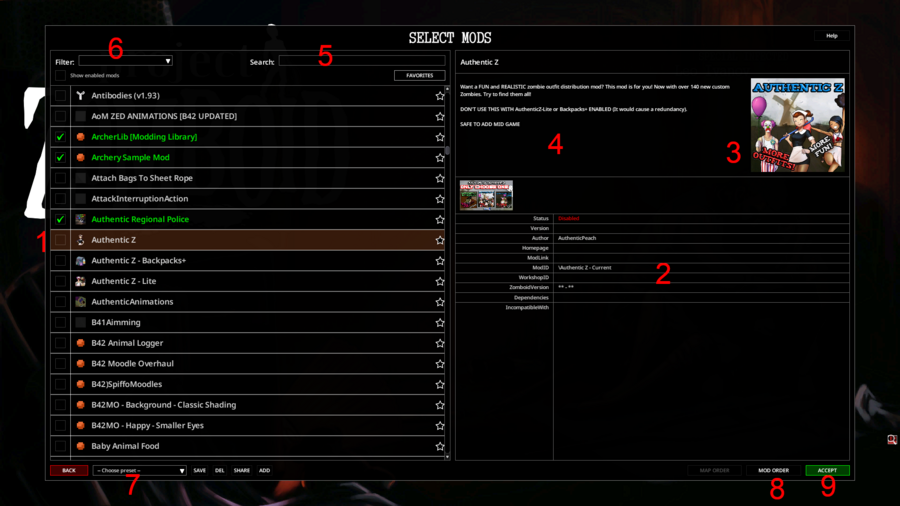

# Mods

> Offline PZwiki reference. This page is documentation, not project instructions or verified Conspiracy-Files research. Source build warnings and incomplete entries remain applicable. External destinations are omitted. See the library README and COVERAGE for scope.

This page was last updated for an older version of the current build (42.14.0).

The current stable version is 42.20.4, so information on this page may be inaccurate.

Help get this page updated by adding any missing content. [Edit](Mods.md) (Create account)

This article is about created mods. For the details about creating mods, see [Modding](Modding.md).

**Mods** are player created customized content. Mod stands for modification, as it alters the original game content. Guidelines for creating your own Project Zomboid modded content can be found on the [modding](Modding.md) page. If you are not interested in making your own mods, player created mods can be found on the Official Project Zomboid Forum - Mods category or in the Spiffo's Workshop on Steam.

## Installing mods

### Steam Workshop

For this method, you must have purchased the game on Steam.

- Open Steam.
- Open your games library.
- Click on Project Zomboid.
- Click on the Workshop button on the game page.
- Select a mod, open mod page and click "Subscribe".
- If the game is running, turn it off. Mods can be downloaded with the game running but if you don't find the mod in the [mod manager](Mods.md#Mod_manager), then restart the game.
- Wait for the mod to install.
- You can now launch the game and enable the mod in the mod manager.

Downloaded mods are stored inside the [workshop folder](Game_files.md).

### Manual local installation

You can manually install mods by putting them inside the`mods` folder of the [cache folder](Game_files.md#Cache_folder). Alternatively the`workshop` folder is used for mod development and required extra folders for a mod to be recognized there, see the [mod structure](Mod_structure.md) page for more details on that.

To retrieve mods manually you can either:

- Ask someone to send you the files of the mod. This means someone needs to own the game on Steam, locate the mod files in their [workshop folder](Game_files.md) and send you the mod folder.
- Use [SteamCMD](SteamCMD.md) which needs a lot more setup but allows you to download mods without needing to own the game.

## Using mods

Mods are created by the community and can be version specific. Old mods for older versions of the game are likely to not work with new versions. If you are having problems when using mods, refer to the [mod problem solving article](Resolving_problems_with_mods.md).

### Mod manager

The mod manager is the in-game interface to manage mods which allows you to enable and disable mods, make presets, favorite them, and more. It can be accessed from the main menu by clicking "Mods". The screenshot shown here is of the mod manager with various bit informations indicated with the red numbers, which are as follows:

- Mod list with the mod icon, name and if it is enabled in green or not.
- The mod informations as defined inside the [mod.info](mod.info.md) file of the mod. This lists the status (if enabled), version, author, homepage, mod link, mod ID, [Workshop ID](Workshop_ID.md), the minimum and maximum game version, dependencies, incompatibilities.
- The mod preview.
- The mod description as defined inside the [mod.info](mod.info.md) file of the mod.
- Search bar to easily find mods in the manager.
- Filters by mod type (map, vehicle, features, modpack).
- Activate preset of enabled mods, you can save your current mod activated list, delete it, or share your mod preset by copying it to the clipboard or adding one you copied and want to import.
- Map and mod order.
- Confirmation to load the current selection, which will reload the lua.

When launching a new save, it will use the currently active mod list.

### Changing mods in an existing world

You can change the currently active mods in a save but make sure to backup your save beforehand. To do so:

- Click the "Load" button in the main menu, which will list your current saves.
- Select the save, and click "More".
- Click "Choose Mods".
- This opens the mod manager for this save, which you can toggle on or off the mods you want to change.

### Changing mods in the main menu

You can change the currently active mods in the main menu.

Pros:

- This mod selection will be the default mod selection for every new game world from now on.
- Mods applying animations on animals may have the meatballing issue if the mod is not active when starting the game. (this is why it is sometimes mandatory)
- Some mods (mostly ModManager-like mods) need to be loaded in the main menu to apply their effects.

Cons:

- With every mod update, there is a risk that the game will not launch properly, if the mod is active in the main menu.
- With every game version update, there is a risk that the game will not launch properly for each mod active in the main menu.

To change mods in the main menu:

- Click the "Mods" button in the main menu, which will list your available mods.
- Select the mods you want to be active at the start of the game.
- Click "Accept".

The situation where the game does not launch properly is difficult to handle without serious knowledge of the game. This is why it is advised against activating most mods on main menu unless necessary.

### Setting mods for host

This section may be in need of improvement.

This was copy and pasted from the old [Using mods](Mods.md#Using_mods) page and not verified or tested. It might need rephrasing or additional information.

Editors are encouraged to add any missing information to the article, while verifying that the article's current content is correct. [Edit](Mods.md) (Create account)

- Open server host settings
- Select the item "Steam Workshop" in the menu on the left (If you run the server without Steam, go to step 4)
- Select Steam Workshop mods from the drop down list and click on them to add them. To remove - select the mod in the list on the right and click the "Remove" button
- Next, select "Mods" from the menu on the left
- Select mods from the drop-down list and click on them to add (if you added mods in step 3 - then maybe some mods are already added). To remove - select the mod in the list on the right and click the "Remove" button
- (Optional - map mods) - Select "Map" in the menu on the left and set the order for loading the map. Maps are loaded from top to bottom and if the map intersect - map will overwrite intersected zones of the previous maps.
- Click save

Ready! Now you can start the host server.

### Mod settings

Some mods can have settings in two different form:

- [Sandbox options](../scripts/Sandbox_options.md) - settings which are world specific and which should apply to every players, found in the world creation menu.
- [Mod options](../lua-api/ModOptions.md) - user specific settings independent between players, which can be found in the game settings menu in the section "MODS".

## Commissions

Commissioning mods allows users to bring creative ideas into reality, but like any freelance or contract work, commissioning mods carries certain risks. The best way to reduce those risks is through education, clear communication, and well-documented agreements.

The following guidelines are community recommendations and do not constitute legal advice. [Modding communities](Modding.md#Communities) provide platforms where clients and modders can connect in a safer, moderated environment, with tools to support transparency, written agreements, and secure communication.

The PZ Modding Community has a dedicated commission/request section, geared towards security, transparency, and open communication.

### Writing a commission request

When creating a commission request:

- **Do your research**: Ask around in the modding community if the mod you are interested in already exists and their advice on the project, if it is doable, and at a reasonable price.
- **Be descriptive**: Clearly explain features, functionality, and scope.
- **Provide references**: Include images, examples, or inspirations when possible.
- **Clarify ownership**: State who will publish the mod if this is important to you. Follow-up support (updates) is usually not guaranteed outside of the agreed/initial mod.
- **Set a budget**: Mention your budget or note if it is negotiable.

### Agreements and transactions

- **Stage the work**: Break projects into phases (agreement, draft, delivery, payment). Touch base often to make sure everything is going as planned. This avoids misunderstandings and surprises.
- **Confirm in writing**: Use permanent written records for prices, timelines, and deliverables.
- **Use milestones**: For large projects, consider split payments, initial deposits, continued payments at mid-points, and upon completion.

### Safety recommendations

- **Ask for a portfolio**. A modder capable of making Zomboid mods should have something related to Zomboid to show for it.
- **Do not pay before proof** of work is provided.
- **Do not deliver** the full mod **before payment** is received.
- **Share or archive copies** through email, cloud storage, or workshop pages.
- **Keep all agreements documented** in case of disputes.
- **Ask around** about the modder you are about to hire. Some modders are well known in the community.

### Red flags

Exercise caution if a prospective client or modder:

- Has **no history or visible presence** in the community.
- **Refuses to provide a portfolio**, references, or past work.
- **Insists** on private communication only. They are trying to avoid public scrutiny.
- **Refuses to link** a relevant game profile or **verifiable identity**.

### Payment and trust

Use secure, well-documented payment services. Avoid sending money as a “gift” or “donation,” since this may limit refund options in cases of fraud. A well-known way to defraud is to rely on PayPal's "friends and family" fund transfer. Which does not carry refund protections.

Upfront payment should not be the default and is generally discouraged. Modders should generally expect upfront payment when:

- They are proven and trusted in the community, with a very solid portfolio, past commissions, or a good reputation in the community.
- The project is particularly large or time-intensive.

For most projects, milestone-based payments after work is demonstrated are safest.

### Final tips

Communicate expectations clearly and professionally. Be conservative when money is involved—better to walk away than risk a scam. Transparency protects both the commissioner and the modder, and helps maintain a healthy community.

## See also

- [Modding](Modding.md) – explains the process of creating mods.
- [Resolving problems with mods](Resolving_problems_with_mods.md) – what to do if mods do not work well or break the game.
- [Uploading mods](Uploading_mods.md) – how to upload mods to the Steam workshop.
- [Testing mods in multiplayer](Testing_mods_in_multiplayer.md) – guide about setting up the mod to work on the server.
- Spiffo's Workshop – the Steam Workshop for Project Zomboid mods.
- Server settings – details to know about server settings.
- Tech Support – some of the most common problems.
- Completed mods – the forum section to share completed mods.
- Work-in-Progress mods – the forum section to share Work-in-Progress mods.

Retrieved from "[https://pzwiki.net/w/index.php?title=Mods&oldid=1476269](Mods.md)"
