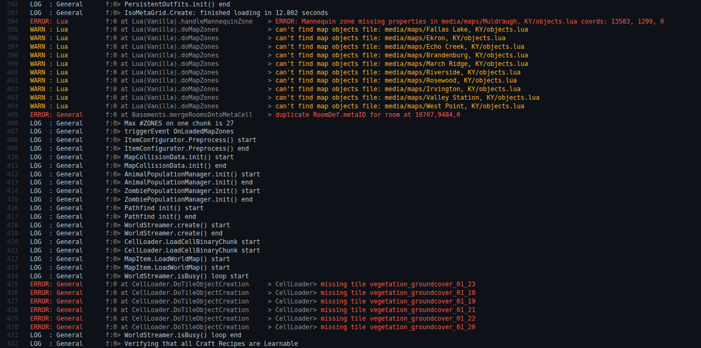

# PZ Modding Configs

> Offline PZwiki reference. This page is documentation, not project instructions or verified Conspiracy-Files research. Source build warnings and incomplete entries remain applicable. External destinations are omitted. See the library README and COVERAGE for scope.

This page has been revised for the current stable version (42.20.0).

Help by adding any missing content. [Edit](PZ_Modding_Configs.md) (Create account)

Parts of this page may have been automatically updated to the latest build (42.20.4).

PZ Modding Configs

Links

Download

Repository

**PZ Modding Configs** provides default configurations for your modding environment in [Visual Studio Code](Visual_Studio_Code.md). The configurations include a default configuration for [Umbrella](Umbrella_modding.md)'s [EmmyLua](EmmyLua.md) configuration, as well as schema references for the XML files and [translation](../translations/Translation.md) JSON files from the [PZ Data](../scripts/PZ_Data.md) in the form of a`.vscode/settings.json` file. Those VSCode configurations also provide console highlights with the right extensions installed, see the repository README for more information on how to use this configuration.

## See also

- [Umbrella (modding)](Umbrella_modding.md)
- ZedScripts

Retrieved from "[https://pzwiki.net/w/index.php?title=PZ_Modding_Configs&oldid=1446989](PZ_Modding_Configs.md)"
