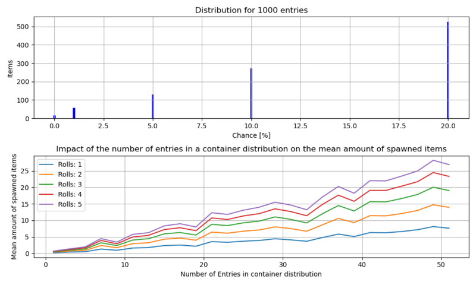

# Procedural distributions

> Offline PZwiki reference. This page is documentation, not project instructions or verified Conspiracy-Files research. Source build warnings and incomplete entries remain applicable. External destinations are omitted. See the library README and COVERAGE for scope.

This page has been revised for the current stable version (42.20.4).

Help by adding any missing content. [Edit](Procedural_distributions.md) (Create account)

Parts of this page may have been automatically updated to the latest build (42.20.4).

**Procedural distribution** explains how the loot system of the game works and how you can add your own loot to the procedural distribution.

Tools exist to make it easier to manage distributions in your mods:

- KR Core OS
- Easy Distributions API

<a id="How_does_loot_generation_works"></a>

## How does loot generation works

Containers in a room generate with different possibilities of [distribution lists](Procedural_distributions.md#Distributions). Loot in containers is generated whenever they get loaded in the game or can respawn loot if the proper settings in the [sandbox options](../scripts/Sandbox_options.md) are set.

Each [distribution](Procedural_distributions.md#Distributions) has a set amount of rolls, and each item entry has a set chance which is neither a weight nor a percentage. Every distribution item entries will be rolled the amount of rolls the [distribution list](Procedural_distributions.md#Distributions) has with a random chance generated based on some criteria such as loot spawn chance and the zombie population.

When loot is being spawned in a container, the event [OnFillContainer](../lua-api/OnFillContainer.md) triggers, allowing you to modify items which are spawning in or add other items.

<a id="Distribution_structure"></a>

### Distribution structure

Vanilla loot distribution is defined in the following file:


```text
📁 ProjectZomboid
    📁 media
        📁 lua
            📁 server
                📁 Items
                    📄 ProceduralDistributions.lua
```


Each [distribution lists](Procedural_distributions.md#Distributions) are added to the [table](../lua-api/Lua_language.md#Tables)`ProceduralDistributions.list` in the following form:


```text
ProceduralDistributions.list = {
    distributionName = { -- the distribution category
        rolls = 3,
        items = { -- can be empty
            "Item1", -- item n°1 in the distribution category
            10, -- the item n°1 roll chance
            "Item2", -- item n°2 in the distribution category
            5, -- the item n°2 roll chance
            ...
            "ItemN", -- item n°N in the distribution category
            3 -- the item n°N roll chance
        },
        junk = { -- ignores zombie density and has a x1.4 chance multiplier
            rolls = 1, -- number of rolls for junk
            items = { -- can be empty
                -- same way to list as items above
            }
        }
    },
    otherDistributionName = {
        ...
    },
    ...
}
```


As a real example, take for example:


```text
ProceduralDistributions.list = {
    ...
    ComicStoreShelfComics = {
        isShop = true,
        rolls = 4,
        items = {
            "ComicBook_Retail", 50,
            "ComicBook_Retail", 20,
            "ComicBook_Retail", 20,
            "ComicBook_Retail", 10,
            "ComicBook_Retail", 10,
        },
        junk = {
            rolls = 1,
            items = {
                "ComicBook_Retail", 10,
            }
        }
    },
    ...
}
```


You can find the documentation of each parameters in the PZ API Docs.

The chance value is **not** a weight **nor** a percentage! To chose your chance values, base yourself on existing vanilla distribution and the chance values of vanilla items!

<a id="Tags_for_distribution"></a>

### Tags for distribution

Alongside the`rolls` tag for the`distributionName` and`junk` tables, you can add arguments which will modify how items spawn in and their conditions of spawn:

-`ignoreZombieDensity` - ignores the zombie density impact on item spawn chance.
-`isShop` - when not set to true:

- Can be a stash. (Related to`stashChance`)
- DrainableComboItem get random amount of uses.
- HandWeapon can have lower condition (40% chance).
- Items with head condition get reduced head condition (40% chance).
- Items with sharpness condition get reduced sharpness condition (40% chance).
- Bags get items inside them.
-`stashChance` - chance for the container to be a stash.
-`canBurn` - Food can be burnt (25% chance) or cooked.
-`isWorn` and`isTrash` - items spawn with lower condition, delta etc:

- HandWeapon get reduced item condition.
- Items with head condition get reduced head condition.
- Items with sharpness condition get reduced sharpness condition.
- DrainableComboItem get reduced item uses (i.e. batteries).
- Impact on non-canned and edible (non can't eat) food:

- Non-vermin, cookable and non-replaceable on cooked will be either cooked or burnt (50% chance).
- Non-rotten items will be rotten (75% chance) or have increased age (less fresh).
- Have reduced food value.
-`isWorn` specifically:

- Clothing items will have reduced condition, can be dirty (25% chance), bloody (1% chance) and/or have holes (25% chance).
-`isTrash` specifically:

- Clothing items will have reduced condition, can be wet (25% chance), dirty (95% chance), bloody (10% chance) and/or have holes (75% chance).
-`isRotten` - non-rotten items will be rotten (75% chance) or have increased age (less fresh).
-`bags` - unsure, could be adding bags to the container.
-`maxMap` (integer) - limits the same item to a max amount. (UNSURE)
-`onlyOne` **DEPRECATED** - a tag which can be found in distributions but looks deprecated from the java.

<a id="How_to_add_your_own_items_to_distributions"></a>

## How to add your own items to distributions

The main challenges you will face is properly understanding how loot generation actually works (see [#How does loot generation works](Procedural_distributions.md#How_does_loot_generation_works)), finding the right distribution list and organizing the file which adds these.

You will want to create a distribution file at the following path:


```text
📁 media
    📁 lua
        📁 server
            📁 YourModName
                📄 ProceduralDistributions.lua
```


The filename or exact path doesn't matter, what matters is that it is locked in the`lua/server` folder. Here we suggest storing in a subfolder named after your mod so your file will never clash with other mods (see [Lua (API)](../lua-api/Lua_API.md#Folder_structure)).

There are many ways of add your own distribution, with the most common one, but **worst** one, being:


```text
table.insert(ProceduralDistributions.list["DistributionListName"].items, "YourItem") -- add your item to the list
table.insert(ProceduralDistributions.list["DistributionListName"].items, 0.5) -- following its chance value
```


Items that are defined with a different [module](../scripts/Scripts.md#Module_block) than`Base` need to have their module in the item name. For example, if you have an item named`MyItem` in the`MyMod` module, you need to add it as`MyMod.MyItem`.

A better way to handle this is to have every distributions and their items and chances in a singular table which is parsed through by a loop and added with a single`table.insert` line. This both makes it easier to manage and easier to fix when it breaks.

Take this example with a few items and distribution lists:


```text
local myDistribution = {
    GigamartPots = {
        items = {
            "GlassWine", 6, -- item, chance,
            "Fork", 10,
            "Mugl", 10,
            "Whetstone", 10,
            "Teacup", 10,
            "CDplayer", 10,
        },
        junk = { -- this one can be removed if you don't put anything in it
            "Mov_CoffeeMaker", 4,
            "HandTorch", 8,
        },
    },
    LibraryMilitaryHistory = {
        items = {
            "Book_Music", 20,
			"Book_Music", 10,
            "Doodle", 0.001,
        },
    },
    MechanicShelfElectric = {
        items = {
            "Battery", 10,
			"BatteryBox", 10,
            "Brochure", 2,
			"Broom", 10,
			"Bucket", 10,
        },
    },
}

-- caching for performance reasons
local ProceduralDistributions_list = ProceduralDistributions.list
local table_insert = table.insert

---@param distrib table<string, {items: table<number, string|number>?, junk: table<number, string|number>?}>
local function insertInDistribution(distrib)
    -- iterate through every given distributions
    for k,v in pairs(distrib) do
        -- cache this distribution list
        local ProceduralDistributions_list_k = ProceduralDistributions_list[k]

        -- insert items
        local items = v.items
        local ProceduralDistributions_list_k_items = ProceduralDistributions_list_k.items
        if items then
            for i = 1,#items do
                ProceduralDistributions_list_k_items[#ProceduralDistributions_list_k_items+1] = items[i]
            end
        end

        -- insert junk
        local junk = v.junk
        local ProceduralDistributions_list_k_junk = ProceduralDistributions_list_k.junk
        if junk and ProceduralDistributions_list_k_junk then
            for i = 1,#junk do
                ProceduralDistributions_list_k_junk[#ProceduralDistributions_list_k_junk+1] = junk[i]
            end
        end
    end
end

insertInDistribution(myDistribution)
```


Other table formating and functions can be used to insert in distribution.

<a id="Other_loot_tables"></a>

### Other loot tables

Some vanilla distribution tables will use generic items which are defined inside`ClutterTables`. Here's all the files that have clutter tables:


```text
📁 lua
    📁 server
        📁 Items
            📄 Distribution_BinJunk.lua
            📄 Distribution_ClosetJunk.lua
            📄 Distribution_CounterJunk.lua
            📄 Distribution_DeskJunk.lua
            📄 Distribution_ShelfJunk.lua
            📄 Distribution_SideTableJunk.lua
        📁 Vehicles
            📄 VehicleDistribution_GloveBoxJunk.lua
            📄 VehicleDistribution_SeatJunk.lua
            📄 VehicleDistribution_TrunkJunk.lua
```


Backpacks that spawn in the world also use loot distribution tables which can be found in`BagsAndContainers` in the following file:


```text
📁 lua
    📁 server
        📁 Items
            📄 Distribution_BagsAndContainers.lua
```


You can add items in these tables to automatically add to existing loot distributions.

<a id="Accessing_a_container_distribution_in-game"></a>

### Accessing a container distribution in-game

Accessing a container distribution in-game can be achieved with LootZed which allows you to check for the various distribution lists for a container as well as listing each items and their estimated chances of spawning in.

<a id="Problem_with_the_system"></a>

## Problem with the system

Due to the way the game works, adding new items to a [distribution list](Procedural_distributions.md#Distributions) will ultimately increase the mean amount of items in this container. For a small demonstration of the issue, see the following image which is a simulation of a distribution list getting more and more entries by following a distribution of loot for different amount of rolls:



This is notably a major problem in some popular mods such as True Music addons, large gun mods or clothing packs which have modders add multiple items in a single [distribution list](Procedural_distributions.md#Distributions) and end up bloating the containers with loot. Other problems are that the game will ignore the container encumbrance limitations or there will be inequal amount of loot in different types of containers.

<a id="Solutions"></a>

### Solutions

Different methods exist to counter act having to add a lot of tiny items to containers. Some of the best methods can involve:

- having an item with variants which can change texture and data on the go. For example imagine a mod which adds game cards, it would require a hundred items but instead of creating an [item script](../scripts/item_scripts.md) for each you can dynamically set the cards by utilizing functions that will change its texture, icon, name, tooltip etc on the go.
- creating dummy items. When the dummy item gets added to the container, you can intercept it with [OnFillContainer](../lua-api/OnFillContainer.md), and replace it with another item which you can pick randomly in a list of items that are supposed to have similar spawn chances.

Decreasing the overall chance of your items spawning is a band-aid solution which has its own problems. If your item is of a similar type as another one and should spawn with the same chances, this won't be possible since you decreased the chance of spawning it compared to the other item.

<a id="Distributions"></a>

## Distributions

For a full list of distributions and detailed information about them, see distributions section of the PZ API Documentation.

<a id="See_also"></a>

## See also

- Easy Distributions API - provides some tools to simplify the process of adding loot distribution.
- KR Core OS - provides tools that utilizes PZ Loot Containers to easily manage distributions.
- PZTools - a tool to explore the loot distribution of the game.
- [PZ Data](../scripts/PZ_Data.md) - provides automatic parsing of the distributions which are then used in the PZ API Documentation.
- PZ Loot Containers - provides a dataset of the distributions associated to categories.

<a id="External_links"></a>

## External links

- Quick Guide: How To Mod The Loot Distribution System (Distributions.lua, ProceduralDistributions.lua) — a 2021 guide to adding loot distribution.

Retrieved from "[https://pzwiki.net/w/index.php?title=Procedural_distributions&oldid=1478275](Procedural_distributions.md)"
