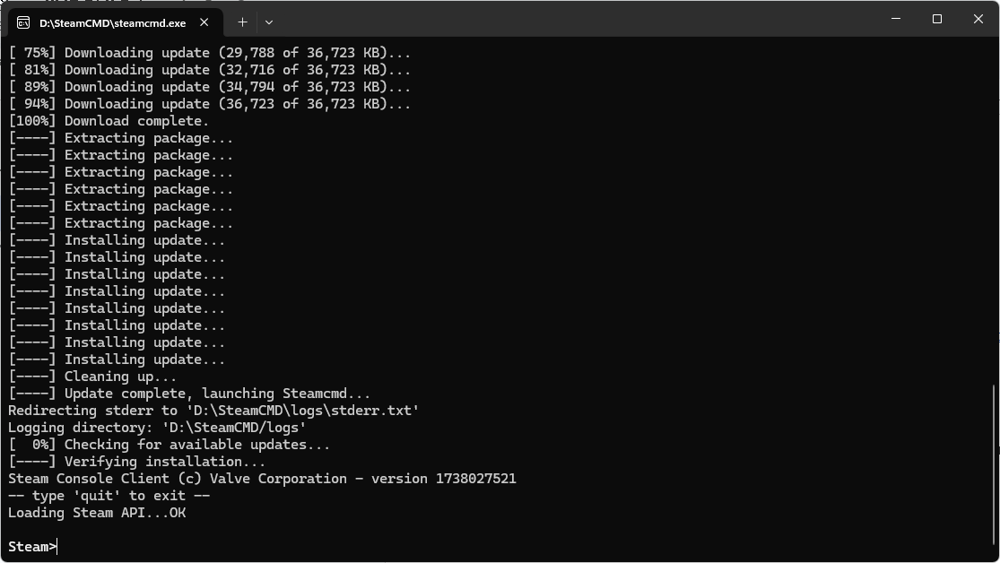

# SteamCMD

> Offline PZwiki reference. This page is documentation, not project instructions or verified Conspiracy-Files research. Source build warnings and incomplete entries remain applicable. External destinations are omitted. See the library README and COVERAGE for scope.

SteamCMD



Links


Valve documentation: Setting up SteamCMD


Workshop item build configuration file

**SteamCMD** is a command-line version of the Steam client, designed for installing and updating dedicated servers for games. It can be used to download and manage game files without the need for a graphical interface, as well as installing or uploading Workshop mods. Regular users do not need to use SteamCMD, and it is primarily intended for server administrators and modders.

The official Valve documentation provides detailed instructions on how to setup SteamCMD. However, the documentation regarding details on how to use it is lacking.

<a id="Connecting_to_SteamCMD"></a>

## Connecting to SteamCMD

This article may have claims which require verification.

How long does the cache credential lasts and can it be changed ?

After installing SteamCMD, you can connect to it by running the command`steamcmd` in a terminal or command prompt. This will start the SteamCMD client and display a custom command prompt where you can enter commands. Actions which do not require an account like download a Workshop item can be done anonymously, while actions that require an account, such as uploading a Workshop item, will require you to log in.

To login anonymously, use the command`login anonymous`. To login with your Steam account, use the command`login username` then enter your password. Your credentials will be cached for some time, allowing you to login back in without giving your password.

<a id="Uploading_Workshop_items"></a>

## Uploading Workshop items

To upload or create a new workshop item, you need to create a build configuration file. SteamCMD uses this file to get the informations about the workshop item you want to upload. Such a file needs to follow a specific format:


```text
"workshopitem"
{
	"appid"		"108600"
	"publishedfileid"		"3525515977"
	"contentfolder"		"<path to content to upload>"
	"previewfile"		"<path to preview image file>"
	"visibility"		"0"
	"title"		"Test SteamCMD upload"
	"description"		"Test SteamCMD upload"
	"changenote"		"Test SteamCMD upload: This is a test"
}
```


The format of the file doesn't matter but these files are usually referred to as VDF files (Valve Data File). To upload the item using the newly created build configuration file, use the command:

steamcmd.exe +login myLogin myPassword +workshop_build_item path/to/build/file.vdf +quit

| Parameter name | Description |
| --- | --- |
|`appid` | The App ID of the game for which you are uploading the workshop item. For Project Zomboid, this is always`108600`. |
|`publishedfileid` | The unique identifier for the workshop item. This number can easily be found for an existing Workshop item in the URL of the item page, but it is also automatically added to the description when using the [in-game uploader](Uploading_mods.md#In-game_uploader). To create a new workshop item, simply set this to`0` or remove the`publishedfileid` line. SteamCMD will create a new item with a new ID and replace or add this value with the new ID in the build file after the upload for future uploads. |
|`contentfolder` | The path to the folder containing the content of the workshop item. This folder should contain all the files that you want to include in the workshop item. For Project Zomboid, this folder should be`Workshop/<mod folder>/Contents/mods/` if you take the default [mod structure](Mod_structure.md). |
|`previewfile` | The path to the preview image file for the workshop item. This file will be displayed as the thumbnail for the item in the Workshop. It can be a PNG, JPG, or GIF file. |
|`visibility` | The visibility of the workshop item. It can be set to:`0` for public visibility (default),;`1` for friends-only visibility,;`2` for private (hidden) visibility.;`3` for unlisted visibility.; |
|`title` | The title of the workshop item. This is the name that will be displayed in the Workshop. |
|`description` | The description of the workshop item. This can be a multiline text in the configuration file, for example:`"workshopitem" { "appid"		"108600" "publishedfileid"		"3525515977" "contentfolder"		"<path to content to upload>" "previewfile"		"<path to preview image file>" "visibility"		"0" "title"		"Test SteamCMD upload" "description"		"Test SteamCMD upload This is a multiline description Hello world" "changenote"		"Test SteamCMD upload: Added build file to content" }` |
|`changenote` | The change note for the workshop item. Like for the description, this can be a multiline text in the configuration file. |

You can find a simple workshop item example uploaded with this method here. In this example, a gif was uploaded as the preview image, which isn't possible with the [in-game uploader](Uploading_mods.md#In-game_uploader).

The description and patch note use Steam BBCode.

<a id="Retrieving_a_workshop_item_information"></a>

## Retrieving a workshop item information

You can retrieve a Workshop item informations by using a POST request from the Steam API:


```text
curl -X POST "https://api.steampowered.com/ISteamRemoteStorage/GetPublishedFileDetails/v1/" -H "Content-Type: application/x-www-form-urlencoded" -d "itemcount=1" -d "publishedfileids[0]=<publishedfileid>"
```


This method was retrieved from this Steam forum post.

<a id="See_also"></a>

## See also

- [Uploading mods](Uploading_mods.md) - a page explaining how to upload a mod.
- [Steam Uploader](Steam_Uploader.md) - a tool for uploading mods which utilizes the Steamworks SDK.

Retrieved from "[https://pzwiki.net/w/index.php?title=SteamCMD&oldid=1393761](SteamCMD.md)"
