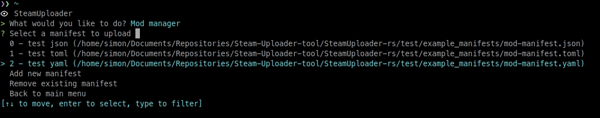
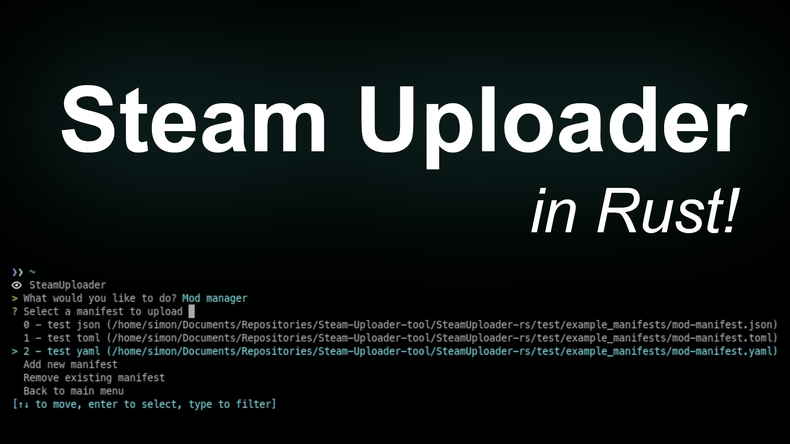

# Steam Uploader

> Offline PZwiki reference. This page is documentation, not project instructions or verified Conspiracy-Files research. Source build warnings and incomplete entries remain applicable. External destinations are omitted. See the library README and COVERAGE for scope.

Steam Uploader

C++ version

GitHub repository

Download

Rust version (less tested)

GitHub repository

Download

Steam Uploader Helper

GitHub repository

**Steam Uploader** is an external uploader for Steam Workshop items that can be used for Project Zomboid to bypass the [in-game uploader](Uploading_mods.md#In-game_uploader) limitations, such as the preview size and file type limits. Since the Rust rework of the tool, it depends on a manifest file for your mod that contains the title, description, tags, etc. of your mod, which makes it easier to manage your mods and upload them.

It uses simple command-line arguments to control what needs to be updated, with the ability to directly provide a text file for the description and patch note. This requires the Steam client to be opened when using the tool.

▶

Steam Uploader - quick demonstration

External link ↗

## Steam Uploader Helper

**SteamUploader Helper** is a companion tool for the C++ version of SteamUploader. It helps manage and publishing mods to the Steam Workshop. This tool offers an interface that handles batch regex editing and batch uploading. Uploads pull title, description, and tags straight from each mod's [workshop.txt](workshop.txt.md)/[mod.info](mod.info.md).

Retrieved from "[https://pzwiki.net/w/index.php?title=Steam_Uploader&oldid=1459649](Steam_Uploader.md)"
