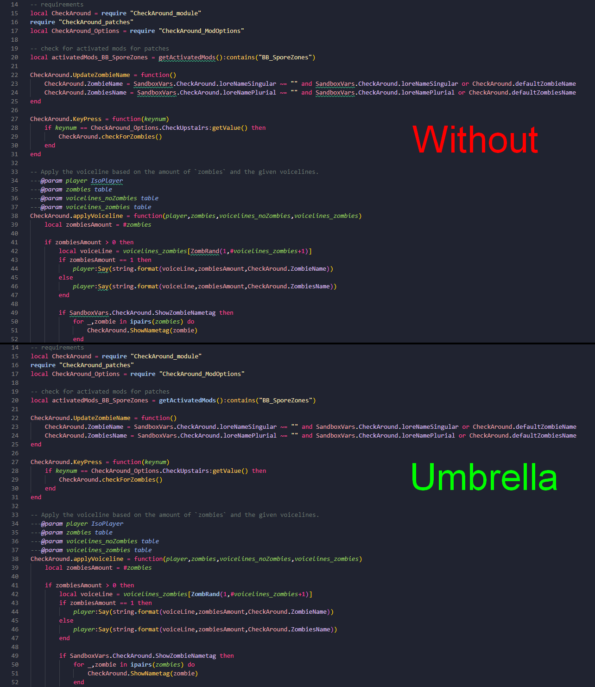

# Umbrella (modding)

> Offline PZwiki reference. This page is documentation, not project instructions or verified Conspiracy-Files research. Source build warnings and incomplete entries remain applicable. External destinations are omitted. See the library README and COVERAGE for scope.

This page has been revised for the current stable version (42.20.4).

Help by adding any missing content. [Edit](Umbrella_modding.md) (Create account)

Parts of this page may have been automatically updated to the latest build (42.20.4).


This article is about a modding project. For the item, see Umbrella.

Umbrella





Links


Umbrella wiki


GitHub repository

Download


Unstable release (Build 42)


Stable release (Build 41)

**Umbrella** is a collection of Lua type stubs for the [Lua API](../lua-api/Lua_API.md). It tells your IDE about Zomboid's classes and functions in order to provide autocomplete and type checking. It can be used with any IDE and language server that supports EmmyLua annotations, but is primarily designed for [VSCode](Visual_Studio_Code.md)'s [EmmyLua](EmmyLua.md) plugin. The Lua stubs are generated from the Rosetta Project datasets and tools.

The extensions below are **not** Umbrella ! These are extensions for other games !

<a id="How_to_activate_Umbrella"></a>

## How to activate Umbrella

Two lua language server extensions are available:

- [LuaLs](LuaLs.md) - Lua Language Server by Sumneko.
- [EmmyLua](EmmyLua.md) (recommended) - EmmyLua plugin for various IDEs.

Both don't use the same installation method, so follow the instructions for your chosen extension.

Build 42 can use both extensions, but Build 41 only supports [LuaLs](LuaLs.md).

<a id="EmmyLua"></a>

### EmmyLua

Install the [EmmyLua extension](EmmyLua.md), compared to [LuaLs](LuaLs.md) git isn't needed here. Download Umbrella's last source code from the GitHub release page or clone the repository.

Once the EmmyLua extension is downloaded and active:

- Create the default configuration file for EmmyLua (`.emmyrc.json`) in your workspace root which you can find the content in [EmmyLua's configuration file section](EmmyLua.md#Configuration_file).
- In the`library` field, add a new entry to the array (`[]`) with the path to Umbrella's`library` folder on your computer.

Your configuration file structure should look something like this:


Configuration file example


```text
{
    "$schema": "https://raw.githubusercontent.com/EmmyLuaLs/emmylua-analyzer-rust/refs/heads/main/crates/emmylua_code_analysis/resources/schema.json",
    "workspace": {
        "library": ["C:\\Documents\\Umbrella-main\\library"],
        "workspaceRoots": [
            "Contents/mods/**/**/media/lua"
        ]
    },
    "runtime": {
        "requirePattern": [
            "shared/?.lua",
            "client/?.lua",
            "server/?.lua"
        ],
        "version": "Lua5.1"
    },
    "diagnostics": {
        "disable": ["unnecessary-if"]
    }
}
```


You can also create an system environment variable on your computer to easily reference Umbrella's library folder. (pay attention to put it in system and not user tab). For example:


```text
"workspace": {
    "library": ["$PZ_UMBRELLA"]
}
```


With the`PZ_UMBRELLA` system variable pointing to`C:\Documents\Umbrella\library`.

On Linux, you can define the system environment variable like so:


```text
export PZ_UMBRELLA="/path/to/Umbrella/library"
```


You may have to do it either in`~/.bashrc`,`~/.profile` or`~/.bash_profile`.

If EmmyLua is not respecting your workspace root and still analyses other version folders, you can ignore them (or any other directory) like so:


```text
"workspace": {
    "ignoreDir": ["Contents/mods/YourModId/media"]
}
```


Do **NOT** use Visual Studio Code workspaces to contain multiple projects using EmmyLua. EmmyLua will only load the first top-level`.emmyrc.json` config and will **ignore the other configs**. This is not an Umbrella issue, but an issue with EmmyLua

<a id="LuaLs"></a>

### LuaLs

Install the [Lua extension by Sumneko](LuaLs.md) as well as git for it to work. You can download the Lua extension from the [VSCode](Visual_Studio_Code.md) extensions marketplace directly in the IDE. See Extension Marketplace documentation if you're having trouble downloading extensions.

Once the Lua extension is downloaded and active:

- Press CTRL+⇧ Shift+P.
- Open "Lua: Open Addon Manager ..."
- In the search bar, look for "Umbrella", or "Umbrella (Unstable)" if developing mods on the Unstable version of the game.
- Click`Enable` to activate it. If not downloaded already, make sure to enable again after it got downloaded.

You need to activate Umbrella for each new [workspace](Visual_Studio_Code.md#Workspace).

Don't forget to install git on your system, as well as activate Umbrella in the **Addon Manager**.

Retrieved from "[https://pzwiki.net/w/index.php?title=Umbrella_(modding)&oldid=1516505](Umbrella_modding.md)"
