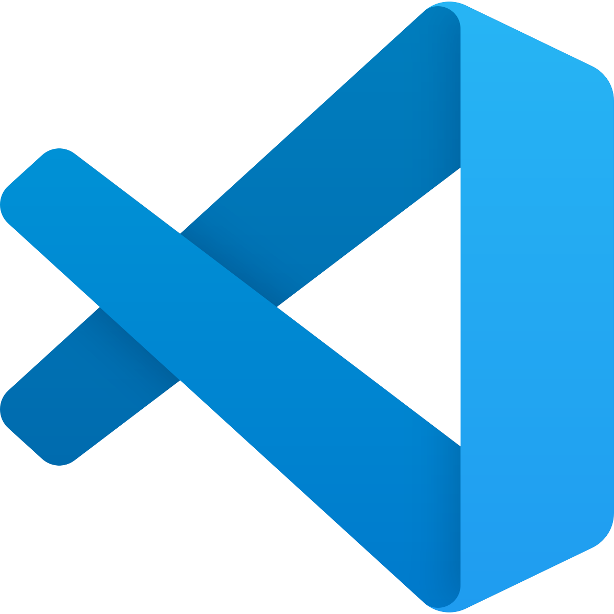
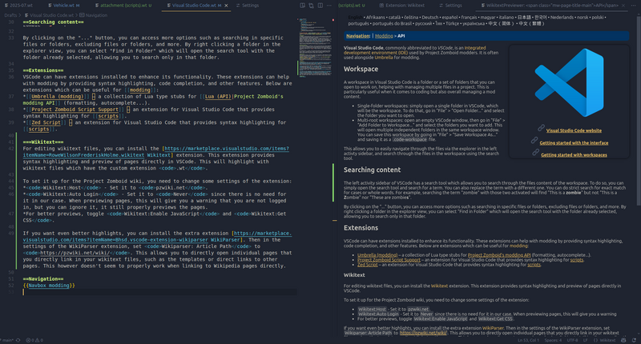

# Visual Studio Code

> Offline PZwiki reference. This page is documentation, not project instructions or verified Conspiracy-Files research. Source build warnings and incomplete entries remain applicable. External destinations are omitted. See the library README and COVERAGE for scope.

Visual Studio Code

Links

Visual Studio Code website

Getting started with the interface

Getting started with workspaces

**Visual Studio Code**, commonly abbreviated to VSCode, is an Integrated development environment (IDE) used by many Project Zomboid modders. It is often used alongside [Umbrella](Umbrella_modding.md) for modding.

## Workspace

A workspace in Visual Studio Code is a folder or a set of folders that you can open to work on, helping with managing multiple files in a project. This is particularly useful when it comes to coding but also overall managing a mod content.

- Single-folder workspaces: simply open a single folder in VSCode, which will be the workspace. To do that, go in "File" > "Open Folder..." and select the folder you want to open.
- Multi-root workspaces: open an empty VSCode window, then go in "File" > "Add Folder to Workspace..." and select the folders you want to add. This will open multiple independent folders in the same workspace window. You can save this workspace by going in "File" > "Save Workspace As..." and saving it as a`.code-workspace` file.

This allows you to easily navigate through the files via the explorer in the left activty sidebar, and search through the files in the workspace using the search tool.

## Searching content

The left activity sidebar of VSCode has a search tool which allows you to search through the files content of the workspace. To do so, you can simply open the search tool and search for a term. You can also replace the term with a different one. You can do strict search for exact match for cases or whole words. For example, searching the term "zombie" with those two activated will find "This is a **zombie**" but not "This is a **Z**ombie" nor "These are zombie**s**".

By clicking on the "..." button, you can access more options such as searching in specific files or folders, excluding files or folders, and more. By right clicking a folder in the explorer view, you can select "Find in Folder" which will open the search tool with the folder already selected, allowing you to search only in that folder.

## Extensions

VSCode can have extensions installed to enhance its functionality. These extensions can help with modding by providing syntax highlighting, code completion, and other features. Below are extensions which can be useful for [modding](Modding.md):

- [Umbrella (modding)](Umbrella_modding.md) – a collection of Lua type stubs for [Project Zomboid's modding API](../lua-api/Lua_API.md) (formatting, autocomplete...).
- ZedScripts - the most up-to-date extension for [scripts](../scripts/Scripts.md) syntax highlight and diagnostics.
- Project Zomboid Script Support – an extension for Visual Studio Code that provides syntax highlighting for [scripts](../scripts/Scripts.md).
- Zed Script – an extension for Visual Studio Code that provides syntax highlighting for [scripts](../scripts/Scripts.md).

### Lua

Two extensions are available to help with Lua programming for [modding](Modding.md):

- [EmmyLua](EmmyLua.md)
- [LuaLs](LuaLs.md)

EmmyLua is the suggested extension for creating [Lua mods](../lua-api/Lua_API.md).

### Wikitext

For editing wikitext files, you can install the Wikitext extension. This extension provides syntax highlighting and preview of pages directly in VSCode. This will highlight with wikitext files which have the custom extension`.wt`.

To set it up for the Project Zomboid wiki, you need to change some settings of the extension:

-`Wikitext:Host` - Set it to`pzwiki.net`.
-`Wikitext:Auto Login` - Set it to`Never` since there is no need for it in our case. When previewing pages, this will give you a warning that you are not logged in, but you can ignore it, it still properly previews the pages.
- For better previews, toggle`Wikitext:Enable JavaScript` and`Wikitext:Get CSS`.

If you want even better syntax highlights, you can install the extra extension WikiParser then in the settings of the WikiParser extension, set`Wikiparser: Article Path` to`[https://pzwiki.net/wiki/](https://pzwiki.net/wiki/)`. This allows you to open individual pages that you directly link in your wikitext files, such as the templates or direct links to other pages. This however doesn't seem to properly work when linking to Wikipedia pages directly.

Retrieved from "[https://pzwiki.net/w/index.php?title=Visual_Studio_Code&oldid=1439187](Visual_Studio_Code.md)"
