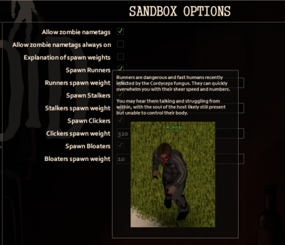
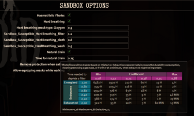
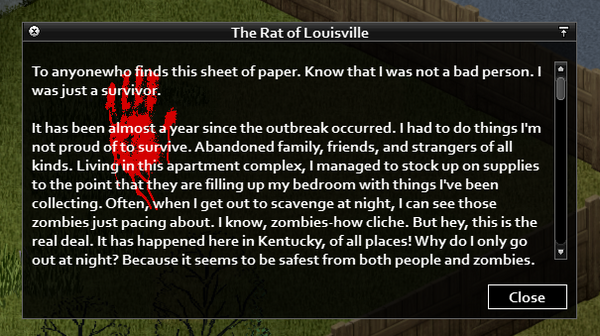

# ISRichTextPanel

> Offline PZwiki reference. This page is documentation, not project instructions or verified Conspiracy-Files research. Source build warnings and incomplete entries remain applicable. External destinations are omitted. See the library README and COVERAGE for scope.

This page was last updated for an older version of the current build (42.3.1).

The current stable version is 42.20.4, so information on this page may be inaccurate.

Help get this page updated by adding any missing content. [Edit](ISRichTextPanel.md) (Create account)

**ISRichTextPanels** are UI panels that support tags for formatting strings.





Example usage of ISRichTextPanel tags to make custom [Sandbox options](../scripts/Sandbox_options.md) more appealing

`ISRichTextPanel` definition location in game folder:


```text
ProjectZomboid/
└── media/
    └── lua/
        └── client/
            └── ISUI/
                └── ISRichTextPanel.lua
```


<a id="Available_tags"></a>

## Available tags

-`<LINE>` - starts a new line, useful in translation strings as they cannot use`\n`

-`<BR>` - similar to <LINE>, but it creates a larger space between lines, effectively creating a double line break

-`<SPACE>` - adds a space character's width to the current X position, used for inline spacing

-`<H1>` - formats text with H1 properties, making it centered and setting the font to large

-`<H2>` - formats text with H2 properties, aligning it to the left and setting the font to medium

-`<TEXT>` - resets text properties to defaults for the body text, using a smaller font than headers

-`<CENTRE>`,`<LEFT>`,`<RIGHT>` - aligns the text to the center, left, or right of the line respectively

-`<PUSHRGB:R,G,B>` - saves the current color state onto a stack and sets the new text color according to the provided RGB values

-`<POPRGB>` - restores the last text color from the stack, reversing the effect of the most recent`<PUSHRGB>`

-`<RGB:R,G,B>` - sets the current text color to the specified RGB values without affecting the stack

-`<RED>`,`<ORANGE>`,`<GREEN>` - sets the current text color to red, orange, or green respectively

-`<SIZE:small/medium/large>` - changes the font size to small, medium, or large

-`<IMAGE:path/to/image,width,height>` - inserts an image at the specified path with given width and height (width and height are optional)

-`<IMAGECENTRE:path/to/image,width,height>` - inserts an image and centers it horizontally on the line, with specified width and height (width and height are optional)

-`<INDENT:int>` - sets the current indentation level in pixels. The current and next lines will maintain this indent until another INDENT tag is used.

-`<JOYPAD:key from Joypad.Texture,width,height>` - inserts an image from the Joypad.Texture table with a specified key label and dimensions (see below)

-`<SETX:int>` - sets the X position to a specific pixel position, overriding the text flow

-`<GHC>` - the Good Highlited Color set by the player in options

-`<BHC>` - the Bad Highlited Color set by the player in options

-`<VIDEOCENTRE:VIDEO_NAME.bik, original_width, original_height, display_width, display_height>` -`VIDEO_NAME.bik` must be in`media/videos/` (that's where the panel looks for videos); the original dimensions of the video; the size at which it will be displayed in the panel (default for displayed size is w=384, h=216 if undefined).

-`<VIDEOCENTRE:VIDEO_NAME.bik, original_width, original_height, backup_image_name>` - if the video effects are off it will show the backup image, must be in`media/videos/` (hardcoded location).

Any space in a tag will break it and the formatting needs to be strictly respected!

<a id="Examples_for_IMAGE"></a>

### Examples for IMAGE

`<IMAGE:media/ui/spiffo/packing.png>` or texture name`<IMAGE:Item_Plank>`,`<IMAGE:location_entertainment_gallery_01_8>`

**width, height in pixels** **keys from Joypad.Texture** {AButton, BButton, XButton, YButton, LBumper, RBumper, DPadLeft, DPadRight, DPadUp, DPadDown, DPad, LStick, RStick, LTrigger, RTrigger, Menu, View, Back, Start}

<a id="Make_custom_tags_to_use_in_ISRichTextPanel"></a>

## Make custom tags to use in`ISRichTextPanel`

This snipet is an example of custom tag you can create to add new options. It allows you to add images on top of text to have a nice effect of a bloody hand on top of a handwritten letter.

You are allowed to use these tags but adding the same tags as other modders can cause duplicates and create issues when PZ checks for tags. The best would be to name these tags with your own names even if you plan to use this snippet.


```text
--- Made by Arendameth

require "ISUI/RichTextPanel"
local originalProcessCommand = ISRichTextPanel.processCommand
function ISRichTextPanel:processCommand(command, x, y, lineImageHeight, lineHeight)
    if string.find(command, "IMAGEFLOW:") then
        local w = 0
        local h = 0
        if string.find(command, ",") ~= nil then
            local vs = string.split(command, ",")
            command = string.trim(vs[1])
            w = tonumber(string.trim(vs[2]))
            h = tonumber(string.trim(vs[3]))
        end
        self.images[self.imageCount] = getTexture(string.sub(command, 11))
        if w == 0 then
            w = self.images[self.imageCount]:getWidth()
            h = self.images[self.imageCount]:getHeight()
        end
        self.imageX[self.imageCount] = x + 2
        self.imageY[self.imageCount] = y
        self.imageW[self.imageCount] = w
        self.imageH[self.imageCount] = h
        self.imageCount = self.imageCount + 1
    elseif string.find(command, "IMAGEFLOWCENTRE:") then
        local w = 0
        local h = 0
        if string.find(command, ",") ~= nil then
            local vs = string.split(command, ",")
            command = string.trim(vs[1])
            w = tonumber(string.trim(vs[2]))
            h = tonumber(string.trim(vs[3]))
        end
        self.images[self.imageCount] = getTexture(string.sub(command, 17))
        if w == 0 then
            w = self.images[self.imageCount]:getWidth()
            h = self.images[self.imageCount]:getHeight()
        end
        local mx = (self.width / 2) - self.marginLeft
        self.imageX[self.imageCount] = mx - (w / 2)
        self.imageY[self.imageCount] = y
        self.imageW[self.imageCount] = w
        self.imageH[self.imageCount] = h
        self.imageCount = self.imageCount + 1

        for c, v in ipairs(self.lines) do
            if self.lineY[c] == y then
                self.lineY[c] = self.lineY[c] + (h / 2)
            end
        end

        y = y + (h / 2)
    end

    return originalProcessCommand(self, command, x, y, lineImageHeight, lineHeight)
end
```


<a id="Example"></a>

### Example



Retrieved from "[https://pzwiki.net/w/index.php?title=ISRichTextPanel&oldid=1389505](ISRichTextPanel.md)"
