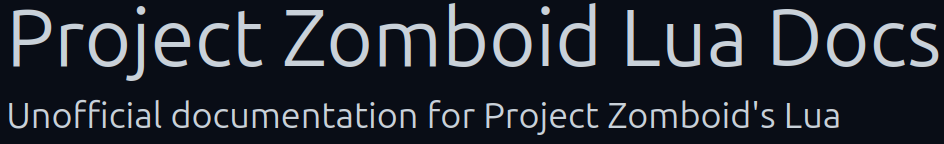
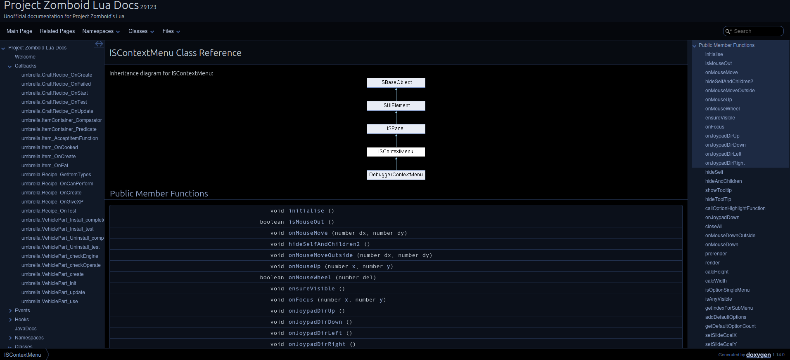

# LuaDocs

> Offline PZwiki reference. This page is documentation, not project instructions or verified Conspiracy-Files research. Source build warnings and incomplete entries remain applicable. External destinations are omitted. See the library README and COVERAGE for scope.

This page was last updated for an older version of the current build (42.8.1).

The current stable version is 42.20.4, so information on this page may be inaccurate.

Help get this page updated by adding any missing content. [Edit](LuaDocs.md) (Create account)

LuaDocs

Links

LuaDocs website

GitHub repository

Rosetta Doxygen repository

**LuaDocs** is a project which aims to provide a comprehensive documentation of the [Lua](Lua_API.md) of Project Zomboid. It is intended to be used by modders to understand the available functions, classes, and methods in the game Lua. The documentation was generated by using Doxygen.

The documentation notably lists:

- Various Callbacks (usually functions triggered by [scripts](../scripts/Scripts.md).
- [Lua events](Lua_event.md).
- Hooks.
- A direct link to the lasted version of the [JavaDocs](../java/JavaDocs.md).
- Various [classes](Lua_object.md) and their functions, as well as their hierarchy and inheritance.
- Locations of the Lua files, notably useful to figure out the location of various classes.

Retrieved from "[https://pzwiki.net/w/index.php?title=LuaDocs&oldid=1390445](LuaDocs.md)"
