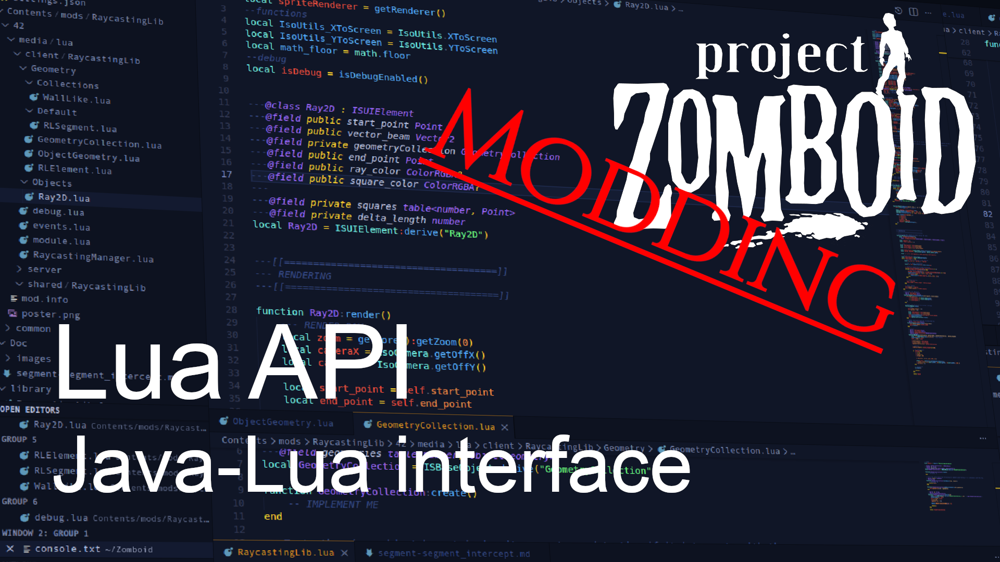
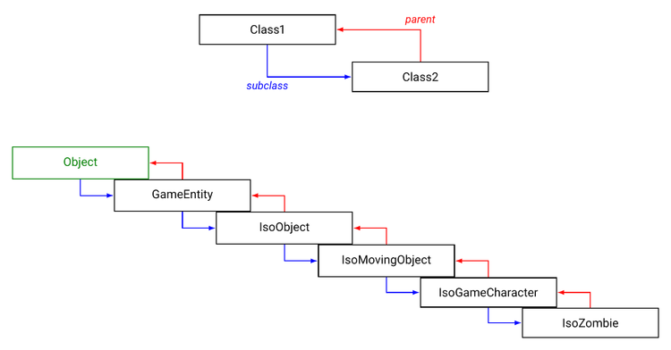

# Lua (API)

> Offline PZwiki reference. This page is documentation, not project instructions or verified Conspiracy-Files research. Source build warnings and incomplete entries remain applicable. External destinations are omitted. See the library README and COVERAGE for scope.

This page has been revised for the current stable version (42.20.3).

Help by adding any missing content. [Edit](Lua_API.md) (Create account)

Parts of this page may have been automatically updated to the latest build (42.20.4).


This article is about the Lua API. For a guide to learn how to code with Lua, see [Lua (language)](Lua_language.md).

Project Zomboid allows modders to program functionalities via a [Java](../java/Java.md) implementation of **[Lua](Lua_language.md)** called Kahlua, which enables Lua scripts to run within Java programs. It bases itself on Lua 5.1 with a few differences and allows the use of exposed Java class and methods from Lua scripts.

It is highly suggested to take note of the [JavaDocs](../java/JavaDocs.md) and possibly decompiling the game code to make your life easier when it comes to finding functions and understanding their inner working to more easily manipulate the game's Lua. Alternatively, an unofficial project called [LuaDocs](LuaDocs.md) acts like a JavaDocs but for the Lua API.

[Java](../java/Java.md) modding also exists and is a more powerful way to mod the game, by reducing the limitations to the minimum. However, it is more complex and has its own major drawbacks.

<a id="Video_guide"></a>

## Video guide



▶

PZ Modding Guides - Lua API, Java-Lua interface

External link ↗

<a id="How_do_Java_classes_work_in_the_Lua_API"></a>

## How do Java classes work in the Lua API

Lua acts as a bridge to the Java, thanks to Project Zomboid's API. Every time you try to run functions on a Java object from Lua, there are more operations happening than simply running a Lua function on a Lua object, which is also the source of performance impacts (see [Mod optimization](../foundations/Mod_optimization.md)).

There are many ways to access the various class objects in the game, sometimes easy and sometimes not so easy. The usual way is to utilize [Lua events](Lua_event.md) which will output the various class objects they refer to. Take for example OnZombieUpdate which runs for every single zombies and every zombie update tick:


```text
local function OnZombieUpdate(zombie)
	-- Your code here
end

Events.OnZombieUpdate.Add(OnZombieUpdate)
```


In this case, the variable`zombie` is an IsoZombie with various methods that can be used on it. Sometimes it involves creating one yourself with a [#Constructor](Lua_API.md#Constructor) or directly retrieving the list of objects. Most classes can have multiple instances, like in the case of IsoZombie.

<a id="Parent_and_subclasses"></a>

### Parent and subclasses



The parent and subclass relationship between Java classes with IsoZombie as an example.

All Java classes are a subclass to another class, and might also be the parent to subclasses. On the side here, you can see a representation of this relationship, with an example of the IsoZombie class and its parent and subclasses.

Subclasses inherit all the public and protected methods and fields from their parent class, while also having their own unique methods and fields, possibly overriding some of the inherited methods. In the [JavaDocs](../java/JavaDocs.md), subclasses are listed in the "Direct Known Subclasses" section of the class page. The hierarchy tree with parents is shown at the top of the class page and its inherited methods and fields are listed in the "Method Summary" and "Field Summary" sections of the class page.

<a id="Nested_classes"></a>

### Nested classes

A subclass inherits another class, while a **nested class** is defined directly in a class and as such has access to even private methods and fields from its original class. In the [JavaDocs](../java/JavaDocs.md), nested classes are listed in the “Nested Class Summary” section of the class page. Nested classes are written as`ClassName.NestedClassName`.

This principle is not too important to understand to work with the Lua API and mostly a technical detail, however there are some notable nested classes which are often used, such as the PerkFactory.Perks for example.

<a id="Instance_and_static"></a>

### Instance and static

Java classes can have two types of methods and fields: instance methods and static methods. To run, instance methods require an instance of the class, while static methods can be run without an instance.

<a id="Access_Modifiers"></a>

### Access Modifiers

Java class members have an access modifier (public, protected, package, private) which determines where they are accessible. Only public members are exposed to Lua.

<a id="Methods_and_fields"></a>

### Methods and fields

Java classes can have methods and fields which are respectively functions and variables associated to the class if private or unique to an instance of the class.

<a id="Exposed_elements"></a>

## Exposed elements

Not all the Java classes and methods are exposed to the Lua API. In the [JavaDocs](../java/JavaDocs.md), there is no indication of which classes are exposed but for the classes that are exposed, it shows only the methods that are exposed. To call a static method, you need to use the syntax`ClassName.methodName(args...)`, while for instance methods, you need to use the syntax`instance:methodName(args...)`. This directly refers to the Lua syntax for calling [Lua object](Lua_object.md) methods with the colon`:` operator passing`self` (the instance here) as the first argument, while the dot`.` operator is used for static methods.

For example`getLocalPlayerByOnlineID(ID)` can be ran without an instance of IsoPlayer (`IsoPlayer.getLocalPlayerByOnlineID(ID)`), while`getForname()` needs an instance of IsoPlayer to be ran (`player:getForname()`).

LuaManager.GlobalObject defines global methods which are exposed in peculiar way, not following the usual way to use them described above. Static methods listed in the JavaDocs page for LuaManager.GlobalObject are called simply by like global Lua functions, such as`getPlayer()` or`getCell()`.

Class objects from the Java are not the same as [Lua object](Lua_object.md)! They are not tables, but rather direct links to the Java classes. As such, they cannot be used as Lua objects and do not have the same properties as Lua objects.

<a id="Accessing_fields"></a>

### Accessing fields

<a id="Static_fields"></a>

### Static fields

Public static fields of exposed classes are exposed to Lua in a global table of the same name as the class.


```text
local DEATH_MUSIC_NAME = IsoPlayer.DEATH_MUSIC_NAME
```


<a id="Instance_fields"></a>

### Instance fields

Accessing fields is no longer possible since Build 42.15.0 due to reflection being restricted to [debug mode](../foundations/Debug_mode.md) only for security reasons. Static fields can still be accessed without any problems however.

Instance fields are different as they are not directly exposed but can be accessed by using reflection. It involves a fairly complex set of operations:


```text
local function getJavaField(object, field)  -- (IsoZombie instance, "strength")
    local offset = string.len(field)
    for i = 0, getNumClassFields(object) - 1 do
        local m = getClassField(object, i)
        if string.sub(tostring(m), -offset) == field then
            return getClassFieldVal(object, m)
        end
    end
    return nil -- no field found
end
```


This can access any field declared by the class, regardless of whether it is private or public.

Accessing the inherited fields of a class from one of its subclass is not possible currently.

<a id="Constructor"></a>

### Constructor

Constructors are used to instantiate a Java class. This is done with the following way:


```text
ClassName.new(args...)
```


The`ClassName` of course needs to be the name of the Java class, so for example IsoZombie, while the arguments`args` are specific to the Java class.

If you want to instantiate an IsoZombie, you can use its associated <init>(zombie.iso.IsoCell) constructor.


```text
-- create the IsoZombie instance
local isoZombie = IsoZombie.new(getCell())
```


Something very important to take note of is that this will not create an actual zombie, but simply an instance of IsoZombie which can be used for different operations which require an IsoZombie instance. This is the usual usage of the constructor, and creating entities is mostly done with different kinds of methods.

This IsoZombie instance can be used to create a corpse, for example with the following method for Build 41:


```text
-- square is an IsoGridSquare
square:addCorpse(IsoDeadBody.new(zombie), false) -- note the use of IsoDeadBody constructor here
```


<a id="Example"></a>

### Example


```text
--- INSTANCE METHOD EXAMPLE ---
-- retrieve the client IsoPlayer instance
local player = getPlayer() -- a LuaManager.GlobalObject method

-- retrieve the IsoPlayer instance move speed
local moveSpeed = player:getMoveSpeed() -- instance method, notice the ":"

--- STATIC METHOD EXAMPLE ---
-- retrieve the list of IsoPlayers
local players = IsoPlayer.getPlayers() -- static method, notice the "."
```


<a id="Hooking_to_Java_methods"></a>

### Hooking to Java methods

It is possible to hook to Java methods, which means to run Lua code when a specific Java method **is called Lua side**. This has the disadvantage that your hook will not be called if the method is called Java side, but it can have niche uses in some cases:


```text
local index = __classmetatables[ClassName.class].__index

local old_method = index.method
function index:method(...)
    old_method(self, ...)
end
```


You cannot hook to Java methods which are called Java side!

<a id="Lua_objects"></a>

## Lua objects

Lua objects are widely used in the Lua API and natively defined in it. They utilize the [ISBaseObject](ISBaseObject.md) class and [derive](Derive.md) from it to define new classes which can themselves be derived from. They are usually global and can be accessed from anywhere but in some cases where they are locked behind a local scope to a file, you can utilize the DOME library to access them.

[Timed Action (Lua)](Timed_Action_Lua.md) use Lua objects to easily instantiate them and derive directly from [Timed Action (Lua)](Timed_Action_Lua.md). UI elements also use Lua objects.

<a id="Where_to_start"></a>

## Where to start

To setup a programming environment, see the getting started page.

Programming with the Lua (API) can be done in many ways, but in most cases it will involve using a [Lua event](Lua_event.md) to run your code at specific moments of the game. As such, it's suggested to check out the [events](../categories/Category_Lua_events.md) which are available to see where you can get started.

When this didn't do much for you, another thing you might be interested to is to either check the vanilla code or for a mod which does something similar and see how they achieve it. With experience, you can learn to understand the game code and create your own functionalities more easily without needing to use examples.

Alternatively, various guides available on the Wiki will explain how to do certain actions.

<a id="Community_libraries"></a>

### Community libraries

There are various community libraries which can help you with your Lua modding. For a full list, see the Modding projects in the libraries category.

<a id="Folder_structure"></a>

## Folder structure

Main article: [Mod structure](../foundations/Mod_structure.md)

**Lua** scripts, with the file extension`.lua` need to be inside three subfolders inside the`media/lua` folder, and are used to determine the loading of files in singleplayer and multiplayer:


```text
📁 media
    📁 lua
        📁 client
            📄 yourFile.lua
            ...
        📁 server
            📄 yourOtherFile.lua
            ...
        📁 shared
            📄 thisIsALuaScript.lua
            ...
```


The only time one of these folder is not loaded is for multiplayer server side:

| Folder | Singleplayer | Multiplayer: / client side | Multiplayer: / server side |
| --- | --- | --- | --- |
|`client` |  |  |  |
|`server` |  |  |  |
|`shared` |  |  |  |

Organization inside the client, server and shared folders is free and subfolders can be created with files named in any way. Files with the same relative path to the`lua` as vanilla files will overwrite them, so make sure to use unique names and relative paths. This applies to other mod files too and is impacted by the load order between mods.

A good trick to not have your Lua files clash with other mods or vanilla files is to put your Lua files inside subfolders named after your mod. This will make it unlikely for your mod to clash with other mods.

<a id="Load_order"></a>

### Load order

Lua files are loaded when launching the game, and when exiting a save, or when manually triggered in [debug mode](../foundations/Debug_mode.md) in the main menu, in the following order:

- Shared - vanilla files
- Shared - mod files
- Client - vanilla files
- Client - mod files

The server subfolder is actually loaded only when launching a save, so anytime Lua is loaded or reloaded the server files are unloaded until a save is loaded. The order for the server subfolder files is:

- Server - vanilla files
- Server - mod files

Translation files are also put inside the`lua` folder but are not Lua files. See the [Translation](../translations/Translation.md) page for more detail.

It is not recommended to overwrite existing files if not needed for compatibility reasons. Instead, overwrite specific functions or [hook](Lua_language.md#Decoration) them when possible.

<a id="See_also"></a>

## See also

- [Java](../java/Java.md) - explains things related to
- [Lua (language)](Lua_language.md) - the programming language used in Project Zomboid.
- [Lua object](Lua_object.md) - classes defined in the Lua.
- [Lua event](Lua_event.md) - events which can be used to run Lua code at specific moments of the game.
- [LuaDocs](LuaDocs.md) - an unofficial project which acts like a JavaDocs but for the Lua API.
- [ModOptions](ModOptions.md) - the native mod options API introduced in Build 42.
- [User Interface](User_Interface.md) - explains how to make a UI via the Lua API.

Retrieved from "[https://pzwiki.net/w/index.php?title=Lua_(API)&oldid=1458817](Lua_API.md)"
