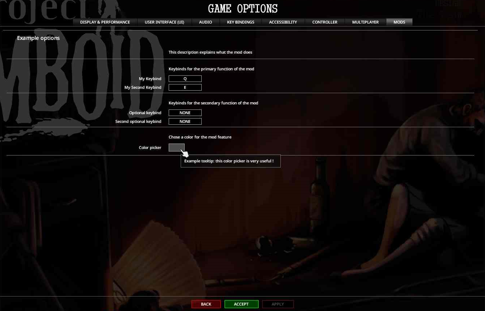

# ModOptions

> Offline PZwiki reference. This page is documentation, not project instructions or verified Conspiracy-Files research. Source build warnings and incomplete entries remain applicable. External destinations are omitted. See the library README and COVERAGE for scope.

This page was last updated for an older version of the current build (42.12.1).

The current stable version is 42.20.4, so information on this page may be inaccurate.

Help get this page updated by adding any missing content. [Edit](ModOptions.md) (Create account)


This article is about Build 42's native mod options. For the unofficial mod option framework for Build 41, see Mod Options.

**You should NOT use mod options for options that will alter gameplay. Something which affects every player should utilize [sandbox options](../scripts/Sandbox_options.md)! Mod options can be used for player UI settings for example.**

The reasons for this are:

- On MP release, your mod will instantly be problematic BY DEFAULT because you will have gameplay options which should be save dependent and server controlled be in the hands of players.

- Best case scenario, players which trigger specific behavior by having an option in a specific state will dictate how the whole server works, basically rendering those options unavailable to servers, or straight up randomized based on current connected playerbase.
- Worst case scenario, you will cause desyncs between players.
- Options which players would want to change per save, will be **only** global on the same Project Zomboid instance. Imagine an option which removes an item if activated, and the players will have to make sure to switch the option in the right state based on the save they are loading or they risk breaking their saves.
- You are alienating the players by not respecting the vanilla default methods of providing **gameplay options**. UI and client dependent changes can be mod options but anything which spawns items, modifies the map, etc should be in sandbox options.

To conclude, by not following these guidelines, you are placing yourself in a position where sooner or later you will be forced to completely change your option system for multiplayer release.

The`ModOptions` [Lua object](Lua_object.md) from PZAPI is a new tool since Build 42 which allows modders to easily add their own options for their mods such as keybinds, tick boxes, color pickers etc. The mod options created from this API will appear in the game options under the "MODS" category, allowing users to easily access them and change their values.

Currently the available types of options are:

- **Text entry** - string option.
- **Tickbox** - boolean option.
- **Multiple tickbox** - multiple booleans for a single option.
- **Combobox** (dropdown menu) - chose between multiple default choices.
- **Color picker** - chose a color.
- **Keybind** - chose a keybind.
- **Slider** - chose a value in-between a minimum and maximum, with a step.
- **Button** - the user can click on it to trigger a function.

`PZAPI.ModOptions` location in the [game folder](../foundations/Game_files.md):


```text
ProjectZomboid/
└── media/
    └── lua/
        └── client/
            └── PZAPI/
                └── ModOptions.lua
```


Mod Options are saved inside the [cache folder](../foundations/Game_files.md#Cache_folder) in the following file:


```text
<cache folder>/
└── Lua/
    └── modOptions.ini
```


Mod options are only used in Lua (disambiguation) mods and are not directly used for [Scripts](../scripts/Scripts.md), [Mapping](../mapping/Mapping.md), etc. This page considers that you are familiar enough with [Lua (language)](Lua_language.md) and [Lua (API)](Lua_API.md) to understand the code snippets shown here.

<a id="Creating_your_option_section"></a>

## Creating your option section

Creating your own mod option section involves the function`PZAPI.ModOptions:create(modOptionsID, name)`. To create a new mod option section in "MODS", simply do:


```text
local myExampleOption = PZAPI.ModOptions:create("myExampleOptionID","Example options")
```


`"myExampleOptionID"` needs to be unique to your mod ! You should probably make the name unique too.

[Caching](../foundations/Mod_optimization.md#Caching) the creation of the option allows for an easier access to it to continue below this code and add your own options. However if at any moment you need to access your mod option section or to access another mod options, you can simply do:


```text
local myExampleOption = PZAPI.ModOptions:getOptions("myExampleOptionID")
```


This means you can also add options to another existing mods, if your mod is an addon to it. The object returned by`getOptions` will be referred as an **option section** (such as`myExampleOption` in the example above).

<a id="Creating_options"></a>

## Creating options

Each option types will have at least 2 arguments:

-`id` (`string`) - needs to be unique for each options within an option section. It should be able to have the same ID as another option in a different option section.
-`name` (`string`) - the displayed name of the option. While it doesn't need to be unique, in most cases it should probably be unique to not confuse the users.
-`_tooltip` (`string`) - tooltip which appears when hovering with the cursor above the option. Might be able to use [ISRichTextPanel](ISRichTextPanel.md) (need confirmation).

Other arguments are available for each types of options which will be detailed in the following subsections.

Options are added this way:


```text
-- for addTextEntry, others use the same way
local myTextEntryOption = myExampleOption:addTextEntry(id, name, value, _tooltip)
```


Due to a bug which breaks identification of mod option custom keybinds, it is highly advised to feed the`name` field the already translated keys by using`getText`. For example:


```text
local myTextEntryOption = myExampleOption:addTextEntry(id, getText(name), value)
```


Where`name` would be a [translation](../translations/Translation.md) key like`IGUI_ModOptions_TestKeybind`.

Present on version 42.13.3. You can find the report of this bug here.

<a id="Text_entry"></a>

### Text entry

**Text entry** allows the user to write a string in a text box.

**Source:**`ProjectZomboid\media\lua\client\PZAPI\ModOptions.lua`

**Retrieved**: Build 42.0.2


```text
function Options:addTextEntry(id, name, value, _tooltip)
```


-`value` (`string`) - default entry.

Accessing value function:`option:getValue()`.

<a id="Tickbox"></a>

### Tickbox

**Tickbox** allows the user to chose a boolean value.

**Source:**`ProjectZomboid\media\lua\client\PZAPI\ModOptions.lua`

**Retrieved**: Build 42.0.2


```text
function Options:addTickBox(id, name, value, _tooltip)
```


-`value` (`boolean`) - default entry.

Accessing value function:`option:getValue()`.

<a id="Multiple_tickbox"></a>

### Multiple tickbox

**Multiple tickbox** allows the user to chose multiple boolean value for a single option. All tickboxes in the option are unique, which means ticking one won't tick the others to false !

**Source:**`ProjectZomboid\media\lua\client\PZAPI\ModOptions.lua`

**Retrieved**: Build 42.0.2


```text
function Options:addMultipleTickBox(id, name, _tooltip)
```


To add a new tickbox for this option, you need to use`myMultiTickOption:addTickBox(name, value)`


```text
local myMultiTickOption = myExampleOption:addMultipleTickBox("myMultiTickOption","Example multitick option")
myMultiTickOption:addTickBox("tick1",true)
myMultiTickOption:addTickBox("tick2",false)
myMultiTickOption:addTickBox("tick3",true)
myMultiTickOption:addTickBox("tick4",false)
```


-`name` (`string`) - name of this tickbox entry.
-`value` (`boolean`) - default value for this tickbox entry.

Accessing value function:`option:getValue(index)` with`index` (`integer`) - order of tick box addition with`option:addTickBox(name,value)`.

<a id="Combobox"></a>

### Combobox

**Combobox** allows the user to chose an option between multiple choices by opening a dropdown menu.

**Source:**`ProjectZomboid\media\lua\client\PZAPI\ModOptions.lua`

**Retrieved**: Build 42.0.2


```text
function Options:addComboBox(id, name, _tooltip)
```


To add a new entry for a combobox, you need to use`myMultiTickOption:addItem(name, _isSelected)`


```text
local myComboOption = myExampleOption:addComboBox("myComboOption","Example combobox option")
myComboOption:addItem("option1",true)
myComboOption:addItem("option2",false)
myComboOption:addItem("option3",false)
myComboOption:addItem("option4",false)
```


-`name` (`string`) - name of this combobox entry.
-`_isSelected` (`boolean`, OPTIONAL) - defines which entry is the default one. You should chose only one but chosing multiple should not cause any problem.

The value given by the combobox is the index of the entry based on the order it was added to the combobox. As such having an array which allows you to easily access the option chosen is better, for example:


```text
local FONT_LIST = {
    "Small",
    "Medium",
    "Large",
    "Massive",
    "MainMenu1",
    "MainMenu2",
    "Cred1",
}

local comboBox = options:addComboBox("Font","Chose your font")
comboBox:addItem(FONT_LIST[1],true) -- add first in the array as default
for i = 2,#FONT_LIST do
    comboBox:addItem(FONT_LIST[i]) -- add the other options
end

-- later when accessing that value, you can access the exact font which was chosen by doing
local fontIndex = comboBox:getValue()
local fontName = FONT_LIST[fontIndex]
```


<a id="Color_picker"></a>

### Color picker

**Color picker** allows the user to chose a color.

**Source:**`ProjectZomboid\media\lua\client\PZAPI\ModOptions.lua`

**Retrieved**: Build 42.0.2


```text
function Options:addColorPicker(id, name, r, g, b, a, _tooltip)
```


-`r` (`float`, min: 0, max: 1) - color red default value.
-`g` (`float`, min: 0, max: 1) - color green default value.
-`b` (`float`, min: 0, max: 1) - color blue default value.
-`a` (`float`, min: 0, max: 1) - color alpha (transparency) default value.

Accessing value function:`option:getValue()`.

<a id="Keybind"></a>

### Keybind

**Keybind** allows the user to chose a keybind.

**Source:**`ProjectZomboid\media\lua\client\PZAPI\ModOptions.lua`

**Retrieved**: Build 42.0.2


```text
function Options:addKeyBind(id, name, key, _tooltip)
```


-`key` (`integer`, see Keyboard) - default keybind.

Accessing value function:`option:getValue()`.

To detect when a keybind was pressed, see the associated [Lua events](Lua_event.md):

- [OnKeyKeepPressed](OnKeyKeepPressed.md)
- OnKeyPressed
- OnKeyStartPressed

<a id="Slider"></a>

### Slider

**Slider** allows the user to chose a value between a minimum and maximum. A step can be defined for the slider.

**Source:**`ProjectZomboid\media\lua\client\PZAPI\ModOptions.lua`

**Retrieved**: Build 42.0.2


```text
function Options:addSlider(id, name, min, max, step, value, _tooltip)
```


-`min` (`float`) - slider minimum.
-`max` (`float`) - slider maximum.
-`step` (`float`) - slider step.
-`value` (`float`) - default value.

Accessing value function:`option:getValue()`.

<a id="Button"></a>

### Button

**Button** allows the user to trigger an action. This is more complex than the previous option types and its uses are way more niche.

**Source:**`ProjectZomboid\media\lua\client\PZAPI\ModOptions.lua`

**Retrieved**: Build 42.0.2


```text
function Options:addButton(id, name, tooltip, onclickfunc, target, arg1, arg2, arg3, arg4)
```


-`onclickfunc` (`function`) - function which runs when clicking the button.
-`target` (`any`) - argument sent to the function.
-`arg1` (`any`) - argument sent to the function.
-`arg2` (`any`) - argument sent to the function.
-`arg3` (`any`) - argument sent to the function.
-`arg4` (`any`) - argument sent to the function.

The`onclickfunc` function receives the arguments this way:


```text
function(target,buttonObject,arg1,arg2,arg3,arg4)
    -- do anything
end
```


`buttonObject` is the button informations, meaning you can change it when clicking on it, such as its color. You can access the UI the button is in for example, allowing you to modify the UI when clicking the button such as changing its color.

The`onclickfunc` function has its arguments not properly passed with`arg4` being`arg3` instead.

Present on version 42.10.0. You can find the report of this bug here.

<a id="Visual_presentation"></a>

## Visual presentation

Various functions can be used to visually organize your mod options:

-`addTitle(<string>)` - adds a title.
-`addDescription(<string>)` - adds a description.
-`addSeparator()` - adds a horizontal separation bar.

These can be added at any point between your option definitions to visually organize your options.

<a id="Apply_function"></a>

## Apply function

You can link various actions to settings for your mod options being changed. For that you can simply hook to the`apply` function of your option section.


```text
local myExampleOption = PZAPI.ModOptions:create("myExampleOptionID","Example options")
myExampleOption.apply = function(self)
    -- do anything
end
```


This can be used to update some variables on your side after changing the mod options. This can for example be used to cache the option values elsewhere with the method described in the section [#Alternative accessing method: module](ModOptions.md#Alternative_accessing_method:_module).

<a id="Example"></a>

## Example

This code snippet utilizes the different options in subsections of the mod options section.


This is an example of a mod options usage.


```text
local myExampleOption = PZAPI.ModOptions:create("myExampleOptionID","Example options")
myExampleOption:addDescription("This description explains what the mod does")

-- text entry example
myExampleOption:addSeparator()
myExampleOption:addDescription("Write your name")
myExampleOption:addTextEntry("yourName","Your name","") -- empty text entry

-- tickbox example
myExampleOption:addSeparator()
myExampleOption:addDescription("Do you love Project Zomboid ?")
myExampleOption:addTickBox("lovePZ","I love it !",true)

-- multitick example
myExampleOption:addSeparator()
myExampleOption:addDescription("What fruit do you like ?")
local myMultiTickOption = myExampleOption:addMultipleTickBox("likedFruits","Fruits")
myMultiTickOption:addTickBox("orange",true)
myMultiTickOption:addTickBox("apple",false)
myMultiTickOption:addTickBox("cherry",true)
myMultiTickOption:addTickBox("lemon",false)

-- color picker example
myExampleOption:addSeparator()
myExampleOption:addDescription("What's the color of apples ?")
myExampleOption:addColorPicker("appleColor","Color picker",1,1,1,1,"Example tooltip: this color picker is very useful !")

-- keybind example
myExampleOption:addSeparator()
myExampleOption:addDescription("My keybinds for this mod")
myExampleOption:addKeyBind("keybind_PZlove", "Do I like Project Zomboid ?", Keyboard.KEY_A)
myExampleOption:addKeyBind("keybind_myName", "Say my name", Keyboard.KEY_NONE)

-- slider example
myExampleOption:addSeparator()
myExampleOption:addDescription("Give a score to this wiki page")
myExampleOption:addSlider("slider_scoreThis", "Score",0,1,0.1,5)

-- button example
myExampleOption:addSeparator()
myExampleOption:addDescription("Swap the button color")

-- swap the color of the button between green and red
local swapColor = function(_,button)
    if button.swap then
        button.backgroundColor = {r = 0,g = 1,b = 0,a = 1}
        button.swap = false
    else
        button.backgroundColor = {r = 1,g = 0,b = 0,a = 1}
        button.swap = true
    end
end

myExampleOption:addButton("button_colorSwap", "Change color !",nil,swapColor)

-- apply function example
local swapBoolean = true

-- swaps the swapBoolean between true and false when applying changes to the mod options
myExampleOption.apply = function(self)
    if swapBoolean then
        swapBoolean = false
    else
        swapBoolean = true
    end
end
```




<a id="Accessing_option_values"></a>

## Accessing option values

After defining the options, you need to be able to access those. This can be done with the function`getValue` on most options. As in a few examples shown before, you need to access the option itself which is either done by [caching](../foundations/Mod_optimization.md#Caching) it in a variable or by accessing it with`function Options:getOption(id)`.

The methods of accessing values for each types of options are defined in the sections detailing each option type.

For example, using the options defined in [#Example](ModOptions.md#Example)


```text
-- accessing with getOptions
local myExampleOption = PZAPI.ModOptions:getOptions("myExampleOptionID")

-- accesing the slider value
local sliderOption = myExampleOption:getOption("slider_scoreThis")
local sliderValue = sliderOption:getValue()

-- accessing the fruit "orange" tickbox
local likedFruits = myExampleOption:getOption("likedFruits")
local orangeBoolean = likedFruits:getValue(1)

-- checking the keybind pressed is ours
local keybind_PZlove = myExampleOption:getOption("keybind_PZlove")
local OnKeyPressed = function(keynum)
    if keynum == keybind_PZlove:getValue() then
        -- keybind "keybind_PZlove" was pressed
    end
end

Events.OnKeyPressed.Add(OnKeyPressed)
```


<a id="Alternative_accessing_method:_module"></a>

### Alternative accessing method: module

A way to not have to do all these steps is by using a [module](Lua_language.md#Modules) to easily store and access each options values. The following code snippets allow exactly that:

**Source:**`media\lua\client\ExampleModOptions.lua`


```text
local config = {}

--- "UNIQUEID" should be replaced with your own unique ID. Possibly best to just use your mod's ID
local options = PZAPI.ModOptions:create("UNIQUEID", "Example option section")

-- define your options here .....

-- This is a helper function that will automatically populate the "config" table.
--- Retrieve each option as: config."ID"
options.apply = function(self)
    for k,v in pairs(self.dict) do
        if v.type == "multipletickbox" then
            for i=1, #v.values do
                config[(k.."_"..tostring(i))] = v:getValue(i)
            end
        elseif v.type == "button" then
            -- do nothing
        else
            config[k] = v:getValue()
        end
    end
end

Events.OnMainMenuEnter.Add(function()
    options:apply()
end)

-- We now return the `config` object, so it can be used as a module!
return config
```


And to access the values:

**Source:**`media\lua\client\AnotherFile.lua`


```text
local config = require("ExmampleModOptions")
-- Then:
local option = config["modOptionID"]
```


If we take our [options example](ModOptions.md#Example) from before, we could simply access the values of each options by doing: **Source:**`media\lua\client\AnotherFile.lua`


```text
local config = require("ExmampleModOptions")

-- accesing the slider value
local sliderValue = config["slider_scoreThis"] -- can also do config.slider_scoreThis

-- accessing the fruit "orange" tickbox
local orangeBoolean = config["likedFruits"][1]

-- checking the keybind pressed is ours
local OnKeyPressed = function(keynum)
    if keynum == config["keybind_PZlove"] then
        -- keybind "keybind_PZlove" was pressed
    end
end

Events.OnKeyPressed.Add(OnKeyPressed)
```


<a id="External_links"></a>

## External links

- ModOptions Example - a small mod which modders can use as an example on how to add their own mod options.

Retrieved from "[https://pzwiki.net/w/index.php?title=ModOptions&oldid=1391013](ModOptions.md)"
