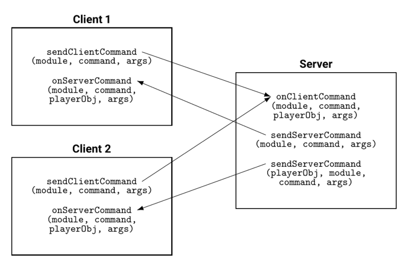

# Networking

> Offline PZwiki reference. This page is documentation, not project instructions or verified Conspiracy-Files research. Source build warnings and incomplete entries remain applicable. External destinations are omitted. See the library README and COVERAGE for scope.

This page was last updated for an older version of the current build (42.13.1).

The current stable version is 42.20.4, so information on this page may be inaccurate.

Help get this page updated by adding any missing content. [Edit](Networking.md) (Create account)

**Networking** is a process needed to handle client/server interactions, allowing for the exchange of data and commands between the two to properly sync. This guide will not explain when networking should be used, but rather how to implement it.

Since Build 42.13.1 release, server side handles most of the logic for player damage, item stats etc. This means you need to set any of these from the server side instead of the client side and then use sync functions to sync specifically what you changed.

<a id="Client.2FServer_only_code"></a>

## Client/Server only code

When writing code that should only run on the client or server, you can use the following checks:


```text
if isClient() then
    -- this code is ran client side
elseif isServer() then
    -- this code is ran server side
else
    -- this code is ran in singleplayer
end
```


You can user a helper function to check if the code is ran in singleplayer:


```text
local function isSinglePlayer()
    return not isClient() and not isServer()
end
```


These methods can be used to have client/server or singleplayer only specific Lua files by adding at the very top of your lua files the following which will skip the entire file content based on the environment it is ran in:


```text
-- most commonly used: file should load only on the server side or in singleplayer
if isClient() then return end
```


```text
-- file should load only on the client side or in singleplayer
-- you can also accomplish this by placing your file in the lua/client/ directory
if isServer() then return end
```


```text
-- file should load only on the client side and not in singleplayer
if not isClient() then return end
```


```text
-- file should load only on the server side and not in singleplayer
if not isServer() then return end
```


```text
-- file should load only in singleplayer
if isClient() or isServer() then return end
```


Use these to skip loading functions or variables in an environment that does not need them.

<a id="Client_status"></a>

### Client status

To check if the client is an admin, you can use`isAdmin()` from client side, and from server side you can use`IsoPlayer.getAccessLevel()`:


```text
-- if ran client side, check if the client is an admin
-- else, check if it's singleplayer, meaning the player has admin rights
-- use this based on what your mod needs to do for both situations
local function checkClientIsAdmin()
    return isClient() and isAdmin() or isSinglePlayer()
end
```


<a id="Commands"></a>

## Commands

The main method used for networking is the command system. Commands are sent from one side (client or server) to the other, and are handled by a function on the receiving side. Commands can be sent with or without parameters, and can be sent to all clients, a specific client, or the server and intercepted by the use of specific [Lua events](Lua_event.md).

Commands can be identified with the use a`module`, which is suggested to be your mod name, and`command` name. The transmitted data can only hold plain old data (strings, booleans, numbers, and tables), so no Java object instances such as the player (IsoPlayer) or an inventory (InventoryContainer).



<a id="Client_to_server"></a>

### Client to server

The client sends commands to the server with the use of the following:


```text
local args = {} -- put any data inside this table
sendClientCommand("ModuleName", "CommandName", args)
```


And the server intercepts the client commands with the use of [OnClientCommand](OnClientCommand.md):


```text
local function onClientCommand(module, command, playerObj, args)
    if module == "MyModule" then
        if command == "MyCommand" then
            -- do something
            -- access arguments with -> args.myValue
            -- access the sender with playerObj
        end
    end
end
Events.OnClientCommand.Add(onClientCommand)
```


<a id="Server_to_client"></a>

### Server to client

The server sends commands to every clients with the use of the following:


```text
local args = {}
sendServerCommand("ModuleName", "CommandName", args)
```


Or a specific client by using its IsoPlayer instance:


```text
-- assuming playerObj here is an IsoPlayer instance
local args = {}
sendServerCommand(playerObj, "ModuleName", "CommandName", args)
```


And the client intercepts the server commands with the use of OnServerCommand:


```text
local function onServerCommand(module, command, args)
    if module == "MyModule" then
        if command == "MyCommand" then
            -- do something
            -- access arguments with -> args.myValue
        end
    end
end
Events.OnServerCommand.Add(onServerCommand)
```


<a id="Passing_a_player_object"></a>

### Passing a player object

Since you can't send an IsoPlayer instance directly, you need to utilize what is called the onlineID which is a simple unique identifier associated to the player. This ID also exists for zombies but doesn't have a dedicated function to retrieve the zombie object from the server side compared to IsoPlayer.

When sending a command from the client to the server, the command caller IsoPlayer instance is passed to the [OnClientCommand](OnClientCommand.md) event, thus it is usually not needed to pass the onlineID of the player client from client to server.

To pass a player object from client to server, simply use this:


```text
--- CLIENT SIDE
-- assuming player is an IsoPlayer instance
local args = { onlineID = player:getOnlineID() }
sendClientCommand("YourModule", "YourCommand", args)
```


```text
--- SERVER SIDE
local function onClientCommand(module, command, playerObj, args)
    if module == "YourModule" then
        if command == "YourCommand" then
            local playerObj = getPlayerByOnlineID(args.onlineID)
        end
    end
end
Events.OnClientCommand.Add(onClientCommand)
```


To pass it from server to client, use this:


```text
local args = { onlineID = playerObj:getOnlineID() }
sendServerCommand("YourModule", "YourCommand", args)
```


```text
local function onServerCommand(module, command, args)
    if module == "YourModule" then
        if command == "YourCommand" then
            local playerObj = getPlayerByOnlineID(args.onlineID)
        end
    end
end
Events.OnServerCommand.Add(onServerCommand)
```


The onlineID is **not persistent** so it cannot be used for identification of players or zombies after loading or unloading them. For zombies, see PersistentOutfitID.

<a id="Syncing_functions"></a>

## Syncing functions

This article may need more content.

Editors are encouraged to add new material to the page while expanding upon current topics. [Edit](Networking.md) (Create account)

Syncing functions are defined as global methods for the [Lua API](Lua_API.md) to call to update stats, items etc. Below is a list of them:

| function | Description |
| --- | --- |
|`syncPlayerStats(IsoPlayer player, int syncParams` | Syncs various player stats, need to pass an integer in`syncParams` which can be easily found using CharacterStat. |

<a id="See_also"></a>

## See also

- [Mod data](Mod_data.md) – methods for storing data.
- [Lua (API)](Lua_API.md#Folder_structure) – details which files are loaded on client/server/singleplayer.

<a id="External_links"></a>

## External links

- command guide – a guide on Discord on commands by Konijima.

Retrieved from "[https://pzwiki.net/w/index.php?title=Networking&oldid=1436101](Networking.md)"
