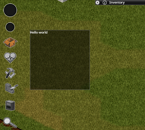
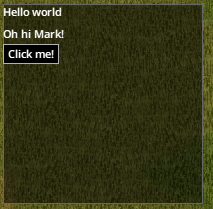
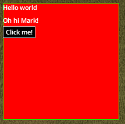

# User Interface

> Offline PZwiki reference. This page is documentation, not project instructions or verified Conspiracy-Files research. Source build warnings and incomplete entries remain applicable. External destinations are omitted. See the library README and COVERAGE for scope.

This page was last updated for an older version of the current build (42.14.1).

The current stable version is 42.20.4, so information on this page may be inaccurate.

Help get this page updated by adding any missing content. [Edit](User_Interface.md) (Create account)

**User Interface**, often shortened to UI, is the means by which a player interacts with the game. It includes elements such as menus, buttons, and other visual components that allow players to navigate and control the game. The process of making user interfaces for mods is supported natively by the game via the [Lua API](Lua_API.md) and the use of UI elements which are [derived](Derive.md) from a central UI element class called ISUIElement. Any ISUIElement subclass can be used to create a standalone UI, but can also be added as a child to another ISUIElement, allowing for the creation of complex UIs with multiple layers and components.

More advanced UI drawing functions exist without being dependent on this central UI class system but the majority of UIs are built using it and **should** be using it to ensure compatibility with the game and other mods.

UI making involves calling a lot of different Lua functions, UI elements and modify different aspects of classes. As such, it is recommended to use the [LuaDocs](LuaDocs.md) to find the functions and classes definitions and content.`ISUIElement` for example has a lot of utility functions to do specific things in your UI.

<a id="Folder_structure"></a>

## Folder structure

UIs are only useful client side, and as such it is recommended to place them in the client folder of your mod. They follow the [same rules as any other Lua files](Lua_API.md#Folder_structure), which means they can clash with other mods or vanilla files if they have the same relative paths.


```text
📁 media
    📁 lua
        📁 client
            📁 YourMod       <--- used to reduce file clashes
                📄 yourUIClassFile.lua
            ...
        📁 server
            ...
        📁 shared
            ...
```


It is prefered to keep one file for one UI class to make it easier to organize things. This is also best so you can keep your UI elements as [modules](Lua_language.md#Modules) to access and not clash with any other module or [global variables](Lua_language.md#Local_and_global).

<a id="Creating_a_simple_UI"></a>

## Creating a simple UI



Making a simple UI involves creating a [class](Lua_API.md#Lua_objects) with the needed required functions to work properly. It is best to derive either`ISUIElement` or subclasses of it such as`ISPanel`.

In the following example, we create a very simple UI using`ISPanel` as a base, which is one of the most basic UI elements, and we draw a simple "Hello world" text on it.


```text
---@class YourCustomUI : ISPanel
local YourCustomUI = ISPanel:derive("YourCustomUI")

--- initialize the UI, notably used to add child elements
function YourCustomUI:initialise()
    ISPanel.initialise(self)
end

--- called before the render function, notably used to precalculate data and cache
function YourCustomUI:prerender()
    ISPanel.prerender(self)
end

-- use to render text and draw elements every render ticks
function YourCustomUI:render()
    --- draw a simple hello world
    self:drawText("Hello world",0,0,1,1,1,1, UIFont.Small)
end

-- this is used to create a new instance of the UI
function YourCustomUI:new(x, y, width, height)
    local o = ISPanel.new(self, x, y, width, height)
    return o
end

return YourCustomUI
```


To display and close the UI, simply create a new instance and add it to the UI manager or remove it. In the example below, we make the UI when pressing the key X:


```text
local YourCustomUI = require("YourMod/YourCustomUI")

local yourCustomUI
Events.OnKeyPressed.Add(function(key)
    -- verify the key X is pressed
    if key ~= Keyboard.KEY_X then return end

    -- if the UI exists, we close it
    if yourCustomUI then
        yourCustomUI:setVisible(false)
        yourCustomUI:removeFromUIManager()
        yourCustomUI = nil

    -- else we create a new instance of that UI
    else
        yourCustomUI = YourCustomUI:new(100, 100, 200, 200)
        yourCustomUI:initialise()
        yourCustomUI:addToUIManager()
    end
end)
```


`setVisible` can hide the UI without removing it from the UI manager, allowing you to show it again later without needing to recreate it and re-add it to the UI manager.

If you lose the reference to your UI instance, you won't be able to close it unless you have a close button directly on the UI itself, or something internal to the UI is closing it.

<a id="Adding_a_child_element"></a>

## Adding a child element



As seen in the example provided in [#Creating a simple UI](User_Interface.md#Creating_a_simple_UI), it is possible to draw text in the render function, but this is a very inefficient way of doing it which will make managing those drawing functions annoying. Instead, it is best to use **children UI elements**, which are simply UIs in themselves, linked to the UI you are creating to add specific elements.

While in most cases it is to add for example a health panel UI to another UI, it is best used to add children of low level UI elements such as`ISButton`,`ISLabel` etc. Those UIs each have their own render, create, initialise functions which will handle all the necessary parts to add such UI elements. This makes it easy to add a button or text on a UI without having to manually draw the button and the text every render tick or handle its behavior in your UI.

Take our previous`YourCustomUI` example, we add a text label and a button to it:


```text
function YourCustomUI:initialise()
    local textLabel = ISLabel:new(0, 20, 20, "Oh hi Mark!", 1, 1, 1, 1, UIFont.Small, true)
    self:addChild(textLabel)

    local button = ISButton:new(0, 40, 50, 20, "Click me!", self, function(parent)
        print("Hello world!")
        parent:close()
    end)
    self:addChild(button)

    ISPanel.initialise(self)
end
```


When clicking the button, it will close the UI and print "Hello world!" in the console.

The children UIs are stored in a table called`children`, but they are also usually stored in a variable in the parent UI for easy access when needed.

<a id="Changing_the_UI_appearance"></a>

## Changing the UI appearance



The UI elements derived from`ISPanel` will all have two tables used to color the UI:

-`backgroundColor` (default is`{r=0, g=0, b=0, a=0.5}`)
-`borderColor` (default is`{r=0.4, g=0.4, b=0.4, a=1}`)

You can freely modify the color values of these to change the appearance of the UI. For example, to make the background fully red and the border fully green, you can do:


```text
function YourCustomUI:new(x, y, width, height)
    local o = ISPanel.new(self, x, y, width, height)
    o.backgroundColor = {r=1, g=0, b=0, a=1}
    o.borderColor = {r=0, g=1, b=0, a=1}
    return o
end
```


More advanced UI appearance customization can be done by directly rendering the UI differently, drawing textures in it etc. This is way more complex however, and can often lead to a UI not looking like the vanilla ones. If you are new to UI making, it is recommended to stick to the default vanilla ISPanel equivalents.

<a id="ISPanel_alternatives"></a>

## ISPanel alternatives

While`ISPanel` is the most basic and commonly used UI element to create custom UI panels, there are some alternatives that can be used as a base for your UI which often give more default tools and functions to work with. Here is a non-exhaustive list of alternatives:

-`ISPanelJoypad` - used to handle gamepad inputs directly in the UI.
-`ISCollapsableWindow`

<a id="Utility_functions"></a>

## Utility functions

Lots of utility functions exist to retrieve UI related data, for example:

-`getCore():getScreenWidth()`
-`getCore():getScreenHeight()`
-`getMouseX()`
-`getMouseY()`
-`isShiftKeyDown()`
-`isCtrlKeyDown()`

<a id="ISUIElement_drawing_functions"></a>

## ISUIElement drawing functions

Below is a non-exhaustive list of drawing functions natively implemented in the`ISUIElement` class:

-`drawText`
-`drawRect`
-`drawRectBorder`
-`drawTextureScaled`
-`drawTextureScaledUniform`
-`drawTextureScaledAspect`
-`drawTexture`
-`drawTextureTiled`
-`drawTextureStatic`
-`drawItemIcon`
-`drawScriptItemIcon`
-`drawLine2`
-`drawPolygon`
-`drawProgressBar`

<a id="See_also"></a>

## See also

- Make a custom UI by MrBounty
- [ISContextMenu](ISContextMenu.md) - UI element for context menus.
- Imgui - a debugging tool notably used to view the UI elements hierarchy.

Retrieved from "[https://pzwiki.net/w/index.php?title=User_Interface&oldid=1394655](User_Interface.md)"
