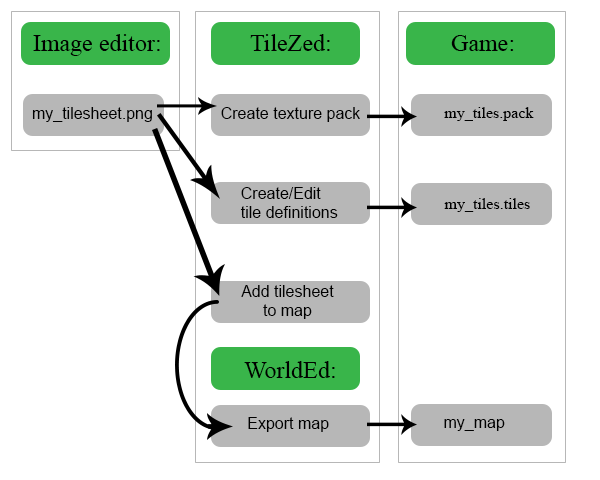
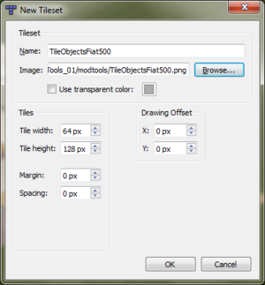

# Adding new tiles

> Offline PZwiki reference. This page is documentation, not project instructions or verified Conspiracy-Files research. Source build warnings and incomplete entries remain applicable. External destinations are omitted. See the library README and COVERAGE for scope.

This page was last updated for an older version (41.78.19).

The current stable version is 42.20.4, so information on this page may be inaccurate.

Help get this page updated by adding any missing content. [Edit](Adding_new_tiles.md) (Create account)

This article may be outdated.

Editors are encouraged to update this article with new information. [Edit](Adding_new_tiles.md) (Create account)

This page attempts to run through the key processes and methods necessary for both adding **creating new tiles**/sprites for modding Project Zomboid, and the physical act of getting them playable in the game.

<a id="Video_tutorials"></a>

## Video tutorials

- By Daddy DirkieDirk
- By Atox
- By Thuztor
- By 불어난미역

<a id="Adding_tiles_into_the_game"></a>

## Adding tiles into the game



Above is a flowchart with an overview of the processProject Zomboid.

Note we need to carry out all the necessary processes (sprite packing, map definition, tile definition) to be able to use the tiles in the game.

This guide assumes you already have the mapping tools installed and configured from steam, and have some familiarity with how the games sprite sheets look.

<a id="Drawing_new_tiles"></a>

## Drawing new tiles

<a id="Software"></a>

#### Software

There are a number of tools and workflows available, here are some popular software choices:

- Paint.NET
- GIMP
- Krita
- Aesprite
- Adobe Photoshop

Additionally, one may want to start with 3d, rendering images out using software such as:

- Blender
- Autodesk Maya

<a id="Working_with_a_Spritesheet"></a>

#### Working with a Spritesheet

This guide isn't meant to cover the creative aspect of drawing new tiles, but some tips and tricks are included at the bottom of the page.

This link points to a sample PSD file (in the "2d Stuff" subfolder) which is the size for a typical sprite sheet. It contains the individual sub-cells of the sprite sheet separated via shaded blocks, as well as floor markers, masks and references for the different wall types.

Tilesheets are typically 1024x2048 or 1024x4096. Using other dimensions will cause issues when creating the texture pack. With 1024x2048, this gives you 64 total sprites (8 across and 8 down), the game refers to each sprite location by number, lighting_outdoor_01_0, for example. Numbering starts at 0 in the upper left and increments to the right before moving to the next row.

Each sprite has a maximum size of 128x256. (note, the game has so-called 1x and 2x texture sizes. 2x is the default and is double the size of the 1x textures, intended for lower end computers.)

Filenames should be fully lowercase and in png format, e.g.: lighting_outdoor_01.png

You should save two copies of your png:

- In Tiles\2x\
- In a separate folder containing only your new tilesheet(s).

When you installed and configured TileZed, you had defined a folder where it can find the tilesheets; it contains a "2x" folder. Copies of your new tilesheets should be placed here to be used in the editors. Note that this location will vary for you, if you installed the tools via Steam, the tiles will be in that location.

This separate folder can be anywhere at your convenience, you will use it later when creating the texture pack, and it's easier to configure the tool to use folder contents.

<a id="Adding_tiles_into_Tiled.2FTilezed"></a>

## Adding tiles into Tiled/Tilezed



Adding Tiles in to TileZed is pretty straightforward. To add them to your TileZed map project, use Tools > Tilesets, and click the "new" icon; this brings up a small window allowing you to pick unused sheets. After confirming this, your new tilesheet will be available in TileZed/BuldingEd/WorldEd for use, check the tilesheet palette. See [Mapping](Mapping.md) for more info on the creation of maps.

NOTE: New tilesheets must be placed in the correct 2x folder to be importable for use in the editor or else you will receive an error!

You can continue to edit your sprites, TileZed will automatically update itself when you do. There's no need to restart or re-add your sheet again!

<a id="TileZed_XML_Data"></a>

#### TileZed XML Data

At the bottom of the Tilesheets palette, a blue grid icon is enabled by default: "Layer Switch Enabled". This function will automatically pick the correct layer (if it exists) when selecting a given tile. Right clicking on a tile allows you to choose which layer this will be.

The following is the abridged version of TileOffice.tilelayers.xml, used to define the default layers for the sprites contained within the vanilla tileset TileOffice. For your own tilesets, simply create a new .xml file called TileSheetName.tilelayers.xml and follow the same format. For default layers please refer to the existing tilelayers .xml files contained within the maptools download.


```text
<?xml version="1.0" encoding="UTF-8"?>
<tileset columns="16" rows="8">
 <tile id="0" layername="Walls"/>
 <tile id="1" layername="Walls"/>
....
 <tile id="96" layername="Furniture2"/>
 <tile id="97" layername="Furniture2"/>
</tileset>,
```


Note the index number relates to the specific cell within the tileset, reading from zero (the first, top left tile) across to index seven (the last tile on the first row) and then down through the tiles in a similar fashion.

Once we have done this, TileZed can attempt to locate the tiles on the right layer automatically, increasing the efficiency of map-making.

<a id="Editing_tiledefinitions.tiles"></a>

## Editing tiledefinitions.tiles

In TileZed, Tools > Tile Properties brings up the editor to set the properties for your tiles. This is where you set how your tiles behave in-game, such as acting like a floor, container, or something that can be picked up.

See [Tile properties](Tile_properties.md) for more information on what the individual properties do.

Take the newtiledefinitions.tiles file, located within Project Zomboid \media\. directory, and place a copy in your 'Master Mapping Directory'. You should back up important files like this regularly to ensure that any grievous, unexplainable errors can be remedied quickly and with the minimum of heartache. You'll likely refer to this file often as a reference or to copy from.

To start, create a new .tiles file, and use the "blue plus" icon at the bottom to add your tilesheet(s) to the list.

Multiple tiles can be selected and copied/pasted between .tiles files, and making edits to a selection will set the properties for the whole selection. Save the file whenever you're satisfied.

As best practice, keep a copy of the .tiles file as a backup. Your mod folder should have something like this as well: C:\Users\me\Zomboid\mods\myTiles\media\myTiles.tiles

<a id="Creating_the_Texture_Pack"></a>

## Creating the Texture Pack

The tilesheets we've been using are made to be used in the editor, but have a lot of empty space which isn't good for game use. The texture pack creator trims the images down to their smallest bounding box, and places them in a format expected by the game.

In TileZed, Tools > .pack files > Create .pack File. Choose a destination to save the .texturepack file, eg: C:\Users\me\Zomboid\mods\myTiles\media\texturepacks\myTiles.pack

For now, leave Output Texture size at 1024x1024, and Scale to 1x unchecked.

Clicking the plus button, you should pick the folder mentioned above; the one containing only your tilesheets. This creates the pack using only your new sprites after you've clicked Ok. There's a pack viewer if you'd like to preview your results.

<a id="Wrapping_up"></a>

## Wrapping up

With your mod now containing a textures .pack, definitions .tiles, and presumably an exported map, you also need to configure your mod.info to read the texture pack with these two lines:


```text
pack=myTiles
```


where myTiles is the name of your .pack


```text
tiledef=myTiles xxx
```


This must be a unique number starting from 100. where myTiles is the name of your .tiles. The xxx is a number between 0-999. The game uses this number as an ID internally to avoid clashes in similar tilesheet names between different .tiles files.

Optional: To use tiles that come from another mod without needing to bundle them in your mod, use the require tag instead.


```text
require=myTiles
```


<a id="Extra_settings"></a>

## Extra settings

Add translation for the tile

def: CustomName = Antique_Oven

Moveables_EN: Antique_Oven = "Antique Oven"

Add translation for the container

def: ContainerType = crate

IGUI_ContainerTitle_crate = "Crate"

Add texture for the container button in inventory page

ContainerButtonIcons.campfire = getTexture("media/ui/Container_Campfire.png")

Add Overlays using TileZed to generate an overlay map, or copy paste one and change the sprite names.

If you add both overlays, one is used for 1-6 items, the other for 7+. If you add only the first it's used whenever the container is not empty.

You can change the scrap items by editing the item's modData (it's what some built furniture do) or you can add / edit scrap definitions

def: Material & Scrap options

ISMoveableDefinitions.lua: set tools, materials, xp, etc for in-game use

Item script is optional

examples found in newMoveables.txt, but usually moveables don't require scripts to function. One use of the item script is to appear it item lists for debug.

unless you set a CustomItem for pickup, the tile will be converted into a Moveable item, e.g: Moveable.carpentry_01_0.

<a id="Tips_and_tricks"></a>

## Tips and tricks

<a id="Paint.NET"></a>

#### Paint.NET

If you are using Paint.NET, this bit is a doddle.

Animation Helper – plugin for Paint.NET

The above tool allows for easy slicing up of the tilesheet .png file in to the constituent parts with the click of a button. Follow the instructions in the link to install the helper, and then use it to export all your relevant files in to a dedicated directory where you wish to work with all your tiles.

If you intend on putting together a few separate tilesheets, feel free to put them all together in the same folder. (e.g. say you have built some new walls, some new furniture, some new objects etc.).

If using the Paint.NET Animation Helper, always remember to suffix the filename with an underscore (e.g. TileObjectsFiat500_). This then gives each tile an index that the game is happy to work with. The filename is important, and should match that used elsewhere.

I'm sure there are other easy ways to do this with other programs, or alternatively for those with a masochistic streak simply crop the tilesheet a few hundred times and individually save a load of 64x128 .png files.

With this, we have a whole load of files, ready for bunching up in to a nice, compact, memory saving sprite sheet, getting rid of all the blank spaces.

<a id="Photoshop"></a>

#### Photoshop

Sometimes it is easier to draw something "flat" or straight, then skew it into the dimetric perspective later. Using the Free Transform input boxes, an angle of about 27.6 works nicely.

<a id="See_also"></a>

## See also

- [Tiledefs used by mods](Tiledefs_used_by_mods.md)

<a id="External_links"></a>

## External links

- PZ Mapping Tools (includes MapTools.exe for editing tiledefinition.tiles, Sprite Sheet Packer.exe, sspack.exe and batch files, plus base .tmx files)
- PZ Mod Tools (Used more for 0.1.5 map modding)
- matsydoodles' Legacy Tiling Tutorial describing the methods of getting tiles in to PZ 0.1.5 and earlier.
- masks and tool for generating sprites by Alree / Unjammer

<a id="See_also_2"></a>

## See also

- [Depthmap editor](Depthmap_editor.md)
- [Depthmap editor](Depthmap_editor.md)
- [Seam editor](Seam_editor.md)

Retrieved from "[https://pzwiki.net/w/index.php?title=Adding_new_tiles&oldid=1460845](Adding_new_tiles.md)"
