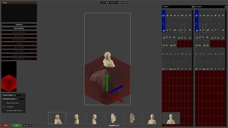
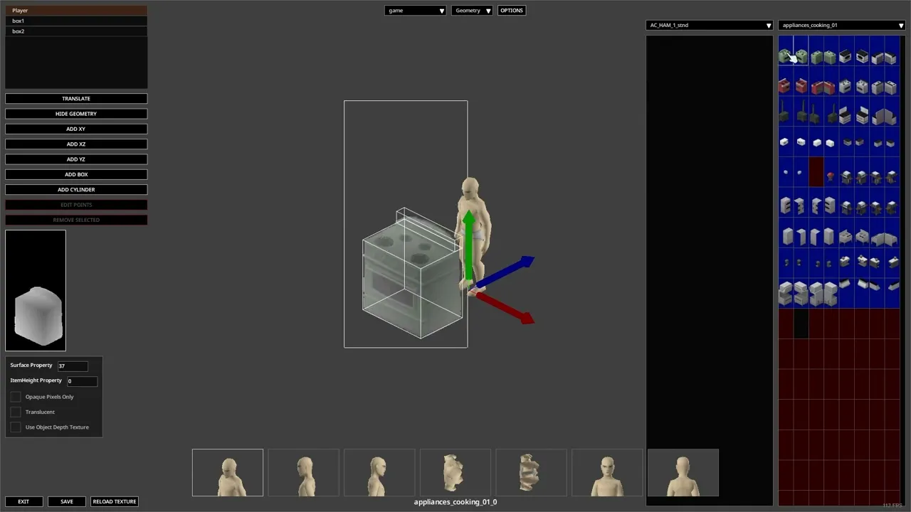

# Depthmap editor

> Offline PZwiki reference. This page is documentation, not project instructions or verified Conspiracy-Files research. Source build warnings and incomplete entries remain applicable. External destinations are omitted. See the library README and COVERAGE for scope.

This page has been revised for the current stable version (42.20.4).

Help by adding any missing content. [Edit](Depthmap_editor.md) (Create account)

Parts of this page may have been automatically updated to the latest build (42.20.4).

This article may need more content.

This debug tool needs more detail on how to use it. Possibly typing out what Crater explains in his video tutorial would be a good start.

Editors are encouraged to add new material to the page while expanding upon current topics. [Edit](Depthmap_editor.md) (Create account)



The Depthmap editor UI

The **Depthmap editor** is a UI accessed by pressing ⇧ Shift + F9 while in [debug mode](../foundations/Debug_mode.md) which is used to edit the tiledepths of tiles. Tile depths are used to provide an equivalent to a normal map for a tile, telling the game how to render each pixel of the tile in the XYZ directions. This allows the game to have rules between tiles on how to render each others when colliding in comparison to the old layer system that Build 41 used, but also how to render items, characters and objects that collide with the tile properly.

The tile depth is created by first applying geometries on the tile, by using the tile depth editor tool. 3 types of geometries are available which are simply [scripts](../scripts/Scripts.md) blocks:

- box
- cylinder
- polygon

All the geometries of tiles are stored inside the [scripts](../scripts/Scripts.md) file tileGeometry.txt.

The following files will be used to store the depthmap geometries and the sprite assignments for the tiles, either in the vanilla [game files](../foundations/Game_files.md) or in your own [mod](../foundations/Mod_structure.md):


```text
📁 media
    📄 tileDepthTextureAssignments.txt
    📄 tileGeometry.txt
```


<a id="Video_guide"></a>

## Video guide



▶

Project Zomboid - Depthmap Tutorial [B42+]

External link ↗

<a id="See_also"></a>

## See also

- [Seam editor](Seam_editor.md)

Retrieved from "[https://pzwiki.net/w/index.php?title=Depthmap_editor&oldid=1460575](Depthmap_editor.md)"
