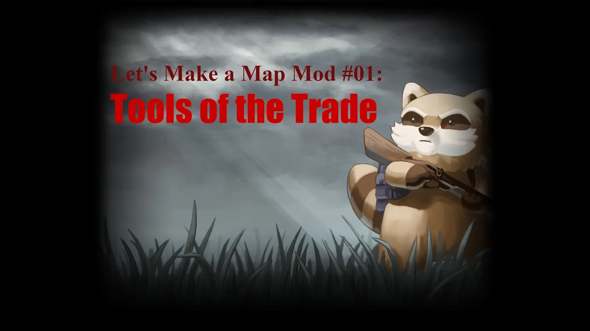
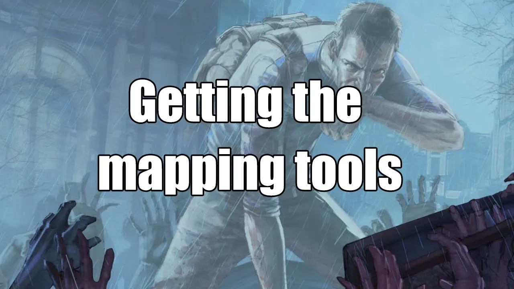
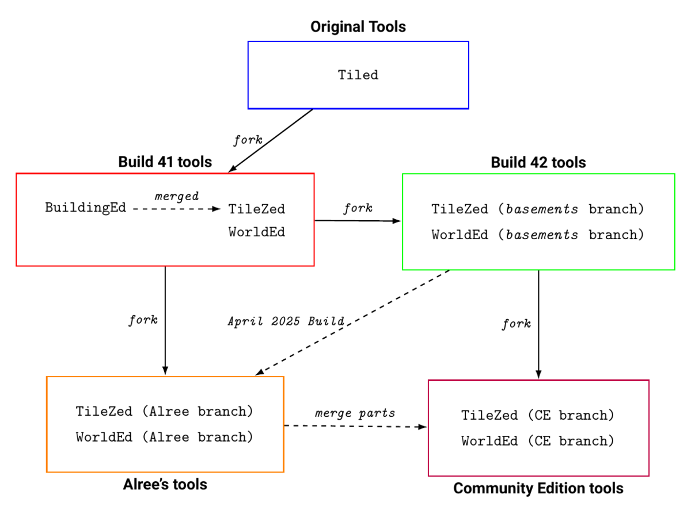
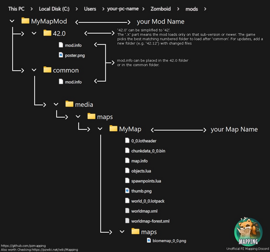
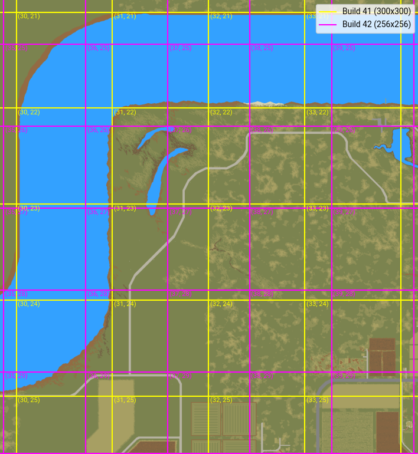
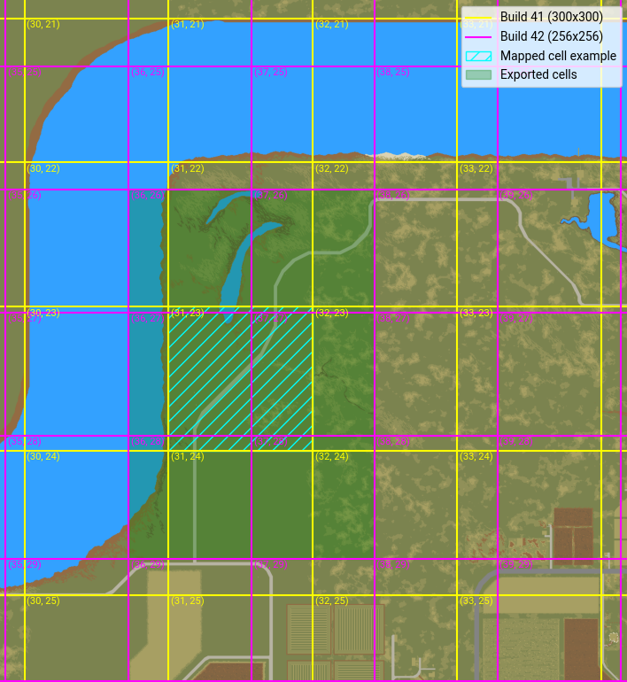
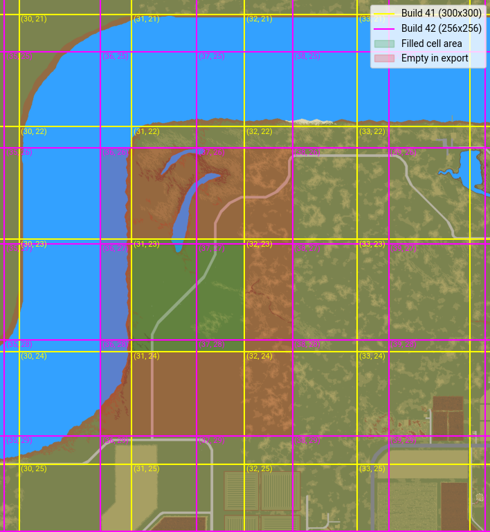
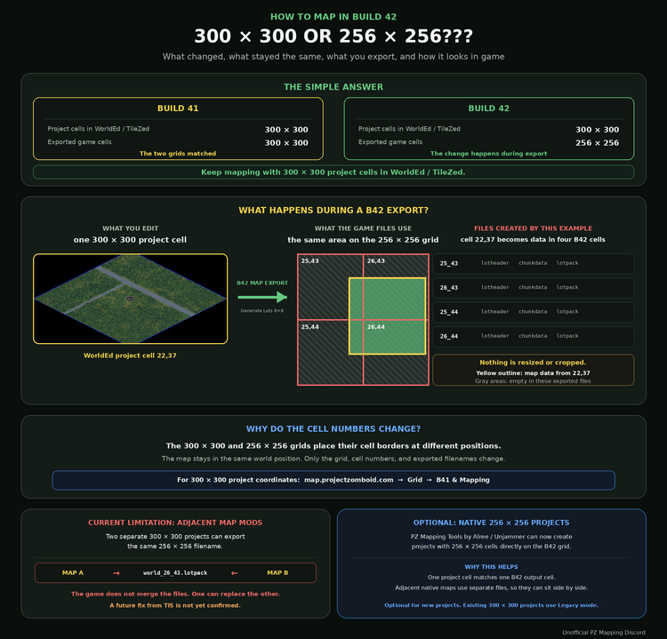

# Mapping

> Offline PZwiki reference. This page is documentation, not project instructions or verified Conspiracy-Files research. Source build warnings and incomplete entries remain applicable. External destinations are omitted. See the library README and COVERAGE for scope.

This page has been revised for the current stable version (42.20.4).

Help by adding any missing content. [Edit](Mapping.md) (Create account)

Parts of this page may have been automatically updated to the latest build (42.20.4).

**Mapping** in Project Zomboid consist of creating new maps which are either standalone to the vanilla Knox Country or directly inserted inside it. This is done by creating a new map cell, which is a 300x300 tile area in Build 41 and 256x256 in Build 42 (see [#Cells](Mapping.md#Cells) for more information). Replacing an existing cell is done by overriding the existing one, which means that the entire cell must be replaced, including its terrain data and any structures within it. This means it is not possible to simply place a single building in an existing cell without remaking all the surrounding buildings as well.

You can access a full view render of the Knox Country map via the Project Zomboid Map Project.

<a id="Video_guides"></a>

## Video guides

Below are the two most recommended video guide series for mapping that exist, but more are documented in [#See also](Mapping.md#See_also).



▶

Zomboid Map Making Quick Guide

External link ↗



▶

Daddy Dirkie Dirks zomboid mapping tutorials

External link ↗

<a id="Mapping_tools"></a>

## Mapping tools

No releases of the [official mapping tools](../foundations/Mapping_tools_official.md) have been made for Build 42 but these tools are a public project on GitHub which can be compiled by anyone and are fully usable to make maps. The best is to use one of the available community made tools which are based more or less on the official Build 42 mapping tools:

- [Mapping tools (Alree)](Mapping_tools_Alree.md) - Created by Alree, they are a fork of the Build 41 official mapping tools and implement changes from the official Build 42 tools.
- [Mapping tools (Community Edition)](Mapping_tools_Community_Edition.md) - Created by Crater, it is a direct fork of the Build 42 official tools and merges some elements from Alree's tools while also adding improvements on top of that.

While the official mapping tools for Build 42 are not yet released, the community tools still provide a reliable way to create maps for Build 42, without any serious problems that should arise from moving to the official tools in the future.

The Indie Stone stated in the NEXT STEPS 2 blog post that the mapping tools should be released after the stable release planned for Build 42.20.0 has received hotfixes and such:

“

After we hit Stable, once hot fixing and such is over, we will be releasing both our latest mapping tools (WorldZed, TileZed, etc.) and our in-house animation editor and integration tool, AnimZed. We believe that having greater control over animations will be of huge benefit to modders looking to unleash their creativity.

— The Indie Stone in the NEXT STEPS 2 blog post

An unofficial compilation of the official mapping tools is often distributed by the creator of the [Mapping tools (Alree)](Mapping_tools_Alree.md) on Google Drive links. The latest in date can be found here. They do not support that version and simply raw compile it, without providing any changes or bug fixes to it.



<a id="Folder_structure"></a>

## Folder structure

Main article: [Mod structure](../foundations/Mod_structure.md)



The`maps` folder in`media` is used to store map files. It's subfolder will correspond to a map and its associated files which are obtained by exporting a map from the mapping tools.


```text
📁 media
    📁 maps
        📁 MyMap
            📁 maps
                ...
            📄 X_Y.lotheader
            📄 chunkdata_X_Y.bin
            📄 map.info
            📄 objects.lua
            📄 spawnpoints.lua
            📄 thumb.png
            📄 worldmap-forest.xml
            📄 worldmap.xml
            📄 world_X_Y.lotpack
            ...
```


`MyMap` will need to be a unique name associated with your map but the map informations are mostly defined the [map.info](../foundations/map.info.md) file. Other files are used to define spawnpoints as well as the biomes, chunks, streetnames etc.

Source marks this entry as incomplete.

| File | Description |
| --- | --- |
|`.lotheader` files | Defines the location/cell of your map. |
|`chunkdata.bin` | Source marks this entry as incomplete. |
| [map.info](../foundations/map.info.md) | Contains the informations about your map, such as its name, description, location... |
|`objects.lua` | Defines car spawns and navigation meshes. |
| [spawnpoints.lua](spawnpoints.lua.md) | Defines the spawnpoints XYZ coordinates for specific occupations for your map. |
|`thumb.png` | Image used as a thumbnail for the spawnpoints of your map. |
|`worldmap-forest.xml` | Source marks this entry as incomplete. |
|`worldmap.xml` | Source marks this entry as incomplete. |
|`world.lotpack` | Source marks this entry as incomplete. |

<a id="Cells"></a>

## Cells

The cells are the main building blocks of a map, as you will fill those with buildings, roads, vegetation and other map elements. Previously in Build 41, cells were 300x300 tiles big, but in Build 42 they are now 256x256 tiles big. However when you create your map, you still work with 300x300 cells, but the mapping tools will export them as 256x256 cells, which means that the exported map will have some empty tiles around the borders of the exported cells.

The following image shows the difference of the cell sizes with in yellow the 300x300 cells and in magenta the 256x256 cells:



If we create a map for the Build 41 cell ID (31, 23) in cyan on the image below, the exported cells from the mapping tools will be (36, 26), (37, 26), (36, 27), (37, 27), (36, 28) and (37, 28) in Build 42 cell IDs, which are shown in green:



The resulting exported cells will have active and inactive areas as shown in the image below with the green area corresponding to the 300x300 cell which contains your map elements, and in red the area which is empty in the exported map:



The active areas will replace the vanilla map, but the inactive areas will use the vanilla map. When it comes to other mod maps however, those that share the same adjacent 256x256 cells will clash together and one will not be loaded in. This was the conclusion from a test which you can find more information on in the talk page.



<a id="Building_pools"></a>

## Building pools

The Indie Stone and the community have created several building pools, which are collections of buildings that can be used in custom maps. These pools can be used as a reference or directly in your own maps, as long as you credit the original authors when asked for credit. Below is the list of available building pools:

- Building Pool (official)
- Building Pool (Blackbeard)
- Building Pool (okkydoo)
- Building Pool (Dylan)
- Community Architect
- B42 Vanilla Map Building Exports

<a id="Tile_packs"></a>

## Tile packs

Below is a list containing references to tilepacks which are available for the mappers to use directly in their map mods. Those usually come in the form of Spiffo's Workshop items that you can directly use as an addon to your map mod.

- Azakaela's Mountain Tiles
- Asian Style Builds
- Community Tile Pack
- Tile pack (BigZombieMonkeys)
- Tile pack (Daddy Dirkie Dirks)
- Tile pack (Dylan)
- Tile pack (ExtraNoise's Newburbs)
- Tile pack (Fear's Funky)
- Tile pack (Ivery)
- Tile pack (Loolie)
- Tile pack (Pertominus)
- Tile pack (Simon MDs)
- Tile pack (Skizot)
- Tile pack (throttlekitty)
- Tile pack (TryHonesty)
- Tile pack (Melos)

<a id="Public_maps"></a>

## Public maps

Some maps created by the community had their files made public for other mappers to use or study. Below is a list of public maps, their authors as well as how they can be used:

| Map | Author | Files | Permissions | Last updated |
| --- | --- | --- | --- | --- |
| Dirkerdam |  Daddy Dirkie Dirk  daddydirkiedirk |  Download | No restrictions, but credit the author. (source) | 2023-07-21 (Last Workshop item update) |
| Knox Country unofficial export | The Indie Stone, map files exported by Unjammer:  alree_unjammer  Alree  Unjammer | See the modding project Vanilla Map Export | No direct details on permissions since it is an unofficial export. | 2023-01-31 Build 41.78.16 (last Build 41 update) |

<a id="See_also"></a>

## See also

- The Indie Stone forum post with the latest mapping tools
- [Room definitions and item spawns](Room_definitions_and_item_spawns.md)
- [Vehicle zones](Vehicle_zones.md)
- Defining generator spawns
- Unofficial PZ Mapping Discord

| Tutorial | Description | Author | Last updated |
| --- | --- | --- | --- |
| Project Zomboid - Depthmap Tutorial B42+ | A full guide on adding depthmaps to your custom tiles for Build 42. | Crater | 2025 January 19 |
| How To Make Sittable Chairs In Build 42 I Project Zomboid Modding | A video tutorial on how to make sittable chairs in Build 42. | PentyT | 2025 January 5 |
| Zomboid Map Making Quick Guide (recommended) | A playlist of video tutorials regarding mapping like Daddy Dirkie Dirk's tutorials which goes in detail. | DystopianOutcasts_Rax | 2024 December 17 |
| Daddy Dirkie Dirks zomboid mapping tutorials (recommended) | A playlist of tutorial videos to mapping Project Zomboid, which is often the main tutorial source for new and veteran mappers. Mappers are usually redirected to watching this video serie to learn mapping properly. It was made for Build 41 mapping, but is still very relevant to Build 42 mapping (confirmed as of 2025-10). | Daddy Dirkie dirk | 2022-09 |
| Official TIS Mapping guides | A set of official guides by The Indie Stone on how to create maps and mod maps. | RingoD123 (The Indie Stone) | 2021 to 2022 |
| How to make a map in Project Zomboid Build 41 | A video tutorial on how to make a map in Project Zomboid Build 41. Also noted as valid for Build 40 by the author. | BlackBeard | 2019 November 20 |
| Card's Tutorial for Terrain Generation | A guide to vegetation maps. | Cardenaglo | 2017 February 22 |
| Video Tutorials mapping | A series of spanish video tutorials for using [TileZed](TileZed.md) and [WorldEd](WorldEd.md). | Atoxwarrior | 2016 June 26 |
| Custom texture packs and tile definitions | Explains the texture pack and tile pack process. An image in the guide is not longer available, but the rest should be fairly up to date. | EasyPickins | 2014 June 4 |

| Resource | Description | Author | Last updated |
| --- | --- | --- | --- |
| Zomboid Map Cleaner | A tool to clean up the map of saves from Build 41 by resetting specific cells. | LordIkol | 2022 March 29 |
| Build 41 base and vegetation maps | Base and vegetation image maps for Build 41. | Unknown | 2022 March 14 |
| New Room Definitions (41.65+) | List of the new room definitions available in Build 41.65. | RingoD123 (The Indie Stone) | 2021-12-30 (source) |
| Build 40 vegetation map Build 40 base map | Base and vegetation image maps for Build 40. Originally posted on the Project Zomboid forum. | Okamikurainya | 2019 August 24 |

Retrieved from "[https://pzwiki.net/w/index.php?title=Mapping&oldid=1515935](Mapping.md)"
