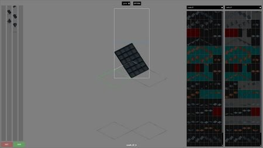

# Seam editor

> Offline PZwiki reference. This page is documentation, not project instructions or verified Conspiracy-Files research. Source build warnings and incomplete entries remain applicable. External destinations are omitted. See the library README and COVERAGE for scope.

This page has been revised for the current stable version (42.20.4).

Help by adding any missing content. [Edit](Seam_editor.md) (Create account)

Parts of this page may have been automatically updated to the latest build (42.20.4).

This article may need more content.

This debug tool needs

Editors are encouraged to add new material to the page while expanding upon current topics. [Edit](Seam_editor.md) (Create account)



The Seam editor UI

The **Seam editor** is a UI accessed by pressing F9 while in [debug mode](../foundations/Debug_mode.md) which is supposedly used to edit how roof tiles are connected to each other. It has yet been documented how to use this UI but is probably necessary process when [creating roof tiles](Adding_new_tiles.md), like with the [Depthmap editor](Depthmap_editor.md) for tiledepths of tiles in general.

The output is a [scripts](../scripts/Scripts.md) file stored at the following path, either in the vanilla [game files](../foundations/Game_files.md) or in your own [mod](../foundations/Mod_structure.md):


```text
📁 media
    📄 seams.txt
```


<a id="See_also"></a>

## See also

- [Depthmap editor](Depthmap_editor.md)

Retrieved from "[https://pzwiki.net/w/index.php?title=Seam_editor&oldid=1460577](Seam_editor.md)"
