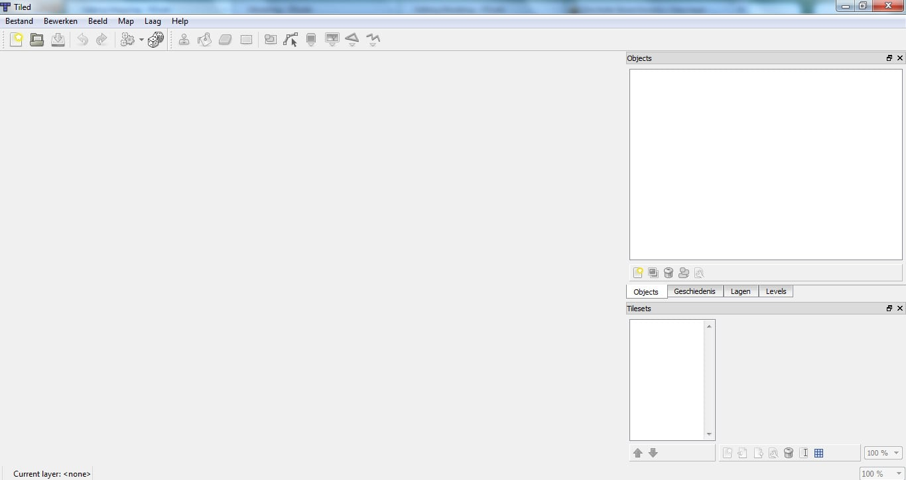
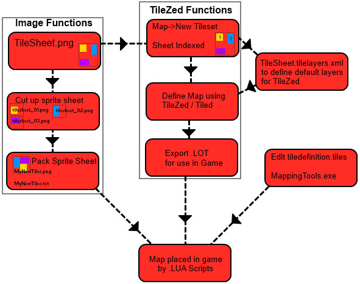

# TileZed

> Offline PZwiki reference. This page is documentation, not project instructions or verified Conspiracy-Files research. Source build warnings and incomplete entries remain applicable. External destinations are omitted. See the library README and COVERAGE for scope.

This page was last updated for an older version (41.78.19).

The current stable version is 42.20.4, so information on this page may be inaccurate.

Help get this page updated by adding any missing content. [Edit](TileZed.md) (Create account)

TileZed

Links

Latest uploaded version

GitHub repository

This article may need more content.

This page could appreciate more informations and more details on how to use TileZed.

Editors are encouraged to add new material to the page while expanding upon current topics. [Edit](TileZed.md) (Create account)

**TileZed**, also sometimes referred as its old forked project TilEd, is an official Project Zomboid mapping tool which allows you to create and edit tilesets for the game as well as edit maps. It is part of the [official mapping tools](../foundations/Mapping_tools_official.md), which also includes [WorldEd](WorldEd.md). It was previously an unofficial tool but was later adopted by the developers as an official tool.

## See also

- [WorldEd](WorldEd.md)
- [Mapping tools (Alree)](Mapping_tools_Alree.md)
- Unofficial PZ Mapping Discord

Retrieved from "[https://pzwiki.net/w/index.php?title=TileZed&oldid=1394309](TileZed.md)"
