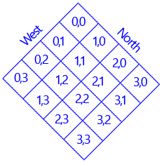
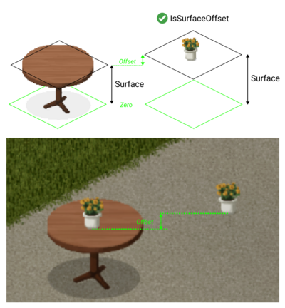
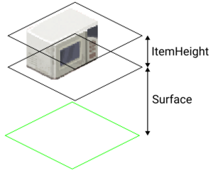

# Tile properties

> Offline PZwiki reference. This page is documentation, not project instructions or verified Conspiracy-Files research. Source build warnings and incomplete entries remain applicable. External destinations are omitted. See the library README and COVERAGE for scope.

This page was last updated for an older version of the current build (42.19.0).

The current stable version is 42.20.4, so information on this page may be inaccurate.

Help get this page updated by adding any missing content. [Edit](Tile_properties.md) (Create account)

**Tile properties** are used to provide different characteristics and information about the tiles. It is a necessary process to go through when [creating new tiles](Adding_new_tiles.md) which is often resolved by copying the tile properties of existing tiles that are similar to the new tile you are creating. But if in need of documentation on what each property does, you can refer to the PZ API Doc.

Not all game interactions come from tile properties. For example, if a car is driving on a floor tile from blends_street_*, it's considered to be on a road, otherwise the car is offroad. Reading the java source files is the only way to find other such interactions.

## Directions

Directions for the tiles follow the classic coordinate system of the Project Zomboid isometric view, with north being the top right and west being the top left.

## Surface and ItemHeight

Below are images demonstration the parameters Surface, ItemHeight and IsSurfaceOffset. The "Zero" here is not a parameter but simply added on the image to better show where the parameters start counting from.

Retrieved from "[https://pzwiki.net/w/index.php?title=Tile_properties&oldid=1465161](Tile_properties.md)"
