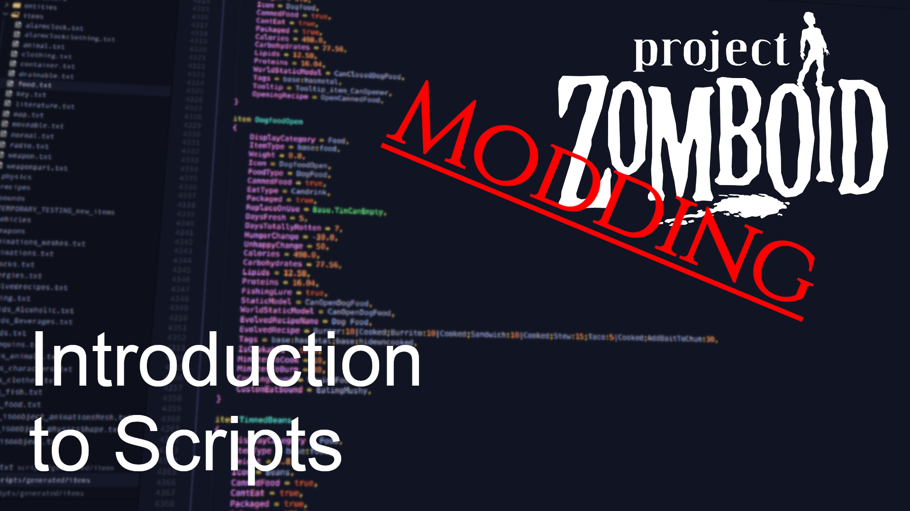

# Scripts

> Offline PZwiki reference. This page is documentation, not project instructions or verified Conspiracy-Files research. Source build warnings and incomplete entries remain applicable. External destinations are omitted. See the library README and COVERAGE for scope.

This page has been revised for the current stable version (42.20.3).

Help by adding any missing content. [Edit](Scripts.md) (Create account)

Parts of this page may have been automatically updated to the latest build (42.20.4).

**Scripts**, also referred to as zedscripts, are a format for modding in Project Zomboid which is used to implement new items, recipes, sounds, vehicles and more. Scripts do not follow a normalized typing format and are a fully custom syntax with rules of their own, even varying between the different types of scripts. The script files are usually located in the folder`media/scripts` in the [game files](../foundations/Game_files.md) or the [mod folder](../foundations/Mod_structure.md).

Scripts are not a programming language, but mostly a custom format to define data for game elements which are parsed and cached inside the Java.

<a id="Video_guide"></a>

## Video guide



▶

PZ Modding Guides - Introduction to Scripts

External link ↗

<a id="Folder_structure"></a>

## Folder structure

Main article: [Mod structure](../foundations/Mod_structure.md)

**Scripts** are put inside the`scripts` folder and are used to define items, models, vehicles etc. There is no specific organization of scripts compared to the [Lua](../lua-api/Lua_API.md). The only rule is that the script files must end with the extension`.txt`. Various script blocks can be used and spread across multiple script files in different subfolders.


```text
📁 media/
    📁 scripts/
        📁 subFolder/
            📄 anotherScript.txt
        📄 this_is_a_script.txt
        ...
```


It is preferable to put your script files inside a subfolder named after your mod to reduce clash issues with other mods.

<a id="Scripts_syntax"></a>

## Scripts syntax

The files need to be saved with the`.txt` extension and follow a set of rules which should be the same for every script blocks as of Build 42. Script entries follow a block structure, similar to [Lua tables](../lua-api/Lua_language.md#Tables), usually defined by the characters`{` and`}`.

Comments follow the Java multiline comment syntax, starting with`/*` and ending with`*/`. Comments can be placed anywhere in the script, even inside blocks. Single line`//` comments do not work and should not be used.

Key value pairs are used to define the parameters of the script elements, with the syntax`Key = Value,`. The comma at the end of each key value pair line is mandatory, even for the last line in a block. Some parameters do not need to be present for a script block to work.

Scripts can be inconsistent in some cases and some syntax rules which are present in this section may not apply to all script blocks. Refer to the specific script block documentation for more details.

Make sure to not forget commas at the end of each key value pair lines, as this will cause the script to not be parsed correctly.

<a id="Module_block"></a>

### Module block

Main article: module (scripts)

A module block needs to be defined at the start of the script files, unless it is a [sandbox options](Sandbox_options.md) script. The base game module is`Base`, which means most entries will have the full ID`Base.ItemName`. It can be used for your own scripts:


```text
module Base {
    ...
}
```


```text
// alternative syntax
module Base
{
    ...
}
```


A custom module name can also be defined:


```text
module MyModule {
    ...
}
```


If you use the vanilla module, make sure to use unique naming for your script entries to not clash with other mods. One trick is to add a prefix related to your mod name (`MyMod_MyItemID`).

The module block should not be used for [sandbox options](Sandbox_options.md) scripts.

To reference a script object, it is suggested to always use the module prefix, which is the module name followed by a dot. For example, if you define an item in the`MyModule` module, you can reference it as`MyModule.MyItem`. If you don't use the module prefix, the game will search in the following order:

- The current module.
- The [imported modules](Scripts.md#Imports_block).
- The`Base` module.
- Every other module.

This behavior is inconsistent in the various script types and as such it is recommended to always use the module prefix when referencing script objects. If you are having problems, try to put your script in the`Base` module instead of a custom one.

<a id="Imports_block"></a>

### Imports block

Main article: imports (scripts)

By importing custom modules, you give your scripts direct access to the elements from these modules, and you can use item IDs directly without the module prefix (for example, you can use`ThatModItem` instead of`ThatModule.ThatModItem`). By default, the`Base` module is already imported, so importing it doesn't make any sense.


```text
module MyModule {
    imports {
        OtherMod
    }
}
```


Read more about it in the ScriptsDocs.

It is suggested to not use the imports blocks, but to directly use the module prefix when referencing script objects.

<a id="VSCode_syntax_highlighting"></a>

### VSCode syntax highlighting

To have syntax highlighting and diagnostics for Project Zomboid scripts in [Visual Studio Code](../foundations/Visual_Studio_Code.md), which will help in reading and writing script files, you can install the extension ZedScripts.

<a id="Properties"></a>

## Properties

This is new and not every script blocks are fully documented yet both in the [PZ Data](PZ_Data.md) and on the Wiki.

Script blocks can have specific sets of properties depending on their type. A property defines syntax rules and conditions for the script block as well as how the game should handle it.

<a id="Parent_blocks"></a>

### Parent blocks

Some script blocks need to be defined inside specific parent blocks, most commonly the`module` block.

<a id="Example"></a>

#### Example

A [craftRecipe](craftRecipe.md) block must be defined inside a`module` block and [inputs](inputs.md) block must have a craftRecipe block as parent:


```text
module MyModule { // parent of craftRecipe block
    craftRecipe MyRecipe { // parent of inputs block
        inputs {
            ...
        }
    }
}
```


<a id="Children_blocks"></a>

### Children blocks

Some script blocks can contain other script blocks inside them, called children blocks. These children blocks can be mandatory or optional depending on the script type.

<a id="ID"></a>

### ID

Some script blocks require an ID to be defined, usually mandatory, but sometimes optional based on the parent block. The ID is used to reference the script block in other scripts or in the [Lua](../lua-api/Lua_API.md). For example, [items](item_scripts.md) use what is called a full type or full ID, which is composed of the module name and the item ID separated by a dot (`MyModule.MyItem`).


```text
module MyModule {
    item MyItem {
        ...
    }
}
```


<a id="File_overrides"></a>

### File overrides

Naming a file with the same relative path as another will override all script definitions of the original file. This is usually not a good solution as most vanilla scripts are now in huge script files together, so you can't override a single script and have other mods also do it.

<a id="Soft_overrides"></a>

### Soft overrides

When defining a script block which already exists, such as an [item](item_scripts.md#Soft_overrides) or a [craftRecipe](craftRecipe.md), based on the type of script, the game will either override the whole block, or merge the new definition with the existing one. This process is called a soft override. Script blocks which support soft overrides will be marked as such on their specific documentation page.

<a id="Example_2"></a>

#### Example

Take an item definition with fake parameters as an example`Parameter1`,`Parameter2` and`Parameter3`:


```text
module Base {
    item MyItem {
        Parameter1 = Value1,
        Parameter2 = Value2,
        Parameter3 = Value3,
    }
}
```


[Item](item_scripts.md) scripts will support soft overrides, so if you define the same item again with only`Parameter2` changed, the other parameters will be kept and that specific parameter will be updated:


```text
module MyMod {
    item MyItem {
        Parameter2 = NewValue2,
    }
}
```


<a id="Script_blocks"></a>

## Script blocks

Script blocks are the different kind of elements that can be defined in scripts. Each type has its own block structure name, and its own set of parameters that you can find in the ScriptsDocs.

Below is an incomplete list of some of the most important script blocks you will encounter in modding:

| Parameter name | Description |
| --- | --- |
| character_profession_definition | Used to define a new character profession. |
| character_trait_definition | Used to define a new character trait. |
| [craftRecipe](craftRecipe.md) | Used to define a recipe in Build 42. |
| entity | Used to define a buildable in Build 42, like walls, fences, furnitures and more. It is composed of different sub-blocks. |
| [Evolved Recipe](evolvedrecipe_scripts.md) | Used to define recipes which can have a different set of ingredients and adapt the resulting item based on the ingredients used. Usually used for food recipes. |
| [Fixing](Fixing_scripts.md) | Used to define how items can be repaired or fixed. |
| [Fluid](fluid_scripts.md) | Used to define a fluid in Build 42. |
| [item](item_scripts.md) | Used to define items, such as weapons, clothing, food and more. |
| [mannequin](mannequin_scripts.md) | Used to define a mannequin type, notably used in [Mapping](../mapping/Mapping.md) to create custom mannequins in the world. |
| [model](model_scripts.md) | Used to define a model, such as its 3D model, texture, animations and more. These models can then be used in other scripts. |
| perk | Used to implement the basic of a new perk with its name, category and XP values. It needs to be defined inside a specific file in the [Mod structure](../foundations/Mod_structure.md#Media_folder)`media/perks.txt`. |
| physicsHitReaction | Used to define the physics reaction a bullet or bomb imposes to objects. |
| [Sandbox options](Sandbox_options.md) | Sandbox options are different from the other script blocks as they should not have a module block. They are used to define custom sandbox options which can be used in the [Lua (API)](../lua-api/Lua_API.md). |
| [Sound](sound_scripts.md) | Used to define sound parameters, such as volume, pitch and more. These sounds can then be used in other scripts or called from the [Lua API](../lua-api/Lua_API.md). |
| template | Used to create repeatable script definitions which can then be referenced to in script blocks of the same type. Currently only used to create [vehicle scripts](Vehicle_scripts.md) templates. |
| [Vehicle](Vehicle_scripts.md) | Used to define a vehicle, which consists of a complex set of different scripts. |

<a id="Trivia"></a>

## Trivia

The reason scripts exist in the form they are in and not as json or other data formats is because they were originally created to be a scripting language, allowing modders to create more complex behaviors. It was then replaced by [Lua](../lua-api/Lua_API.md) but stayed as a data definition format. You can find early references of its scripting capabilities in this archived guide here (this guide is useless and outdated, do not follow it!).

<a id="See_also"></a>

## See also

- ZedScripts
- Zomboid Script Generator
- [PZ Data](PZ_Data.md)

Retrieved from "[https://pzwiki.net/w/index.php?title=Scripts&oldid=1514361](Scripts.md)"
