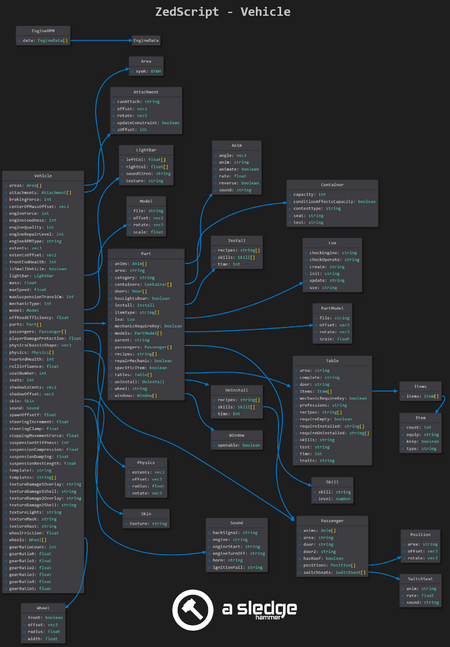

# Vehicle (scripts)

> Offline PZwiki reference. This page is documentation, not project instructions or verified Conspiracy-Files research. Source build warnings and incomplete entries remain applicable. External destinations are omitted. See the library README and COVERAGE for scope.

This page was last updated for an older version of the current build (42.10.0).

The current stable version is 42.20.4, so information on this page may be inaccurate.

Help get this page updated by adding any missing content. [Edit](Vehicle_scripts.md) (Create account)

This article is currently under construction.

It is in the process of an expansion or major restructuring. You are welcome to assist in its construction by editing it. [Edit](Vehicle_scripts.md) (Create account)

If this page has not been updated in a while, please replace this notice with`{{Improve}}`. Last edit was 28/08/2026.



General structure and parameters of a vehicle script

The`vehicle` script block is used to define the various aspects of a vehicle in the game. This page explains the parameters which are involved in defining a new vehicle.

Some parameters are easy to change later in game via debug tool Vehicle editor.

Vehicles use different Axis logic:

- X - width.
- Y - height.
- Z - length.

In comparison, the game world coordinates use:

- X - pointing east.
- Y - pointing south.
- Z - pointing up.

Vehicles are complex objects to implement due to the high amount of parameters and scripting required.

<a id="Parameters"></a>

## Parameters

| Parameter name | Description | Example |
| --- | --- | --- |
| extents | Dimensions of the physical parallelepiped that the player interacts with (X Y Z). (Vehicle dimensions that affect how close a player can approach the vehicle model). Can be configured in Vehicle Editor. |`extents = 0.7582 0.5934 1.8462,` |
| shadowExtents | Defines the shadow dimensions under the vehicle. (X Z) |`shadowExtents = 0.7582 1.8462,` |
| shadowOffset | Defines the shadow offset under the vehicle. (X Z) |`shadowOffset = 0.0000 0.0000,` |
| physicsChassisShape | Dimensions of the vehicle's physical parallelepiped that interacts with the environment (X Y Z) (excluding the player) |`physicsChassisShape = 0.7582 0.5934 1.8462,` |
| extentsOffset | Not used in game at this moment. |`extentsOffset = 1.0 1.0,` |
| mass | Sets the vehicle weight. Affects the vehicle's physics behavior. |`mass = 650,` |
| offRoadEfficiency | Affects the chance of parts breaking when off-road. |`offRoadEfficiency = 0.8,` |
| centerOfMassOffset | Defines the vehicle's center of mass. |`centerOfMassOffset = 0.0000 0.3077 0.0000,` |
| engineForce | Affects the vehicle's engine power. |`engineForce = 3600,` |
| engineIdleSpeed | Affects the vehicle's speed in idle state. |`engineIdleSpeed = 120,` |
| gearRatioCount | Sets the number of gears in the vehicle. (Does not affect the vehicle's maximum speed). |`gearRatioCount = 4,` |
| textureRust | Sets the rust texture for the vehicle. |`textureRust = Vehicles/Veh_Rust,` |
| textureMask | Sets the mask texture for the vehicle. Used to set the display of changes on certain parts of the vehicle (rust, blood, damage) |`textureMask = Vehicles/vehicle_smallcar_mask,` |
| textureLights | Sets the texture of vehicle lights. |`textureLights = Vehicles/vehicle_smallcar_lights,` |
| textureDamage1Overlay | Sets the texture for blood. |`textureDamage1Overlay = Vehicles/Veh_Blood_Mask,` |
| textureDamage1Shell | Sets the texture for damage. Usually used to display light damage. |`textureDamage1Shell = Vehicles/Veh_Damage1,` |
| textureDamage2Overlay | Sets the texture for blood. Usually the same texture as textureDamage1Overlay is used. |`textureDamage2Overlay = Vehicles/Veh_Blood_Hvy,` |
| textureDamage2Shell | Sets the texture for damage. Usually used to display heavy damage. |`textureDamage2Shell = Vehicles/Veh_Damage2,` |
| textureShadow | Sets the texture for the shadow under the vehicle. |`textureShadow = Vehicles/CustomShadowTexture,` |
| steeringClamp | Modifier affecting the vehicle's turning angle. |`steeringClamp = 0.3,` |
| suspensionStiffness | Sets suspension stiffness. (Physics param) |`suspensionStiffness = 30,` |
| suspensionDamping | Sets suspension damping. (Physics param) |`suspensionDamping = 2.88,` |
| suspensionCompression | Sets suspension compression. (Physics param) |`suspensionCompression = 2.83,` |
| suspensionRestLength | Sets suspension rest length. (Physics param) |`suspensionRestLength = 0.2,` |
| maxSuspensionTravelCm | Sets max suspension travel cm. (Physics param) |`maxSuspensionTravelCm = 10,` |
| wheelFriction | Wheel friction modifier. (Physics param) |`wheelFriction = 1.6f,` |
| stoppingMovementForce | Sets stopping movement force. (Physics param) |`stoppingMovementForce = 2.0f,` |
| maxSpeed | Sets max speed. (Physics param) |`maxSpeed = 70f,` |
| isSmallVehicle | Sets variable that used in zombie behavior logic. |`isSmallVehicle = false,` |
| spawnOffsetY | Height at which the vehicle spawns. |`spawnOffsetY = 0.19392952,` |
| engineLoudness | Vehicle loudness modifier. |`engineLoudness = 55,` |
| engineQuality | Sets the engine quality. Affects the chance to start the vehicle, the chance to hotwire the vehicle. If the engine quality is less than 65 - then the weather will affect the engine start chance. |`engineQuality = 60,` |
| mechanicType | Type of vehicle. Values: 0 - Burnt.; 1 - Standard.; 2 - Heavy Duty.; 3 - Sport.; |`mechanicType = 1,` |
| forcedColor | Sets force vehicle color values (HSV). Values: from 0.0 to 1.0. All vehicles will spawn with this color. |`forcedColor = 0.3 0.5 0.0,` |
| engineRPMType | Sound of vehicle engine. The sound is set in the sound block from the vehicle block. |`engineRPMType = firebird,` |
| template | Loads template. Allows loading a specific part of template code. |`template = Trunk/part/TruckBed,` |
| template! | Loads template. Loads as if the template is part of the script code. |`template! = SmallCar,` |
| engineRepairLevel | Required mechanics skill level for repairing the vehicle's engine. |`engineRepairLevel = 4,` |
| playerDamageProtection | Damage modifier for the player inside the vehicle. |`playerDamageProtection = 1.2,` |
| area | Block describes the area around the car in which the player must be in order to access the spare part (The name of area must match the name of the spare part). See area scripts for more details. |  |
| attachment | The block describes the parameters for attachments that are used for towing and attaching trailers (trailer and trailerfront). See [attachment scripts](attachment_scripts.md) for more details. |  |
| model | Block describes the parameters for vehicle model or part model. See [model scripts](model_scripts.md) for more details. |  |
| part | Source marks this entry as incomplete. |  |
| passenger | Source marks this entry as incomplete. |  |
| physics | Source marks this entry as incomplete. |  |
| skin | Source marks this entry as incomplete. |  |
| wheel | Source marks this entry as incomplete. |  |
| lightbar | Source marks this entry as incomplete. |  |
| sound | Source marks this entry as incomplete. |  |

<a id="Area_block"></a>

## Area block

Describes the area around the car in which the player must be in order to access the spare part (The name of the area must match the name of the spare part)

Example:


```text
area Engine
{
	xywh = 0.0000 1.1374 0.7692 0.4176,
}
```


<a id="xywh"></a>

### xywh

Coordinates of area. (X Y Width Height)


```text
xywh = 0.5989 -0.6703 0.4286 0.4725,
```


<a id="Attachment_block"></a>

## Attachment block

The block describes the parameters for attachments that are used for towing, attaching trailers (trailer and trailerfront) or vehicle anims.

Example:


```text
attachment trailer
{
	offset = 0.0000 0.3500 -0.7500,
	rotate = 0.0000 0.0000 0.0000,
	zoffset = -1.0000,
}
```


<a id="bone"></a>

### bone

Not used in game at this moment.

<a id="offset"></a>

### offset

Offset of attachment. (X Y Z)


```text
offset = 0.0000 -0.5934 1.2582,
```


<a id="rotate"></a>

### rotate

Rotate of attachment (X Y Z)


```text
rotate = 0.0000 0.0000 0.0000,
```


<a id="canAttach"></a>

### canAttach

Sets attachment to which this attachment can be attached.


```text
canAttach = trailer,
```


<a id="zoffset"></a>

### zoffset

Sets offset between attachments.


```text
zoffset = 1.0000,
```


<a id="updateconstraint"></a>

### updateconstraint

DEPRECATED

<a id="Model_block"></a>

## Model block

Block describes the parameters for vehicle model or part model.

Example:


```text
model
{
	file = Vehicles_SmallCar,
	scale = 1.8200,
	offset = 0.0000 0.3022 0.0000,
}
```


<a id="file"></a>

### file

Name of (global) model block, that describes 3d model params.


```text
file = Vehicles_SmallCar,
```


<a id="offset_2"></a>

### offset

Offset of vehicle model.


```text
offset = 0.0000 0.3022 0.0000,
```


<a id="rotate_2"></a>

### rotate

Rotation of vehicle model.


```text
rotate = 0.0000 0.0000 0.0000,
```


<a id="scale"></a>

### scale

Scale of vehicle model.


```text
scale = 1.8200,
```


<a id="Part_block"></a>

## Part block

The part block describes the part parameters for the vehicle part. Example:


```text
part Headlight {
    category = lights,
    specificItem = false,
    /* ... */
}
```


Vector3f in script example:


```text
offset = 0 1.2 0.4321,
```


| key | type | brief |
| --- | --- | --- |
| area | String | vehicle area |
| category | String | category |
| hasLightsRear | Boolean | adds rear lights |
| itemType | String | item types that can be added |
| mechanicRequireKey | Boolean | require key to perform mechanics actions |
| parent | String | parent part to sync animations |
| repairMechanic | Boolean | part can be fixed while installed if there is a fixing script |
| setAllModelsVisible | Boolean | enables all part models when part is installed |
| specificItem | Boolean | when true: the item type is item type + mechanicType of vehicle |
| wheel | String | vehicle wheel |

<a id="Anim_block"></a>

## Anim block

| key | type | brief |
| --- | --- | --- |
| angle | Vector3f |  |
| anim | String |  |
| animate | Boolean |  |
| loop | Boolean |  |
| reverse | Boolean |  |
| rate | Float |  |
| offset | Vector3f |  |
| sound | String |  |


```text
For animations the model should be `static = false,`
```


<a id="Container_block"></a>

## Container block

| key | type | description |
| --- | --- | --- |
| capacity | Integer | container maximum capacity - capacity priority is from item first, then from part container, conditionAffectsCapacity works when item capacity is used |
| conditionAffectsCapacity | Boolean | capacity scales with condition |
| contentType | String | contentType is used for other contents than inventory items e.g. air and fuel |
| seat | String | vehicle seat |
| test | String | lua function - test is called to check if player can access container when player is near or inside vehicle |

<a id="Door_block"></a>

## Door block

Adds door to part, has no usable values


```text
door {}
```


<a id="Lua_block"></a>

## Lua block

Creates a new HashMap with lua functions.


```text
lua {
    create = Vehicles.Create.Engine,
}
```


<a id="Table_block"></a>

## Table block

The table block is parsed into a KahluaTable. If a table exists, then it is added to; otherwise, a new table is created, and values are set, overwriting previous values.


```text
table tableId {
    key = value,
    keyRemove = ,
    subTable {
        1 = ordered,
        2 = table,
    }
    requireInstalled = BrakeFrontLeft;SuspensionFrontLeft,
}
```


<a id="Window_block"></a>

## Window block

Adds window to part.


```text
window { openable = true, }
```


| key | type | brief |
| --- | --- | --- |
| openable | Boolean | describes if window can be opened |

<a id="Example"></a>

## Example

Below is an example of all the different scripts involved in defining a vehicle.

Vehicle script example (source: How to create new vehicle mods)


```text
module Base
{
    vehicle MOD_NAME
    {
        mechanicType = 1,
        offRoadEfficiency = 0.8,
        engineRepairLevel = 4,
        playerDamageProtection = 0.8,
      /* The first model is always used as the vehicle's model. */
        model
        {
            file = Vehicles_MOD_NAME,
            scale = 2.15,
            offset = 0 0.20 0,
        }

       /* List the different skins for this vehicle here.
          A random skin will be chosen when a vehicle is first created.*/
        skin
        {
            texture = Vehicles/Vehicle_MOD_NAME_Shell,
        }

        textureRust = Vehicles/Vehicle_MOD_NAME_Rust,
        textureMask = Vehicles/Vehicle_MOD_NAME_Mask,
        textureLights = Vehicles/Vehicle_MOD_NAME_Lights,
         textureDamage1Overlay = Vehicles/Vehicle_MOD_NAME_Overlays_Damaged01,
        textureDamage1Shell = Vehicles/Vehicle_MOD_NAME_Shell_Damaged01,
        textureDamage2Overlay = Vehicles/Vehicle_MOD_NAME_Overlays_Damaged02,
        textureDamage2Shell = Vehicles/Vehicle_MOD_NAME_Shell_Damaged02,

        sound
        {
            horn = vehicle_horn1,
        }

       /* The size (in physics coordinates, not affected by model scale)
          of the collision body. */
        extents = 1.75 1 4.7,
       /* shadowOffset - Shadow boundaries shift:
          (right), (left),  (front), (rear) */
        shadowOffset = 0.0 0.0 0.0 0.0,
        mass = 650,
        physicsChassisShape = 1.75 0.85 4.7,

       /* Center of mass relative to the chassis origin.  The lower it
          is, the less likely the vehicle is to flip.
          Setting y too low will cause the vehicle to lean the wrong way
          in turns and when accelerating/braking. */
        centerOfMassOffset = 0.0 0.30 0.0,
      /* Amount of torque applied to each wheel.
           This provides the vehicle's acceleration */
        engineForce = 3600,
        engineQuality = 60,
        engineLoudness = 55,
        maxSpeed = 70f,
      /* Amount of braking torque applied to each wheel. */
        brakingForce = 60,

       gearRatioCount = 4,
       gearRatioR = 4.7,
       gearRatio1 = 3.6,
       gearRatio2 = 2.2,
       gearRatio3 = 1.3,
       gearRatio4 = 1.0,

       extentsOffset = 0.5 0.5,

        stoppingMovementForce = 2.0f,

       /* Reduces the rolling torque applied from the wheels that
         cause the vehicle to roll over.
          This is a bit of a hack, but it's quite effective.
          0.0 = no roll, 1.0 = physical behaviour.
          If m_frictionSlip is too high, you'll need to reduce this to
         stop the vehicle rolling over.
          You should also try lowering the vehicle's centre of mass */
        rollInfluence = 1.0f,

       /* How quickly the front wheels change facing direction. */
       steeringIncrement = 0.02,

       /* Maximum steering angle. */
       steeringClamp = 0.3,

       /* The stiffness constant for the suspension.
          10.0 - Offroad buggy,
          50.0 - Sports car,
          200.0 - F1 Car */
        suspensionStiffness = 30,

       /* The damping coefficient for when the suspension is compressed.
          Set to k * 2.0 * btSqrt(m_suspensionStiffness) so k is
          proportional to critical damping.
          k = 0.0 undamped & bouncy, k = 1.0 critical damping
          0.1 to 0.3 are good values */
        suspensionCompression = 2.83 /*0.88*/ /*4.4*/, /* aka wheelsDampingCompression */

        /* The damping coefficient for when the suspension is expanding.
         See the comments for m_wheelsDampingCompression for how to
         set k.
         m_wheelsDampingRelaxation should be slightly larger than
         wheelsDampingCompression, eg 0.2 to 0.5 */
        suspensionDamping = 2.88 /*1.76*/ /*2.3*/, /* aka wheelsDampingRelaxation */

       /* The maximum distance the suspension can be compressed
          (centimetres) */
        /*    float minSuspensionLength = wheel.getSuspensionRestLength() - wheel.maxSuspensionTravelCm * 0.01f;
            float maxSuspensionLength = wheel.getSuspensionRestLength() + wheel.maxSuspensionTravelCm * 0.01f; */
        maxSuspensionTravelCm = 100,

       /* The maximum length of the suspension (metres) */
        suspensionRestLength = 0.3f,

       /* The coefficient of friction between the tyre and the ground.
          Should be about 0.8 for realistic cars, but can be increased
          for better handling.
          Set large (10000.0) for kart racers */
        wheelFriction = 1.6f /*1000*/, /* aka frictionSlip */

       /* The amount of collision damage the vehicle can sustain while
          still being driveable. */
        frontEndHealth = 150,
        rearEndHealth = 150,
        seats = 4,

        wheel FrontLeft
        {
            front = true,
            /* offset of wheel-model origin from chassis origin, in unscaled model coordinate space */
            offset = 0.32f 0.14f 0.60f,
            radius = 0.3f,
            width = 0.2f,
        }

        wheel FrontRight
        {
            front = true,
            offset = -0.32f 0.14f 0.60f,
            radius = 0.3f,
            width = 0.2f,
        }

        wheel RearLeft
        {
            front = false,
            offset = 0.32f 0.14f -0.67f,
            radius = 0.3f,
            width = 0.2f,
        }

        wheel RearRight
        {
            front = false,
            offset = -0.32f 0.14f -0.67f,
            radius = 0.3f,
            width = 0.2f,
        }

        template = PassengerSeat4,

        passenger FrontLeft
        {
            position inside
            {
                offset = 0.2 0 -0.0121,
                rotate = 0.0 0.0 0.0,
            }
            position outside
            {
                offset = 0.5698 0 -0.0121,
                rotate = 0.0 0.0 0.0,
            }
        }
        passenger FrontRight
        {
            position inside
            {
                offset = -0.2 0 -0.0121,
                rotate = 0.0 0.0 0.0,
            }
            position outside
            {
                offset = -0.5698 0 -0.0121,
                rotate = 0.0 0.0 0.0,
            }
        }
        passenger RearLeft
        {
            position inside
            {
                offset = 0.2 0 -0.4,
                rotate = 0.0 0.0 0.0,
            }
            position outside
            {
            }
        }
        passenger RearRight
        {
            position inside
            {
                offset = -0.2 0 -0.4,
                rotate = 0.0 0.0 0.0,
            }
            position outside
            {
            }
        }

        area Engine
        {
            xywh = 0 1.3256 0.814 0.4651,
        }
        area TruckBed
        {
            xywh = 0 -1.3256 0.814 0.4651,
        }
        area SeatFrontLeft
        {
            xywh = 0.6395 -0.0121 0.4651 0.6512,
        }
        area SeatFrontRight
        {
            xywh = -0.6395 -0.0121 0.4651 0.6512,
        }
        area GasTank
        {
            xywh = 0.6395 -0.668 0.4651 0.4651,
        }
        area TireFrontLeft
        {
            xywh = 0.6395 0.6 0.4651 0.4651,
        }
        area TireFrontRight
        {
            xywh = -0.6395 0.6 0.4651 0.4651,
        }
        area TireRearLeft
        {
            xywh = 0.6395 -0.67 0.4651 0.4651,
        }
        area TireRearRight
        {
            xywh = -0.6395 -0.67 0.4651 0.4651,
        }

        template = TrunkDoor,

        template = Trunk/part/TruckBed,

        part TruckBed
        {
            itemType = Base.SmallTrunk,
            container
            {
                capacity = 40,
            }
        }

        template = Seat/part/SeatFrontLeft,
        template = Seat/part/SeatFrontRight,
        template = Seat/part/SeatRearLeft,
        template = Seat/part/SeatRearRight,

        part SeatRearLeft
        {
            table install
            {
                area = SeatFrontLeft,
            }
            table uninstall
            {
                area = SeatFrontLeft,
            }
        }

        part SeatRearRight
        {
            table install
            {
                area = SeatFrontRight,
            }
            table uninstall
            {
                area = SeatFrontRight,
            }
        }

        part Seat*
        {
            container
            {
                capacity = 20,
            }
            table install
            {
                skills = Mechanics:2,
            }
            table uninstall
            {
                skills = Mechanics:2,
            }
        }

        part GloveBox
        {
            area = SeatFrontRight,
            itemType = Base.GloveBox,
            container
            {
                capacity = 3,
                test = Vehicles.ContainerAccess.GloveBox,
            }
            lua
            {
                create = Vehicles.Create.Default,
            }
        }

        template = GasTank,

        template = Battery,

        template = Engine,

        template = Muffler,

        template = EngineDoor,

        part EngineDoor
        {
            mechanicRequireKey = false,
        }

        part Heater
        {
            category = engine,
            lua
            {
                update = Vehicles.Update.Heater,
            }
        }

        part PassengerCompartment
        {
            category = nodisplay,
            lua
            {
                update = Vehicles.Update.PassengerCompartment,
            }
        }

        template = Windshield/part/Windshield,
        template = Windshield/part/WindshieldRear,

        template = Window/part/WindowFrontLeft,
        template = Window/part/WindowFrontRight,
        template = Window/part/WindowRearLeft,
        template = Window/part/WindowRearRight,

        part WindowRearLeft
        {
            area = TireRearLeft,
            parent = ,
            table install
            {
                requireInstalled = ,
            }
        }

        part WindowRearRight
        {
            area = TireRearRight,
            parent = ,
            table install
            {
                requireInstalled = ,
            }
        }

        template = Door/part/DoorFrontLeft,
        template = Door/part/DoorFrontRight,

        template = Tire,

        template = Brake,

        template = Suspension,

        template = Radio,

        template = Headlight,
    }
}
```


<a id="See_also"></a>

## See also

- How to create new vehicle mods - an official guide from The Indie Stone on how to create new vehicle mods.

Retrieved from "[https://pzwiki.net/w/index.php?title=Vehicle_(scripts)&oldid=1465275](Vehicle_scripts.md)"
