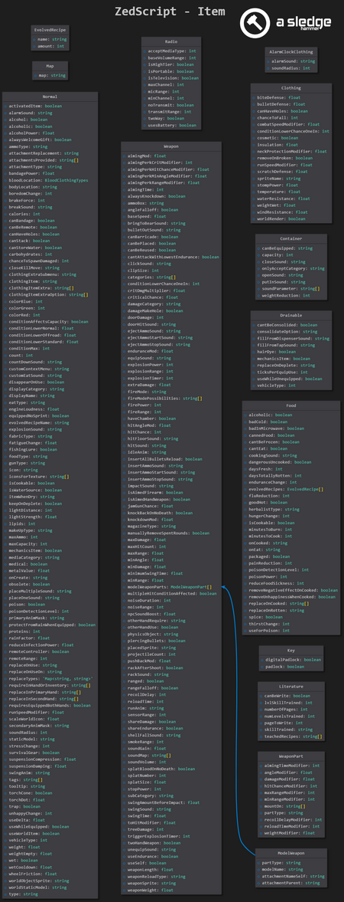
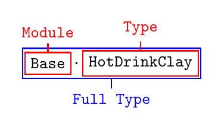

# item (scripts)

> Offline PZwiki reference. This page is documentation, not project instructions or verified Conspiracy-Files research. Source build warnings and incomplete entries remain applicable. External destinations are omitted. See the library README and COVERAGE for scope.

This page has been revised for the current stable version (42.20.4).

Help by adding any missing content. [Edit](item_scripts.md) (Create account)

Parts of this page may have been automatically updated to the latest build (42.20.4).

item


ScriptsDocs

Properties

[Parent blocks](Scripts.md#Parent_blocks)

module

[Children blocks](Scripts.md#Children_blocks)

component
component FluidContainer
component Durability
component ContextMenuConfig

[ID](Scripts.md#ID)

Any

[Soft overrides](Scripts.md#Soft_overrides)

True



List of parameters for each item type (OUTDATED B41) - see ScriptsDocs

The item block is used to create items in the game, from weapons to food and clothing. The parameters available in this block mostly depend on the type of item you are creating, set with ItemType.

To get started, create a simple item structure by setting that parameter up correctly, then add more parameters as you need. For example, for a normal item:


```text
module yourModule
{
  item yourID
  {
    ItemType = base:normal,
    ...
  }
}
```


<a id="Parameters"></a>

## Parameters

When writing a script for an item, be guided by the scripts of similar items from the vanilla game (or from other mods).

You can find a full list of the parameters in the ScriptsDocs. The parameters are arranged by the ItemType parameter. You can find a list of parameters that are exclusive to specific ItemTypes here.

<a id="Other_parameters"></a>

### Other parameters

Any other parameter not in the list will be written as a key-value in the item's ModData. For example:


```text
MyCustomOption = This is custom label,
```


```text
print(item:getModData().MyCustomOption) -- outputs: This is custom label
```


This should not be used in any cases and instead a [lookup table](../lua-api/Lua_language.md#Lookup_tables) should be used associated to the item Type or FullType. Reason being that the custom parameter mod data will be added to every single instance of items that appear in the world, and can bloat save files with repeated informations for every items while using a [lookup table](../lua-api/Lua_language.md#Lookup_tables) for repeated values will not bloat save files.

<a id="Display_name"></a>

## Display name

To add a name to display for your item, you need to add the item full type, that is its`module.id`, inside the ItemName translation file. Taking the example from above, your translation file would be:


```text
{
  "yourModule.yourID": "Your Item Name"
}
```


<a id="Item_ID"></a>

## Item ID



The ID of an item script is often refered to as the type, while it's full ID is the full type. The type is simply the [ID](Scripts.md#ID) of the script block, while the full type is the`module.ID`. Take for example the following incomplete item definition:


```text
module MyModModule {
    item MyItem {
        ...
    }
}
```


It's type is`MyItem` while its full type is`MyModModule.MyItem`.

You can retrieve the full type of an InventoryItem from [Lua](../lua-api/Lua_API.md) by using the getFullType method or for an Item instance you can use getFullName.

<a id="Modifying_existing_item_definitions"></a>

## Modifying existing item definitions

There are two methods to modify existing items:

- via [#Soft overrides](item_scripts.md#Soft_overrides)
- from Java class instance of the item definition (the [#Lua](item_scripts.md#Lua) method)

<a id="Soft_overrides"></a>

### Soft overrides

Main article: [Scripts](Scripts.md#Soft_overrides)

This follows the soft overrides rules defined in the main [Scripts](Scripts.md#Soft_overrides) page, where you make a new definition of the item in your own mod but only add the parameters you want to modify.

For example take the following existing item definition:


```text
module Base
{
    item HotDrinkClay
    {
        DisplayCategory = Food,
        ItemType = base:food,
        EatType = Popcan,
        PourType = Mug,
        Weight = 0.5,
        Icon = Ceramic_Mug_Unfired,
        GoodHot = true,
        IsCookable = true,
        ReplaceOnUse = Base.ClayMug,
        MinutesToCook = 10,
        MinutesToBurn = 50,
        ThirstChange = -20.0,
        UnhappyChange = -10,
        CustomContextMenu = Drink,
        CustomEatSound = DrinkingFromMug,
        StaticModel = MugClay,
        WorldStaticModel = MugClay,
        Tags = base:alcoholicbeverage;base:lowalcohol;base:herbaltea,
        CookingSound = BoilingFood,
        Eattime = 160,
    }
}
```


If I want to modify the Eattime of this item, and let's say the UnhappyChange, I can simply do the following in my own [Scripts](Scripts.md) file:


```text
module Base
{
    /* If you're using ZedScripts, add the following annotation
     *@soft-override
     */
    item HotDrinkClay
    {
        UnhappyChange = -50,
        Eattime = 260,
    }
}
```


There are specific parameters that may act differently based on their usual behavior. Most parameters will act nicely without any special behavior, but for example Tags doesn't allow you to overwrite existing tags. If you soft override tags, your newly listed tags will simply be added to the existing list of tags from the original definition, which is essentially a good thing because you are not breaking vanilla tags of this item.


```text
module Base
{
    /* If you're using [[ZedScripts]], add the following annotation
     *@soft-override
     */
    item HotDrinkClay
    {
        Tags = base:ballpeenhammer,
    }
}
```


The final list of tags will then change from`base:alcoholicbeverage;base:lowalcohol;base:herbaltea` to`base:alcoholicbeverage;base:lowalcohol;base:herbaltea;base:ballpeenhammer`.

<a id="Lua"></a>

### Lua

You can access and modify an item script definition from the [Lua (API)](../lua-api/Lua_API.md) by using the ScriptManager. The most common one is getItem which uses the item full type to retrieve the Item instance. Other useful ones also exist like getItemsByTag and getItemsByType.

If we try to replace the exact same parameters than in [#Soft overrides](item_scripts.md#Soft_overrides), it becomes the following:


```text
local item = ScriptManager.getItem('Base.HotDrinkClay')

local newValues = {
    ['UnhappyChange'] = -50,
    ['Eattime'] = 260,
}

for param, value in pairs(newValues) do
    item:DoParam(param, value)
end
```


DoParam has two variants:

- the first takes a single string line, that is going to be the combination`param = value,` passed directly for processing
- the second one, used above, takes the parameter and the value, way easier to use and less risk of wrong formatting

Alternatively you can pass directly a whole script formatting by using the Load method.


```text
local item = ScriptManager.getItem('Base.HotDrinkClay')

-- the [[ ]] syntax is a multiline string
item:Load('HotDrinkClay', [[
{
    UnhappyChange = -50,
    Eattime = 260,
}
]])
```


<a id="Item_model"></a>

## Item model

Setting up an item model will be done different whenever the item is a HandWeapon or not. The following parameters will have to be used:

- For HandWeapon items, you need to use WeaponSprite.
- For other items, you need to use StaticModel for the item attached to the player (in hands for example, or in the back) and WorldStaticModel for the item placed in the world.

Alternatively, you can use StaticModelsByIndex and WorldStaticModelsByIndex to set multiple model variants for the same item.

To set those up, you will need to setup at least one [model script](model_scripts.md). Take the following model and texture file structure:


```text
📁 media
    📁 models_X
        📁 yourMod
            📄 yourModelFile.glb
    📁 textures
        📁 yourMod
            📄 yourTextureFile.png
```


The model script will then be:


```text
module yourModule
{
    model yourModel
    {
        mesh = yourMod/yourModelFile,
        texture = yourMod/yourTextureFile,
    }
}
```


You can reference this model script inside the relevant item script parameters to setup up the model that were mentioned above:


```text
module yourModule
{
    item yourItem
    {
        ItemType = base:normal,
        StaticModel = yourModule.yourModel,
        WorldStaticModel = yourModule.yourModel,
        ...
    }
}
```


And for weapons:


```text
module yourModule
{
    item yourItem
    {
        ItemType = base:handweapon,
        WeaponSprite = yourModule.yourModel,
        ...
    }
}
```


Check the documentation of these parameters for more details on what can be achieved.

<a id="Attachment_points"></a>

### Attachment points

Whenever you want your item to be physically visible in the player hands, attached on its back or belt, or adjust the rotation and position of the model when placed on the ground, you will have to setup an [attachment script](attachment_scripts.md) inside your item model scripts. You can adjust the translation position of the item using the offset parameter and the rotation using the rotate parameter. This can more easily be achieved using the [Attachment editor](../assets-and-animation/Attachment_editor.md).

If we take our previous model definition, the most common attachment scripts will be the following:


```text
module yourModule
{
    model yourModel
    {
        mesh = yourMod/yourModelFile,
        texture = yourMod/yourTextureFile,

        /* Bip01_Prop1 is for the right hand
         * while Bip01_Prop2 is for the left hand
         * you don't have to define both an offset and rotate
         * and you can also define neither of them if the model is already well placed
        */
        attachment Bip01_Prop1
        {
            offset = x y z, /* you will need to adjust those value */
            rotate = x y z, /* the rotations are in degrees */
        }

        /* here you can modify the rotation and offset of the model */
        attachment world
        {
            ... /* do your things here */
        }

        /* other slots are often simply used to
         * refer to an attachment point on the player model
        */
        attachment back
        {
            ...
        }
    }
}
```


Retrieved from "[https://pzwiki.net/w/index.php?title=Item_(scripts)&oldid=1476931](item_scripts.md)"
