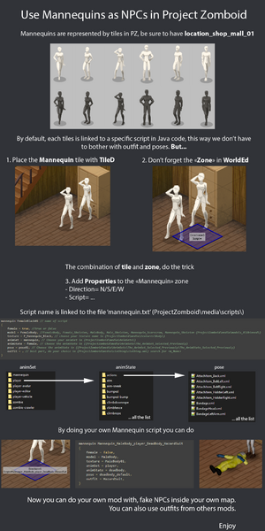

# mannequin (scripts)

> Offline PZwiki reference. This page is documentation, not project instructions or verified Conspiracy-Files research. Source build warnings and incomplete entries remain applicable. External destinations are omitted. See the library README and COVERAGE for scope.

This page was last updated for an older version of the current build (42.19.0).

The current stable version is 42.20.4, so information on this page may be inaccurate.

Help get this page updated by adding any missing content. [Edit](mannequin_scripts.md) (Create account)

mannequin

ScriptsDocs

Properties

[Parent blocks](Scripts.md#Parent_blocks)

module

[ID](Scripts.md#ID)

Any

[Soft overrides](Scripts.md#Soft_overrides)

Need testing

This article is about custom mannequin [scripts](Scripts.md). For mannequin objects, see mannequin.

Used to define mannequins, which can be used in [mapping](../mapping/Mapping.md) to create mannequins in the world.

To get a list of available mannequins, see [this](mannequin_scripts.md#Available_mannequins).

## Parameters

You can find a full list of the parameters in the ScriptsDocs.

Animal models and textures can be used in mannequins ! For the outfit parameter, you can use the`Naked` outfit but some clothing items can be used by animals such as hats.

## Available mannequins

Below is the list of available mannequins in the vanilla game:

-`FemaleBlack01`
-`FemaleBlack02`
-`FemaleBlack03`
-`MaleBlack01`
-`MaleBlack02`
-`MaleBlack03`
-`FemaleWhite01`
-`FemaleWhite02`
-`FemaleWhite03`
-`MaleWhite01`
-`MaleWhite02`
-`MaleWhite03`
-`BloodFirst`
-`Chunk`
-`CommandoIan`
-`CommandoJohn`
-`Frogman`
-`GrimeyRick`
-`Setup`
-`TheGeneral`
-`UppermostFirearm`
-`Walter`
-`Wizard`
-`MannequinScarecrow01`
-`MannequinScarecrow02`
-`MannequinScarecrow03`
-`MannequinSkeleton01`
-`FemaleLeather`
-`MaleLeather`

Retrieved from "[https://pzwiki.net/w/index.php?title=Mannequin_(scripts)&oldid=1440697](mannequin_scripts.md)"
